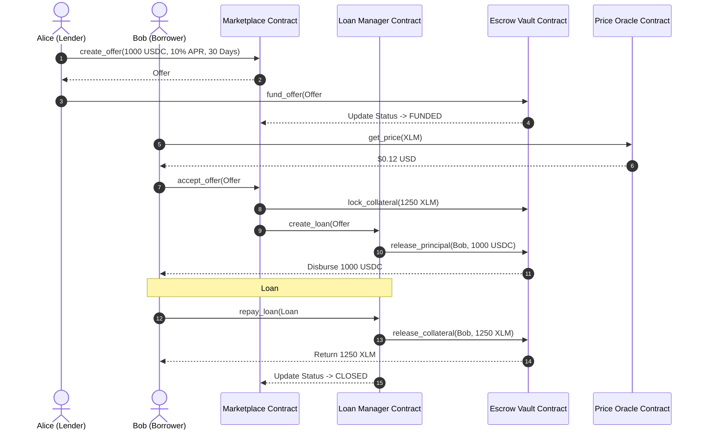
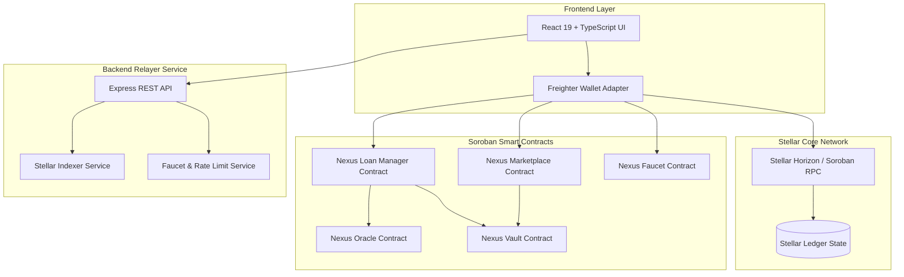

# <div align="center">NEXUS</div>

<div align="center">
  
</div>

<div align="center">
  <h3>Decentralized Peer-to-Peer Isolated Lending Protocol on Stellar Soroban</h3>
  <p>Educational Reference Architecture & Smart Contract Implementation</p>
</div>

<div align="center">

[](https://github.com/TheAnh1404/NexusLending)
[](https://stellar.org/)
[](https://soroban.stellar.org/)
[](LICENSE)

</div>

---

> **Note for Developers**: This repository is designed as a comprehensive, beginner-to-advanced educational reference for building production-ready decentralized financial protocols on **Stellar Soroban**. It demonstrates isolated escrow management, cross-contract authorization, oracle integration, risk math, and automated contract state machines.

---

## 📖 Table of Contents

1. [What is NEXUS?](#1-what-is-nexus)
2. [Why Stellar?](#2-why-stellar)
3. [How NEXUS Works](#3-how-nexus-works)
4. [Project Layout](#4-project-layout)
5. [Smart Contracts](#5-smart-contracts)
6. [Oracle](#6-oracle)
7. [Vault](#7-vault)
8. [Marketplace](#8-marketplace)
9. [Loan Manager](#9-loan-manager)
10. [Health Factor](#10-health-factor)
11. [Liquidation](#11-liquidation)
12. [Contract Interactions](#12-contract-interactions)
13. [Authentication](#13-authentication)
14. [Storage](#14-storage)
15. [Events](#15-events)
16. [Demo & CLI Walkthrough](#16-demo--cli-walkthrough)
17. [Sequence Diagrams](#17-sequence-diagrams)
18. [Architecture](#18-architecture)
19. [Security Architecture](#19-security-architecture)
20. [Future Roadmap](#20-future-roadmap)

---

## 1. What is NEXUS?

### The Real-World Problem

In traditional banking, borrowing or lending money involves central intermediaries, extensive paperwork, credit checks, and long approval delays:

```
[ Alice (Lender) ] ─── Deposit Cash ───> [ Bank Intermediary ] ─── Approve Loan ───> [ Bob (Borrower) ]
                                          │ 3-5% Yield to Alice
                                          │ 12-18% Interest from Bob
                                          └─ (Bank retains spread & collateral)
```

In early Decentralized Finance (DeFi 1.0 protocols like Aave or Compound), lending is structured around **Pooled Liquidity Pools**:

```
[ Alice (Lender A) ] ────┐
[ Carol (Lender B) ] ────┼──> [ Shared Liquidity Pool ] <─── Borrow Debt ──── [ Bob (Borrower) ]
[ Dave  (Lender C) ] ────┘    (Variable APR Curve)
```

While liquidity pools enable instant borrowing, they suffer from critical architectural drawbacks:
1. **Systemic Contamination Risk**: Capital is mixed together. If one collateral token in the pool experiences a sudden crash or exploit, bad debt spreads across all depositors.
2. **Variable Interest Rate Volatility**: Rates fluctuate second-by-second based on pool utilization, depriving lenders of guaranteed yields and borrowers of predictable repayment costs.
3. **Rigid Governance Parameters**: LTV and liquidation rules are globally set by DAO voting, ignoring individual risk appetites.

### The NEXUS Solution

**NEXUS** introduces a **Peer-to-Peer (P2P) Isolated Lending Agreement Model** built on **Stellar Soroban** smart contracts.

Instead of matching borrowers with shared pools, lenders publish customized, fixed-rate lending offers to an on-chain marketplace. Borrowers select the exact offer matching their required duration, loan amount, and APR:

```
┌─────────────────┐                                      ┌─────────────────┐
│ Alice (Lender)  │ ─── 1. Create & Fund Offer ─────────> │                 │
└─────────────────┘                                      │  Vault Escrow   │
                                                         │   (Isolated)    │
┌─────────────────┐ ─── 2. Accept & Lock XLM Collateral ─> │                 │
│  Bob (Borrower) │ <── 3. Receive USDC Principal ───────└─────────────────┘
└─────────────────┘
```

#### Core Benefits of NEXUS:
* **Zero Systemic Contamination**: Every loan operates inside its own isolated Smart Escrow Vault. If Bob defaults, only Alice's offer escrow is involved. Other lenders are 100% unaffected.
* **Fixed APR & Guaranteed Terms**: Interest rates and repayment schedules are locked upon matching and remain immutable throughout the loan term.
* **Granular Risk Control**: Lenders specify custom Loan-to-Value (LTV), Liquidation Thresholds, and Liquidation Bonuses.

---

## 2. Why Stellar?

Building a non-custodial, high-frequency credit market requires a blockchain infrastructure with deterministic performance, low cost, and strong developer primitives:

```
┌─────────────────────────────────────────────────────────────────────────┐
│                         STELLAR NETWORK & SOROBAN                       │
├──────────────────┬──────────────────┬──────────────────┬────────────────┤
│ Sub-Cent Fees    │ 5s Finality      │ Rust + Wasm      │ Built-in Asset │
│ (< $0.0001 / tx) │ (Fast Consensus) │ (Soroban Engine) │ Standards (SEP)│
└──────────────────┴──────────────────┴──────────────────┴────────────────┘
```

1. **Predictable & Sub-Cent Fees**: Transaction execution costs on Stellar cost fractions of a cent ($< 0.0001$), enabling frequent health check updates, partial repayments, and liquidations without prohibitive gas fees.
2. **Fast Ledger Finality**: Stellar closes ledgers every ~5 seconds with instant finality, ensuring collateral deposits and loan releases settle immediately.
3. **Soroban Smart Contract Engine**: Powered by Rust and WebAssembly (Wasm), Soroban provides a sandboxed, deterministic execution environment with explicit state storage models and low footprint overhead.
4. **First-Class Asset Support**: Stellar native assets (XLM) and Soroban token standards share native interoperability with Stellar Classic trustlines and DEX assets.

---

## 3. How NEXUS Works

The complete lifecycle of a NEXUS P2P loan follows a deterministic 8-step process:

```
+-----------------------------------------------------------------------------------+
|                                 NEXUS LOAN LIFECYCLE                              |
+-----------------------------------------------------------------------------------+

 1. CREATE OFFER       Lender creates a peer-to-peer loan offer (Amount, APR, Duration).
        │
        ▼
 2. FUND OFFER         Lender deposits USDC principal into the Marketplace contract.
        │
        ▼
 3. MARKETPLACE        Offer is listed publicly on the open NEXUS marketplace.
        │
        ▼
 4. ACCEPT OFFER       Borrower selects offer and commits XLM collateral.
        │
        ▼
 5. ESCROW VAULT       Vault locks XLM collateral; USDC principal is disbursed to Borrower.
        │
        ▼
 6. LOAN ACTIVE        Loan status becomes Active. Oracle tracks Health Factor in real-time.
        ├─── Option A: REPAYMENT ───────────► Borrower repays USDC -> Collateral released -> CLOSED.
        └─── Option B: LIQUIDATION ─────────► Price crashes (HF < 1.0) -> Liquidator claims collateral.
```

---

## 4. Project Layout

The repository is modularized into clear domain boundaries across Smart Contracts (Soroban Rust), Frontend (React/TypeScript), and Backend (Node.js/Express Relayer):

```
Nexus/
├── contracts/                  # Soroban Smart Contract Crates (Rust)
│   ├── Cargo.toml              # Workspace manifest
│   ├── faucet/                 # Developer Testnet Faucet contract (XLM, USDC, Collateral)
│   ├── oracle/                 # On-chain price oracle adapter (XLM/USD feed)
│   ├── vault/                  # Isolated escrow vault custody contract
│   ├── marketplace/            # Offer creation, funding, and matching engine
│   └── loan_manager/           # Loan state, health math, repayment & liquidation logic
├── frontend/                   # Web Application (Vite + React 19 + TypeScript)
│   ├── src/
│   │   ├── app/                # Application routes & global context providers
│   │   ├── components/         # Reusable UI components (Marketplace, Faucet, Modals)
│   │   ├── pages/              # Primary view pages (Borrow, Lend, My Loans, Faucet)
│   │   └── services/           # Soroban SDK client integration & Horizon RPC wrappers
├── backend/                    # Node.js Express Relayer & Indexer Service
│   ├── src/
│   │   ├── modules/faucet/     # Backend faucet relayer & rate limiting service
│   │   ├── modules/oracle/     # Mock oracle updater & price feed service
│   │   └── routes/             # REST API endpoints
└── docs/                       # Architectural & Technical documentation
```

### Why Every Module Exists
* **`contracts/faucet`**: Provides a self-contained, rate-limited testnet faucet contract allowing developers to claim test XLM and test USDC with trustline validation.
* **`contracts/oracle`**: Guarantees tamper-proof collateral valuation using time-weighted average price feeds and staleness checks.
* **`contracts/vault`**: Holds collateral and principal isolated from business rules, eliminating smart contract vulnerabilities in the main marketplace.
* **`contracts/marketplace`**: Manages order creation, cancellation, and initial matching before handing over active state to the Loan Manager.
* **`contracts/loan_manager`**: Contains state transitions, Health Factor calculations, partial repayments, and liquidation mechanics.

---

## 5. Smart Contracts

NEXUS comprises 5 independent Soroban smart contract crates:

```
┌─────────────────────────────────────────────────────────────────────────────┐
│                            SOROBAN CONTRACT ARCHITECTURE                    │
├─────────────┬─────────────┬─────────────┬───────────────────┬───────────────┤
│ Faucet      │ Oracle      │ Vault       │ Marketplace       │ Loan Manager  │
│ Contract    │ Contract    │ Contract    │ Contract          │ Contract      │
└─────────────┴─────────────┴─────────────┴───────────────────┴───────────────┘
```

### 1. Faucet Contract (`nexus-faucet-contract`)
* **Purpose**: Grants testnet assets to developers and testers.
* **Responsibilities**:
  * Manages per-asset claim amounts and cooldown ledger sequence limits.
  * Mints or transfers test tokens (`USDC`, `XLM`, `COLLATERAL`).
  * Enforces user authentication via `recipient.require_auth()`.

### 2. Oracle Contract (`nexus-oracle-contract`)
* **Purpose**: Serves authoritative asset price data to calculate collateral values.
* **Responsibilities**:
  * Stores asset price records with 7-decimal precision ($1.00 = 10,000,000$).
  * Enforces maximum price staleness thresholds (`max_staleness_seconds`).
  * Emits price update events for indexers.

### 3. Vault Contract (`nexus-vault-contract`)
* **Purpose**: Secure non-custodial custody of locked funds.
* **Responsibilities**:
  * Accepts collateral deposits from borrowers and principal funding from lenders.
  * Disburses funds strictly when authorized by the Loan Manager contract.
  * Maintains isolated ledger balances per loan ID.

### 4. Marketplace Contract (`nexus-marketplace-contract`)
* **Purpose**: Order-book style matching for P2P lending offers.
* **Responsibilities**:
  * Accepts new loan offers from lenders with specified APR, duration, and LTV.
  * Handles offer funding, cancellation, and expiration refunds.
  * Instantiates new loan records in the Loan Manager when matched.

### 5. Loan Manager Contract (`nexus-loan-manager-contract`)
* **Purpose**: Manages active loan state, health monitoring, repayment, and liquidations.
* **Responsibilities**:
  * Calculates real-time Health Factor: $HF = \frac{\text{Collateral Value} \times \text{Threshold}}{\text{Total Debt}}$.
  * Processes full and partial principal/interest repayments.
  * Triggers partial or full liquidation when $HF < 1.0$.

---

## 6. Oracle

The Oracle module acts as the financial truth layer for NEXUS.

```
┌───────────────┐     Update Price     ┌─────────────────┐     Query Price     ┌───────────────┐
│ Admin / Feed  │ ───────────────────> │ Oracle Contract │ <────────────────── │ Loan Manager  │
└───────────────┘                      └─────────────────┘                     └───────────────┘
                                        - Asset: XLM
                                        - Price: $0.12 (1,200,000)
                                        - Timestamp: T_now
```

### Price Freshness & Staleness Defense
Oracle price feeds are subject to market volatility. Using an outdated price introduces severe risks:
* **Stale High Price**: Prevents necessary liquidations, exposing the lender to bad debt during a market crash.
* **Stale Low Price**: Causes unfair liquidations of healthy loans.

To prevent this, NEXUS enforces a strict staleness threshold:

```rust
pub fn get_price(env: Env, asset: Address) -> PriceData {
    let price_data: PriceData = env.storage().persistent()
        .get(&DataKey::Price(asset))
        .unwrap_or_else(|| panic!("Price feed not found"));

    let current_time = env.ledger().timestamp();
    if current_time - price_data.timestamp > MAX_STALENESS_SECONDS {
        panic!("Oracle price feed is stale");
    }
    price_data
}
```

---

## 7. Vault

The Vault contract is the isolated custodian of the protocol. Funds are never pooled in a single global account.

```
┌─────────────────────────────────────────────────────────────────────────┐
│                              VAULT STORAGE                              │
├────────────────────────────┬────────────────────────────┬───────────────┤
│ Loan #101 Escrow Vault     │ Loan #102 Escrow Vault     │ ...           │
│ - Collateral: 10,000 XLM   │ - Collateral: 5,000 XLM    │               │
│ - Borrower: Bob            │ - Borrower: Charlie        │               │
└────────────────────────────┴────────────────────────────┴───────────────┘
```

### Isolation & Non-Custodial Safety
* **Direct Token Transfers**: Uses Soroban `token::Client` to transfer assets directly into the Vault address.
* **Restricted Release**: Funds can only be released if invoked by an authorized Loan Manager contract via cross-contract call.
* **No Emergency Sweep**: Protocol admins cannot withdraw user funds from individual loan escrows.

---

## 8. Marketplace

Lenders create offers specifying their desired parameters. Borrowers search and select offers on the open marketplace.

```
+-----------------------------------------------------------------------------------+
|                              OFFER STATE MACHINE                                  |
+-----------------------------------------------------------------------------------+

         ┌──────────────┐
         │   Created    │ (Lender submits offer parameters)
         └──────┬───────┘
                │
                ▼
         ┌──────────────┐
         │    Funded    │ (Lender deposits USDC principal into Vault)
         └──────┬───────┘
                ├─── Accept (Borrower locks XLM) ───► ┌──────────────┐
                │                                     │   Matched    │ ──► Active Loan
                ├─── Cancel (Lender withdraws USDC) ─► ┌──────────────┐
                │                                     │  Cancelled   │
                └─── Expire (Duration passed) ──────► ┌──────────────┐
                                                      │   Expired    │
```

---

## 9. Loan Manager

The Loan Manager monitors active loans from inception to settlement.

```
+-----------------------------------------------------------------------------------+
|                              LOAN STATE MACHINE                                   |
+-----------------------------------------------------------------------------------+

     ┌──────────────┐
     │  Pending     │ (Offer accepted, collateral locked in Vault)
     └──────┬───────┘
            │
            ▼
     ┌──────────────┐
     │   Active     │ (USDC released to Borrower, Health Factor monitored)
     └──────┬───────┘
            │
            ├─── Repay (Borrower pays principal + interest) ──► ┌──────────────┐
            │                                                  │    Closed    │
            │
            └─── HF < 1.0 (Price drops below threshold) ───────► ┌──────────────┐
                                                               │  Liquidated  │
```

---

## 10. Health Factor

Health Factor ($HF$) is a numeric indicator of a loan's solvency.

### The Health Factor Formula

$$HF = \frac{\text{Collateral Value in USD} \times \text{Liquidation Threshold}}{\text{Total Borrowed Debt in USD}}$$

Where:
* $\text{Collateral Value} = \text{Collateral Amount} \times \text{Oracle Price of XLM}$
* $\text{Liquidation Threshold} = 80\%$ ($0.80$)
* $\text{Total Borrowed Debt} = \text{Principal} + \text{Accrued Interest}$

---

### Scenario Walkthrough: Alice and Bob

#### Step 1: Loan Initialization
* **Bob borrows**: $100$ USDC
* **Bob deposits**: $1,250$ XLM as collateral
* **Oracle Price of XLM**: $0.12$ USD
* **Collateral Value**: $1,250 \times \$0.12 = \$150.00$
* **Liquidation Threshold**: $80\%$ ($0.80$)

$$HF = \frac{\$150.00 \times 0.80}{\$100.00} = \frac{\$120.00}{\$100.00} = 1.20$$

> **Status**: **Healthy** ($HF > 1.0$). Loan is fully solvent.

---

#### Step 2: Market Downturn (Price Drop)
* **XLM Price drops to**: $0.09$ USD
* **New Collateral Value**: $1,250 \times \$0.09 = \$112.50$

$$HF = \frac{\$112.50 \times 0.80}{\$100.00} = \frac{\$90.00}{\$100.00} = 0.90$$

> **Status**: **Undercollateralized / Liquidatable** ($HF < 1.0$). Liquidators can now intervene.

---

### Health Factor Metric Reference Table

| Health Factor Range | Status | Risk Level | Can be Liquidated? |
| :--- | :--- | :--- | :--- |
| $HF \ge 1.50$ | Very Safe | Low Risk | ❌ No |
| $1.10 \le HF < 1.50$ | Moderate | Medium Risk | ❌ No |
| $1.00 \le HF < 1.10$ | Warning Zone | High Risk | ❌ No |
| $HF < 1.00$ | Liquidatable | Critical Risk | ✅ **YES** |

---

## 11. Liquidation

Liquidation protects the lender from bad debt when collateral value drops below the safety threshold.

```
┌─────────────────┐                                      ┌─────────────────┐
│   Liquidator    │ ─── 1. Repays $100 USDC Debt ───────> │                 │
└─────────────────┘                                      │  Vault Escrow   │
                                                         │                 │
┌─────────────────┐ <── 2. Receives $108 XLM Collateral ─└─────────────────┘
│   Liquidator    │     ($100 Debt + 8% Liquidation Bonus)
└─────────────────┘
```

### Partial Liquidation
NEXUS supports **Partial Liquidation**. Rather than seizing $100\%$ of a borrower's collateral on minor dips, liquidators only liquidate enough debt to restore the loan's Health Factor back to a safe benchmark ($HF \ge 1.10$).

---

## 12. Contract Interactions

Every operation on NEXUS involves explicit authentication signatures, storage updates, and on-chain event emissions:

### Borrow Accept Flow
```
User (Borrower)
  │
  ├──► 1. Sign Transaction via Freighter Wallet
  │
  ├──► 2. Call `marketplace.accept_offer(offer_id, collateral_amount)`
  │       ├── Require Auth: borrower.require_auth()
  │       │
  │       ├──► 3. Invoke `vault.deposit_collateral(borrower, amount)`
  │       │       └── Storage Change: Vault balance updated for offer_id
  │       │
  │       ├──► 4. Invoke `loan_manager.create_loan(offer_id, borrower)`
  │       │       └── Storage Change: New Loan Struct saved in persistent storage
  │       │
  │       └──► 5. Invoke `vault.release_principal(borrower, usdc_amount)`
  │               └── Token Transfer: USDC sent to Borrower address
  │
  └── Emit Event: `(symbol!("loan"), symbol!("created"), loan_id)`
```

---

## 13. Authentication

NEXUS leverages Soroban's native authentication model:

```rust
pub fn accept_offer(env: Env, borrower: Address, offer_id: u64) {
    // Enforces cryptographic signature check of the transaction caller
    borrower.require_auth();

    // Protocol state logic...
}
```

### Security Benefits:
* **No Private Key Exposure**: Transactions are signed in-wallet (Freighter) and broadcast via RPC.
* **Cross-Contract Authorization**: When contract $A$ calls contract $B$, authorization context is explicitly passed using `require_auth_for_args()`.
* **Zero Unauthorized Access**: Unsigned or forged transactions fail deterministically at the WebAssembly execution boundary.

---

## 14. Storage

Soroban uses explicit data storage models with State Expiration (TTL):

```
┌─────────────────────────────────────────────────────────────────────────┐
│                            SOROBAN STORAGE TYPES                        │
├────────────────────────────┬────────────────────────────┬───────────────┤
│ Instance Storage           │ Persistent Storage         │ Temporary     │
│ - Admin addresses          │ - Loan structures          │ - Rate limit  │
│ - Contract config          │ - Offer data               │   cooldowns   │
│ - Protocol settings        │ - Vault balance ledgers    │               │
└────────────────────────────┴────────────────────────────┴───────────────┘
```

### Storage TTL & Bump Mechanics
To prevent state bloat, Soroban entries require TTL (Time-To-Live) extensions:

```rust
fn bump_instance(env: &Env) {
    env.storage()
        .instance()
        .extend_ttl(TTL_THRESHOLD, TTL_EXTEND_TO);
}
```

---

## 15. Events

NEXUS emits structured Soroban events for real-time indexing by backends and frontend clients:

```rust
env.events().publish(
    (symbol_short!("loan"), symbol_short!("repaid"), loan_id),
    (borrower, repaid_amount, remaining_debt),
);
```

### Indexer Event Registry

| Event Topic 1 | Event Topic 2 | Payload Data | Trigger Condition |
| :--- | :--- | :--- | :--- |
| `offer` | `created` | `(offer_id, lender, usdc_amount, apr)` | Lender creates a new offer |
| `offer` | `funded` | `(offer_id, lender, amount)` | Principal deposited into Vault |
| `loan` | `created` | `(loan_id, borrower, collateral_amount)` | Borrower accepts offer |
| `loan` | `repaid` | `(loan_id, borrower, amount_paid)` | Full or partial repayment made |
| `loan` | `liquidated` | `(loan_id, liquidator, collateral_seized)` | Health Factor drops below 1.0 |
| `faucet` | `claim` | `(recipient, asset, amount)` | Developer claims testnet tokens |

---

## 16. Demo & CLI Walkthrough

Follow this step-by-step CLI walkthrough to build, deploy, initialize, and execute a complete loan lifecycle using `stellar-cli`.

### Prerequisites
* Rust & `wasm32-unknown-unknown` target
* `stellar-cli` (v22.0 or higher)

```bash
# Install Stellar CLI
cargo install --locked stellar-cli --features opt

# Add WebAssembly target
rustup target add wasm32-unknown-unknown
```

---

### Step 1: Build Contracts

```bash
cd contracts
cargo build --target wasm32-unknown-unknown --release
```

---

### Step 2: Deploy Contracts to Stellar Testnet

```bash
# Deploy Faucet Contract
stellar contract deploy \
  --wasm target/wasm32-unknown-unknown/release/nexus_faucet_contract.wasm \
  --source alice \
  --network testnet

# Output: CDEX...FAUCET_CONTRACT_ID
```

---

### Step 3: Initialize Faucet & Claim Tokens

```bash
# Initialize Faucet Contract
stellar contract invoke \
  --id CDEX...FAUCET_CONTRACT_ID \
  --source alice \
  --network testnet \
  -- initialize \
  --admin alice

# Claim 1,000 Test USDC for Bob
stellar contract invoke \
  --id CDEX...FAUCET_CONTRACT_ID \
  --source bob \
  --network testnet \
  -- request_tokens \
  --recipient bob \
  --asset CB64...USDC_CONTRACT_ID
```

---

## 17. Sequence Diagrams

### Full Loan Lifecycle Sequence Diagram



---

## 18. Architecture



---

## 19. Security Architecture

NEXUS incorporates defense-in-depth engineering practices to safeguard user capital:

```
┌─────────────────────────────────────────────────────────────────────────┐
│                         SECURITY DEFENSE IN DEPTH                       │
├──────────────────┬──────────────────┬──────────────────┬────────────────┤
│ Safe Math        │ Explicit Auth    │ Vault Isolation  │ Oracle Fresh   │
│ (No Overflows)   │ (require_auth)   │ (No Sweeps)      │ Staleness Check│
└──────────────────┴──────────────────┴──────────────────┴────────────────┘
```

1. **Safe Arithmetic Math**: All monetary calculations use `i128` types and checked operations (`checked_add`, `checked_mul`, `checked_div`) to prevent integer overflow/underflow exploits.
2. **Reentrancy Immunity**: Soroban's state environment enforces strict single-entry execution per invocation stack, eliminating cross-function reentrancy vulnerabilities found in EVM contracts.
3. **Escrow Vault Isolation**: Funds are segregated per loan ID. A logic failure in one loan cannot drain or compromise funds stored in another loan escrow.
4. **Stale Oracle Defense**: Prices older than `MAX_STALENESS_SECONDS` trigger automatic invocation panics, stopping invalid liquidations during oracle outages.

---

## 20. Future Roadmap

The NEXUS protocol development timeline includes:

```
2026 Q3                  2026 Q4                  2027 Q1                  2027 Q2
  │                        │                        │                        │
  ▼                        ▼                        ▼                        ▼
[ Multi-Collateral ]   [ Credit Scoring ]      [ RWA Collateral ]      [ DAO Governance ]
- Support WBTC/ETH     - On-chain history      - Real estate & T-bills - Decentralized parameters
- EURC Stablecoin      - Reduced LTV terms     - Tokenized vaulting    - Fee sharing token
```

* **Multi-Collateral Support**: Expanding vault compatibility to accept Wrapped Bitcoin (WBTC), Ether (ETH), and Euro Stablecoins (EURC).
* **On-Chain Credit Scoring**: Calculating borrower reputation scores from past repayment history to unlock lower collateralization requirements.
* **Real-World Asset (RWA) Vaults**: Tokenized Treasury Bills and real estate backing isolated institutional lending pools.
* **DAO Protocol Governance**: Transitioning protocol risk parameters and fee allocation to decentralized token-weighted voting.

---

<div align="center">
  Built with ❤️ for the <strong>Stellar Soroban Ecosystem</strong>
</div>
