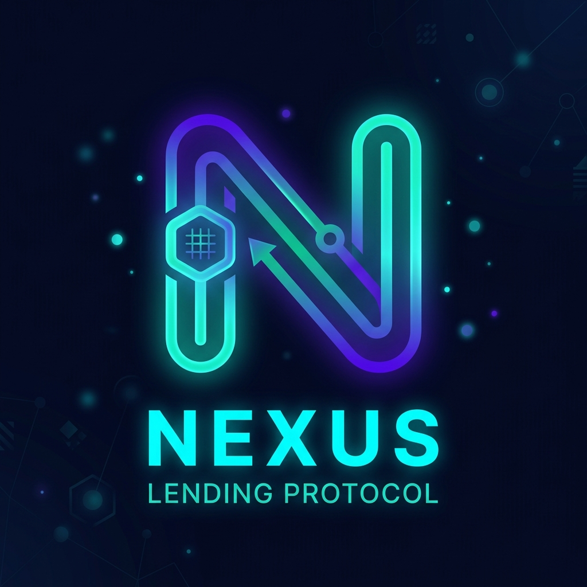
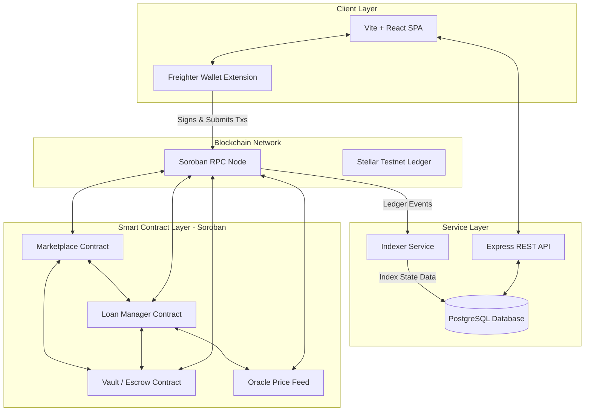
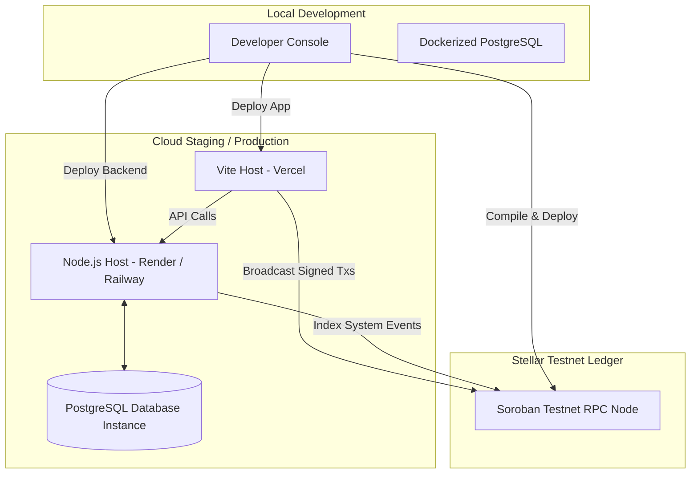
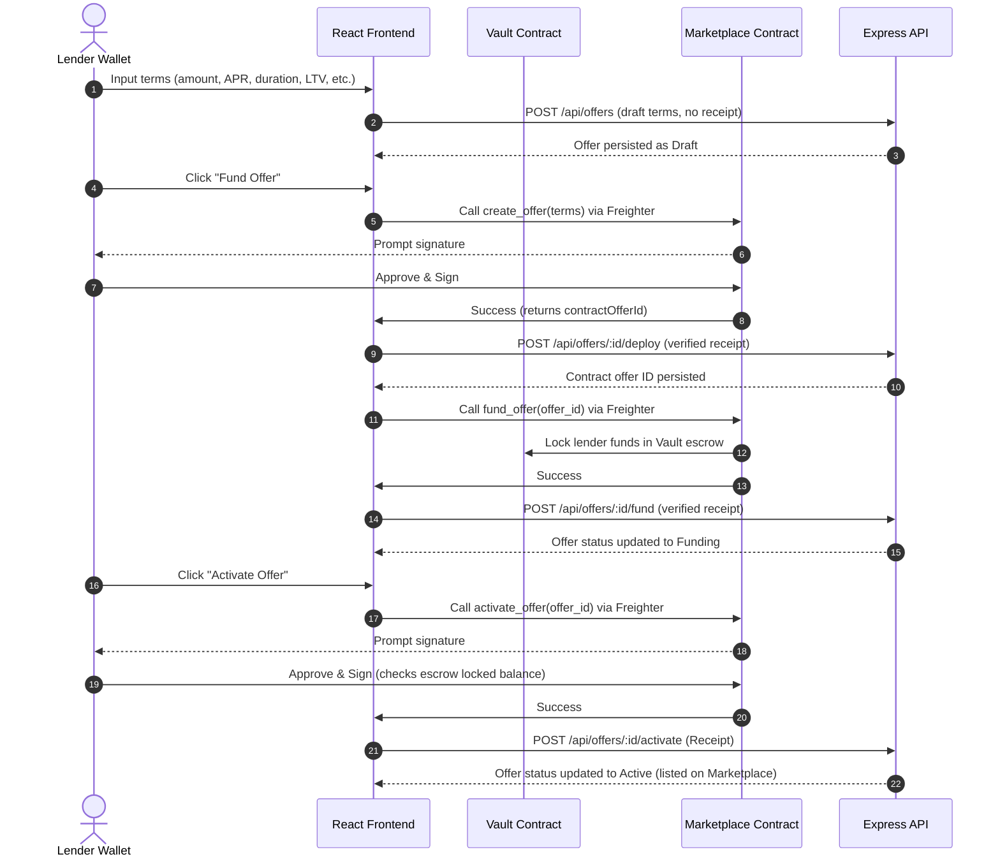
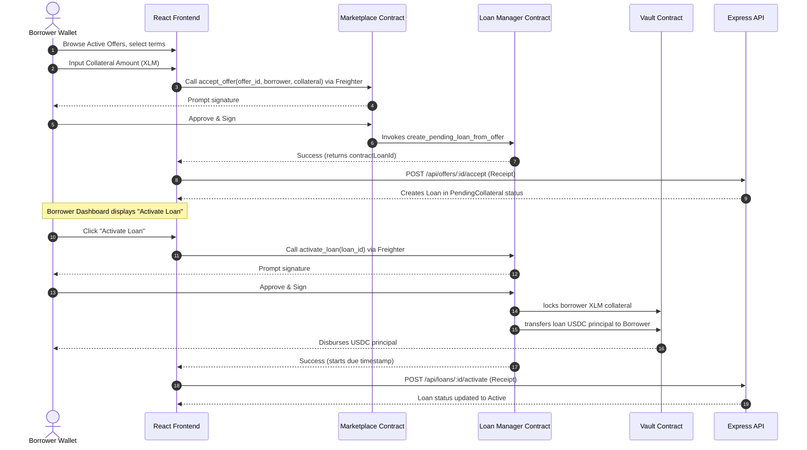
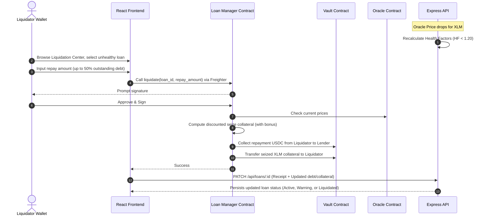
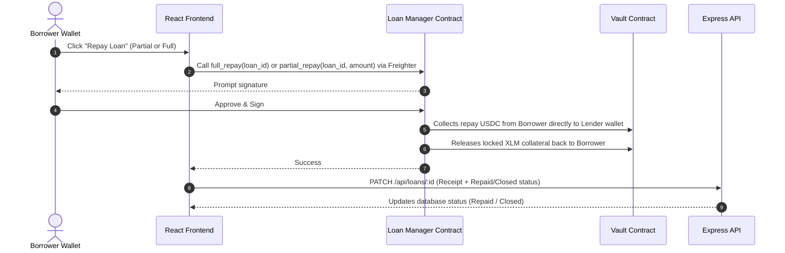
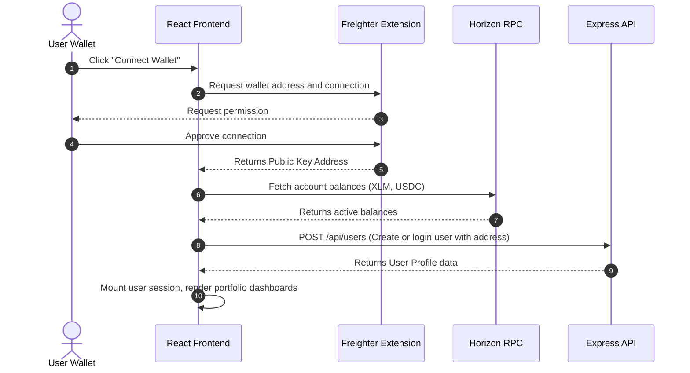

# <div align="center">Nexus Lending Protocol</div>

<div align="center">
  
</div>

<div align="center">
  <h3>Secure Decentralized P2P Fixed-Rate Isolated Lending Marketplace on Stellar Soroban</h3>
  <p>Isolated Debt Agreements • Fixed APR Terms • Real-time Oracle Valuation • Dynamic Health Factor Risk Management</p>
</div>

<div align="center">

[](https://github.com/TheAnh1404/NexusLending)
[](https://github.com/TheAnh1404/NexusLending/releases)
[](LICENSE)
[](https://www.typescriptlang.org/)
[](https://react.dev/)
[](https://nodejs.org/)

[](https://stellar.org/)
[](https://soroban.stellar.org/)
[](https://github.com/TheAnh1404/NexusLending/pulls)
[](https://stellar.org/events)
[](docs/11_SECURITY_RULES.md)

</div>

---

## 📖 Table of Contents

- [1. Project Overview](#1-project-overview)
  - [Problem Statement](#problem-statement)
  - [The Nexus Solution](#the-nexus-solution)
  - [Core Value Proposition](#core-value-proposition)
- [2. Screenshots & UI Gallery](#2-screenshots--ui-gallery)
- [3. System Architecture](#3-system-architecture)
  - [Overall System Architecture](#overall-system-architecture)
  - [Component Architecture](#component-architecture)
  - [Deployment Infrastructure](#deployment-infrastructure)
- [4. Protocol Business Flow](#4-protocol-business-flow)
  - [4.1 Lender Lifecycle](#41-lender-lifecycle)
  - [4.2 Borrower Lifecycle](#42-borrower-lifecycle)
  - [4.3 Liquidation Flow](#43-liquidation-flow)
  - [4.4 Repayment Lifecycle](#44-repayment-lifecycle)
  - [4.5 Wallet Connection & Auth Flow](#45-wallet-connection--auth-flow)
- [5. Project Directory Structure](#5-project-directory-structure)
- [6. Technology Stack](#6-technology-stack)
- [7. Feature Matrix](#7-feature-matrix)
- [8. Smart Contracts (Soroban / Rust)](#8-smart-contracts-soroban--rust)
  - [Crate Overview](#crate-overview)
  - [Contract Responsibilities & Core Functions](#contract-responsibilities--core-functions)
  - [Contract Interactions Matrix](#contract-interactions-matrix)
- [9. Database Schema (PostgreSQL / Prisma)](#9-database-schema-postgresql--prisma)
  - [Entity-Relationship Diagram](#entity-relationship-diagram)
  - [Data Model Reference](#data-model-reference)
- [10. API Documentation (Express REST Layer)](#10-api-documentation-express-rest-layer)
- [11. Protocol Security Architecture](#11-protocol-security-architecture)
- [12. Installation & Quick Start](#12-installation--quick-start)
  - [Prerequisites](#prerequisites)
  - [1. Smart Contracts Setup](#1-smart-contracts-setup)
  - [2. Backend Configuration](#2-backend-configuration)
  - [3. Frontend Configuration](#3-frontend-configuration)
  - [4. Database Migration & Seeding](#4-database-migration--seeding)
- [13. Environment Variables](#13-environment-variables)
- [14. Smart Contract Deployments](#14-smart-contract-deployments)
- [15. Protocol Roadmap](#15-protocol-roadmap)
- [16. Contributing](#16-contributing)
- [17. License](#17-license)

---

## 1. Project Overview

### Problem Statement

Existing decentralized lending markets (like Aave and Compound) are built on a **pooled liquidity model**. While highly efficient for instant swaps and borrowing, this architecture exhibits severe limitations:

1. **Systemic Interest Volatility:** Interest rates are variable, dictated by utilization curves. Lenders cannot guarantee a fixed yield, and borrowers face unpredictable funding costs.
2. **Shared Systemic Risk:** Capital is pooled together. A bad debt event or exploit in one isolated token pool can drain the entire system's liquidity, exposing all depositors to counterparty risk.
3. **Rigid Risk Terms:** Users must accept uniform risk limits (LTV, Liquidation Thresholds) set by DAO governance rather than defining terms suited to their specific collateral profiles.

### The Nexus Solution

Nexus introduces a **Peer-to-Peer (P2P) Isolated Lending Model** built on **Stellar Soroban** smart contracts. Every loan is an independent, 1-to-1 trustless debt agreement between exactly one lender and one borrower.

```
┌─────────────────┐                                  ┌─────────────────┐
│     Lender      │ ─── Create & Fund Term Offer ──> │                 │
└─────────────────┘                                  │  Vault Escrow   │
                                                     │   (Isolated)    │
┌─────────────────┐ ── Accept & Lock Collateral ───> │                 │
│    Borrower     │ <── Receive Loan Principal ──────└─────────────────┘
└─────────────────┘
```

* **1:1 Standalone Escrows:** There are no shared liquidity pools. Each loan has its own dedicated vault escrow. If a loan defaults, only that loan's collateral is impacted. There is zero systemic contamination.
* **Fixed APR:** Lenders set a fixed APR at offer creation. Borrowers lock in this rate upon matching. The yield terms are pre-calculated and remain immutable throughout the loan term.
* **Granular Risk Control:** Lenders define their own terms—Max LTV, Liquidation Threshold, Liquidation Bonus, Grace Period, and Minimum Health Factor—making the protocol highly adaptable for exotic collateral types.

### Core Value Proposition

* **Lenders:** Secure predictable, fixed-yield returns with locked collateral safety.
* **Borrowers:** Secure non-custodial capital at guaranteed interest rates, immune to rate spikes.
* **Liquidators:** Earn collateral arbitrage profits by restoring security to undercollateralized loans.
* **Sponsors:** Expand Stellar's credit utility using Soroban's native gas efficiency and security features.

---

## 2. Screenshots & UI Gallery

<p align="center">
  
  <br />
  <em>Figure 1: Protocol Telemetry Dashboard displaying global TVL, average Health Factors, risk zones, and live transactions.</em>
</p>

<details>
<summary>📸 Expand to View Full Gallery</summary>

### 🛒 Loan Marketplace
<p align="center">
  
  <br />
  <em>Explore open funding terms created by lenders, sorted by yield and duration.</em>
</p>

### 📥 Borrow Request Panel
<p align="center">
  
  <br />
  <em>Setup collateral parameters, analyze real-time Health Factor forecasts, and execute borrow requests.</em>
</p>

### 👛 Wallet Integration Hub
<p align="center">
  
  <br />
  <em>Freighter Wallet connection dashboard showing verified public keys, network configurations, and gas balances.</em>
</p>

### 📊 Vault Simulator
<p align="center">
  
  <br />
  <em>Interactive isolated vault simulator allowing users to stress-test their loan health against asset price fluctuations.</em>
</p>

### ⚙️ Admin Control Panel
<p align="center">
  
  <br />
  <em>Manage contract instances, configure token addresses, and view system logs.</em>
</p>

### 📉 Oracle Price Monitor
<p align="center">
  
  <br />
  <em>Real-time price feeds for XLM/USDC and global loan health recalculation panel.</em>
</p>

</details>

---

## 3. System Architecture

Nexus uses a modern, highly secure three-tier Web3 architecture. Off-chain database tables act as a fast indexed query layer, driven entirely by confirmed on-chain transaction receipts from the client.

### Overall System Architecture



### Component Architecture

```mermaid
graph LR
    subgraph ClientComponents [Frontend React Client]
        LendingCtx[LendingContext]
        FreighterAPI[@stellar/freighter-api]
        StellarSDK[@stellar/stellar-sdk]
        Pages[React Pages / Views]
    end

    subgraph BackendComponents [Backend Service]
        API_Routes[API Router]
        ChainReceipt[Chain Receipt Validator]
        PrismaClient[Prisma Client]
        Indexer[Background Event Indexer]
    end

    subgraph SorobanContracts [Soroban Rust Crate Workspace]
        SharedLib[shared ABI crate]
        MktContract[marketplace contract]
        LMContract[loan-manager contract]
        VaultContract[vault escrow contract]
        OracleContract[oracle contract]
    end

    Pages --> LendingCtx
    LendingCtx --> FreighterAPI
    LendingCtx --> StellarSDK
    LendingCtx --> API_Routes
    API_Routes --> ChainReceipt
    ChainReceipt --> PrismaClient
    Indexer --> PrismaClient
    Indexer -- "Queries RPC Events" --> SorobanContracts
```

### Deployment Infrastructure



---

## 4. Protocol Business Flow

Every state transition on Nexus is secured by Stellar RPC verification. Mutating backend routes require a confirmed, validated ledger receipt hash before committing changes.

### 4.1 Lender Lifecycle



### 4.2 Borrower Lifecycle



### 4.3 Liquidation Flow

Liquidation is enabled whenever a loan's Health Factor drops below `1.20` or remains unpaid past its grace period. It utilizes a **50% close factor**, meaning a liquidator repays up to half of the outstanding debt in exchange for seized collateral containing a liquidation bonus.



### 4.4 Repayment Lifecycle

Repayment can be executed as a partial repayment (restoring the Health Factor) or full repayment (releasing all locked collateral back to the borrower).



### 4.5 Wallet Connection & Auth Flow



---

## 5. Project Directory Structure

```filepath
Nexus/
├── assets/                    # Project documentation visuals
│   ├── logo/                  # Vector and raster logo files
│   ├── screenshots/           # UI walkthrough screenshots
│   ├── diagrams/              # Compiled architecture assets
│   └── banner/                # GitHub repository banner
├── backend/                   # Express API + Prisma indexer service
│   ├── prisma/                # PostgreSQL schema configuration and migrations
│   │   ├── migrations/        # SQL migration history
│   │   └── schema.prisma      # Unified database models
│   ├── src/                   # Node.js source code
│   │   ├── config/            # Server and Stellar client configuration
│   │   ├── middlewares/       # Schema validators and security middlewares
│   │   ├── modules/           # REST endpoints grouped by domain module
│   │   │   ├── indexer/       # Background RPC poller for contract events
│   │   │   ├── loans/         # Repayments, liquidations, and loan updates
│   │   │   ├── offers/        # Loan terms, draft creation, and match logic
│   │   │   ├── oracle/        # Asset price updates and health calculations
│   │   │   ├── transactions/  # Ledger receipts verification and log history
│   │   │   └── users/         # Profile registrations and address checks
│   │   ├── routes/            # Core router declarations
│   │   ├── server.ts          # Express bootstrapper
│   │   └── utils/             # Serializers and async wrappers
│   ├── tsconfig.json          # TypeScript compilation configuration
│   └── package.json           # Node dependencies list
├── contracts/                 # Rust Cargo workspace for Soroban smart contracts
│   ├── Cargo.toml             # Cargo workspace manifest
│   ├── loan-manager/          # Loan terms enforcement, LTV, HF, repayments, liquidations
│   ├── marketplace/           # Creation, funding, and activation of terms offers
│   ├── oracle/                # Timestamped price feeds storage
│   ├── shared/                # Workspace common error codes, constants, structs, and enums
│   └── vault/                 # Escrow custodian for lending principal and borrow collateral
├── deployments/               # Soroban compilation output artifacts
│   └── testnet.json           # Deployed contract addresses on Stellar Testnet
├── docs/                      # Architectural specs, Demo scenarios, and UI/UX Audits
└── frontend/                  # React client + Freighter wallet application
    ├── src/                   # React source code
    │   ├── app/               # Route router configurations
    │   ├── assets/            # Client static graphics
    │   ├── components/        # Isolated design components (common/ UI)
    │   ├── config/            # Frontend runtime configurations
    │   ├── contexts/          # LendingContext providing wallet and API binds
    │   ├── data/              # Mock fallbacks for developer sandbox mode
    │   ├── hooks/             # Custom React lifecycle bindings
    │   ├── layouts/           # Common views (Dashboard navigation templates)
    │   ├── pages/             # Application screen views (Borrower, Lender, Admin)
    │   ├── services/          # API services and on-chain contract invocations
    │   ├── types/             # Common TypeScript interfaces
    │   └── utils/             # Formatting and math calculators
    └── package.json           # React dependencies list
```

---

## 6. Technology Stack

Nexus is built with standard Web3 technologies for security, performance, and cross-platform compatibility:

| Layer | Technology | Version | Purpose |
| :--- | :--- | :--- | :--- |
| **Frontend** | [React](https://react.dev/) | `19.2.7` | UI runtime framework |
| | [Vite](https://vite.dev/) | `8.1.1` | Build and dev environment compiler |
| | [Ant Design](https://ant.design/) | `6.5.0` | UI component system |
| | [Framer Motion](https://www.framer.com/motion/) | `12.4.2` | Fluid micro-animations |
| | [Recharts](https://recharts.org/) | `3.9.1` | Data visualization charts |
| | [@stellar/freighter-api](https://www.freighter.app/) | `6.0.1` | Browser wallet extension bindings |
| | [TypeScript](https://www.typescriptlang.org/) | `~6.0.2` | Client compiler static typing |
| **Backend** | [Node.js (Express)](https://expressjs.com/) | `v18+` | REST API runtime server |
| | [Prisma ORM](https://www.prisma.io/) | `6.19.0` | Database modeling and queries |
| | [@stellar/stellar-sdk](https://github.com/stellar/js-stellar-sdk) | `16.0.1` | Transaction verification and RPC client |
| | [Zod](https://zod.dev/) | `4.1.12` | JSON payload validators |
| **Smart Contracts** | [Rust](https://www.rust-lang.org/) | `2021 Edition` | Contract source language |
| | [Soroban SDK](https://soroban.stellar.org/) | `25.3.1` | Stellar smart contract framework |
| **Database** | [PostgreSQL](https://www.postgresql.org/) | `15+` | Relational storage index |
| **DevOps & QA** | [Oxlint](https://github.com/oxc-project/oxc) | `1.71.0` | High-speed JavaScript linter |

---

## 7. Feature Matrix

### 👛 Wallet Integration
*   **Freighter Connection:** Connect browser extension securely, detecting network inconsistencies.
*   **Balance Queries:** Live lookup of native `XLM` and `USDC` token balances.
*   **Sandbox Faucets:** Developer sandbox toggle seeding balances for testing on testnet/sandboxes.

### 🛒 Lending Marketplace
*   **Interactive Offer Board:** Sort and search active lender terms by fixed yields, duration, and maximum LTV.
*   **Ltv limits validator:** Prevent acceptance if borrow ratio violates the lender's risk profiles.

### 📈 Risk Management (Health Factor & LTV)
*   **Dynamic Health Monitor:** Live risk categorization (🟢 Safe, 🟠 Warning, 🔴 Liquidation).
*   **Isolated Vault Simulator:** Interactive slide controls to test portfolio safety against XLM price drops.
*   **Debt Calculators:** Computes principal + fixed interest on-chain at match time.

### 🔴 Liquidation Engine
*   **Liquidation Center:** Lists loans currently below `1.2` HF or defaulted due to grace period expiration.
*   **50% Close Factor Enforcer:** Restricts liquidation repayment to a maximum of 50% of the loan's debt.
*   **Discount Incentives:** Distributes locked collateral to liquidators with a customizable bonus (default: 5%).

### ⚙️ Admin & Oracle Controls
*   **Price Feed Updater:** Form to modify asset values directly on the Oracle contract.
*   **System Recalculations:** Re-evaluate and transition risk statuses for active loans post price updates.

---

## 8. Smart Contracts (Soroban / Rust)

### Crate Overview

The smart contracts workspace is written in Rust, conforming to Soroban's WASM runtime standards. It uses an isolated, modular contract setup:

```
                  ┌──────────────────────┐
                  │  MarketplaceContract │
                  └──────────┬───────────┘
                             │
            Accept Offer     │     Lock Lender Funds
            (Accepts terms)  │     (Holds USDC)
                             ▼
  ┌──────────────────────────┴───────────┐      Release/Seize Assets
  │          LoanManagerContract         ├─────────────────────────┐
  └──────────────────────────┬───────────┘                         │
                             │                                     ▼
            Check Price      │                            ┌─────────────────┐
            (XLM/USDC)       │                            │  VaultContract  │
                             ▼                            └─────────────────┘
                  ┌──────────────────────┐
                  │    OracleContract    │
                  └──────────────────────┘
```

### Contract Responsibilities & Core Functions

#### 1. Marketplace Contract (`marketplace`)
Manages the lifecycle of lender terms offers.
*   `initialize(env, admin, vault_contract, loan_manager_contract)`: Connects dependencies.
*   `create_offer(...)`: Deploys new lending conditions. Registers loan asset, collateral asset, fixed APR, and duration.
*   `fund_offer(offer_id)`: Triggers vault transfer of USDC from lender to escrow.
*   `activate_offer(offer_id)`: Checks escrow holds funding, opens offer to borrowers.
*   `cancel_offer(offer_id)`: Releases funding from escrow, terminates the offer.
*   `accept_offer(offer_id, borrower, collateral)`: Locks borrower collateral, invokes loan initialization.

#### 2. Loan Manager Contract (`loan-manager`)
Maintains active loans, status machines, LTV parameters, and executes liquidations.
*   `create_pending_loan_from_offer(...)`: Initializes loan struct in `PendingCollateral` state.
*   `activate_loan(loan_id)`: Verifies LTV limits, locks borrower collateral, disburses USDC principal.
*   `add_collateral(loan_id, amount)`: Increases borrower collateral, updates status.
*   `partial_repay(loan_id, amount)`: Reduces debt, releases proportional collateral.
*   `full_repay(loan_id)`: Settles all outstanding debt, returns all locked collateral.
*   `liquidate(loan_id, liquidator, repay_amount)`: Checks liquidation eligibility, transfers repaid asset to lender, transfers seized collateral plus bonus to liquidator.

#### 3. Vault Contract (`vault`)
Acts as the single point of custody for all locked tokens.
*   `lock_lender_funds(offer_id, lender, asset, amount)`: Transfers lender principal.
*   `unlock_lender_funds(...)`: Releases lender principal.
*   `lock_borrower_collateral(...)`: Transfers collateral tokens to vault storage.
*   `release_borrower_collateral(...)`: Releases collateral back to borrower.
*   `transfer_loan_asset_to_borrower(...)`: Disburses principal upon activation.
*   `collect_repayment_from(...)`: Moves repayment funds directly from payer to lender.
*   `transfer_collateral_to_liq(...)`: Seizes collateral to liquidator address.

#### 4. Oracle Contract (`oracle`)
Stores verified asset pricing feeds.
*   `set_price_for_assets(base_asset, quote_asset, asset_pair, price, decimals, source)`: Inserts new pricing feed.
*   `get_price_for_assets(base_asset, quote_asset)`: Fetches price metadata.
*   `is_price_stale(asset_pair)`: Determines if data is older than `86,400` seconds (24 hours).

#### 5. Shared Crate (`shared`)
Contains common ABI types, errors, and constants:
*   `ContractError`: Enum listing validation failures (e.g. `LtvExceedsThreshold = 19`).
*   `LoanOffer` & `Loan`: Core entity definitions.
*   Constants: `BPS_DENOMINATOR = 10,000`, `SAFE_HEALTH_FACTOR_BPS = 14,000` (1.40), `LIQUIDATION_HEALTH_FACTOR_BPS = 12,000` (1.20).

### Contract Interactions & Frontend Function Matching Matrix

| Smart Contract | Rust Function Signature (`lib.rs`) | Frontend Integration Wrapper (`@stellar/stellar-sdk`) | User Auth Required |
| :--- | :--- | :--- | :--- |
| **Marketplace** | `create_offer(e, lender, terms)` | `createOffer(terms)` | Lender Signs |
| **Marketplace** | `fund_offer(e, offer_id, funder)` | `fundOffer(offerId, funder)` | Lender Signs |
| **Marketplace** | `activate_offer(e, offer_id)` | `activateOffer(offerId)` | Lender Signs |
| **Marketplace** | `accept_offer(e, offer_id, borrower, collateral)` | `acceptOffer(offerId, borrower, collateral)` | Borrower Signs |
| **Loan Manager**| `activate_loan(e, loan_id)` | `activateLoan(loanId)` | Borrower Signs |
| **Loan Manager**| `full_repay(e, loan_id)` | `fullRepay(loanId)` | Borrower Signs |
| **Loan Manager**| `partial_repay(e, loan_id, amount)` | `partialRepay(loanId, amount)` | Borrower Signs |
| **Loan Manager**| `liquidate(e, loan_id, liquidator, repay_amount)` | `liquidateLoan(loanId, liquidator, repay_amount)` | Liquidator Signs |
| **Oracle** | `set_price(e, asset, price, timestamp)` | `setPrice(asset, price, timestamp)` | Admin Signs |

### Contract Interactions Matrix

| Caller | Target Contract | Method | Purpose |
| :--- | :--- | :--- | :--- |
| **User** | `Marketplace` | `create_offer` | Drafts a new lending offer |
| **Lender** | `Marketplace` | `fund_offer` | Requests `Vault` to transfer lending principal |
| **Borrower** | `Marketplace` | `accept_offer` | Requests `LoanManager` to instantiate a pending loan |
| **Borrower** | `LoanManager` | `activate_loan` | Prompts `Vault` to lock collateral and release principal |
| **Borrower** | `LoanManager` | `full_repay` | Repays debt directly to lender, returns collateral |
| **Liquidator**| `LoanManager` | `liquidate` | Checks health against `Oracle`, repays debt, seizes collateral |
| **Admin** | `Oracle` | `set_price_for_assets`| Commits authenticated price updates |

---

## 9. Database Schema (PostgreSQL / Prisma)

The database serves as an indexer cache for fast frontend queries. All mutating transactions update the database only after verification of their on-chain transaction hash.

### Entity-Relationship Diagram

```
┌────────────────┐          1:N          ┌────────────────┐
│   LoanOffer    ├──────────────────────>│      Loan      │
│                │                       │                │
│  id (PK)       │                       │  id (PK)       │
│  lenderWallet  │                       │  borrowerWallet│
│  loanAsset     │                       │  lenderWallet  │
│  loanAmount    │                       │  offerId (FK)  │
│  fixedAprBps   │                       │  principal     │
│  status        │                       │  outstanding   │
└────────────────┘                       │  status        │
                                         └────────────────┘

┌────────────────┐                       ┌────────────────┐
│  OraclePrice   │                       │  Transaction   │
│                │                       │                │
│  id (PK)       │                       │  id (PK)       │
│  assetPair     │                       │  txHash        │
│  price         │                       │  type          │
│  decimals      │                       │  wallet        │
│  updatedAt     │                       │  status        │
└────────────────┘                       └────────────────┘
```

### Data Model Reference

<details>
<summary>📋 Click to View Prisma Model Fields</summary>

#### `User`
Tracks connected wallet profiles.
*   `id`: String (PK, cuid)
*   `wallet`: String (Unique index, public key)
*   `role`: Enum (`LENDER`, `BORROWER`, `LIQUIDATOR`)
*   `displayName`: String (Optional)
*   `createdAt` & `updatedAt`: DateTime

#### `LoanOffer`
Stores lending conditions created on the marketplace.
*   `id`: String (PK, cuid)
*   `contractOfferId`: BigInt (Unique, links directly to Soroban ID)
*   `lenderWallet`: String (lender key)
*   `loanAsset` & `collateralAsset`: String (Asset addresses)
*   `loanAmount`: Decimal (30, 7)
*   `fixedAprBps` & `durationDays`: Int
*   `maxLtvBps`, `liquidationThresholdBps`, `liquidationBonusBps`, `gracePeriodDays`: Int
*   `status`: Enum (`Draft`, `Funding`, `Active`, `Matched`, `Cancelled`, `Expired`)
*   `txHash`, `explorerUrl`, `ledger`, `blockTimestamp`: Transaction telemetry

#### `Loan`
Stores active matched debt agreements.
*   `id`: String (PK, cuid)
*   `contractLoanId`: BigInt (Unique, links to Soroban ID)
*   `offerId`: String (FK referencing `LoanOffer`)
*   `borrowerWallet` & `lenderWallet`: String
*   `principal` & `outstandingDebt`: Decimal (30, 7)
*   `collateralAmount`: Decimal (30, 7)
*   `startTime` & `dueTime`: DateTime
*   `healthFactor` & `ltv`: Decimal
*   `riskZone`: Enum (`SAFE`, `WARNING`, `LIQUIDATION_PLANNING`)
*   `status`: Enum (`PendingCollateral`, `Active`, `Warning`, `LiquidationPlanning`, `Repaid`, `Closed`, `Expired`, `Defaulted`, `Liquidated`)
*   `txHash`, `explorerUrl`, `ledger`, `blockTimestamp`: Transaction telemetry

#### `OraclePrice`
Stores cached pricing data from the on-chain Oracle.
*   `id`: String (PK, cuid)
*   `assetPair`: String (Unique, e.g. "XLM/USDC")
*   `price`: Decimal (30, 12)
*   `decimals`: Int
*   `source`: String

#### `Transaction`
Audit log of all registered mutations.
*   `id`: String (PK, cuid)
*   `txHash`: String (Unique index)
*   `explorerUrl`: String
*   `type`: Enum (e.g. `CREATE_OFFER`, `ACTIVATE_LOAN`, `LIQUIDATE`)
*   `wallet`: String
*   `amount`: Decimal
*   `status`: String (Default: "CONFIRMED")
*   `blockTimestamp`: DateTime

</details>

---

## 10. API Documentation (Express REST Layer)

Mutating endpoints require a valid Stellar transaction receipt inside the request body before updates are saved.

| Method | Endpoint | Purpose | Payload Requirements |
| :--- | :--- | :--- | :--- |
| **GET** | `/api/offers` | List offers (marketplace) | Query params: `status`, `marketplaceOnly` |
| **GET** | `/api/offers/:id` | Get offer by DB ID | None |
| **POST** | `/api/offers` | Create local draft terms | `{ lenderWallet, loanAmount, fixedAprBps, ... }` |
| **POST** | `/api/offers/:id/deploy` | Persist verified `create_offer` receipt and contract offer ID | Confirmed receipt + `wallet` |
| **POST** | `/api/offers/:id/fund` | Transition offer to Funding | Confirmed receipt + `wallet` |
| **POST** | `/api/offers/:id/sync-chain` | Read and sync current on-chain offer state | `{ wallet }` |
| **POST** | `/api/offers/:id/activate` | Transition offer to Active | Confirmed receipt + `wallet` |
| **POST** | `/api/offers/:id/cancel` | Cancel offer (Draft/Funding/Active) | Confirmed receipt + `wallet` |
| **POST** | `/api/offers/:id/expire` | Expire offer | Confirmed receipt + `wallet` |
| **POST** | `/api/offers/:id/accept` | Accept active offer (creates Loan)| Confirmed receipt + `borrowerWallet` + `collateralAmount` |
| **GET** | `/api/loans` | List active loans | Query params: `status`, `borrowerWallet`, `riskZone` |
| **GET** | `/api/loans/liquidatable`| List loans eligible for liquidation| None |
| **GET** | `/api/loans/:id` | Get loan details | None |
| **POST** | `/api/loans/:id/activate`| Activate loan (disburses principal) | `{ txHash, explorerUrl, ledger, wallet }` |
| **PATCH**| `/api/loans/:id` | Apply verified loan action (`ADD_COLLATERAL`, `PARTIAL_REPAY`, `FULL_REPAY`, `LIQUIDATE`) | Confirmed receipt + `wallet` + action amount |
| **GET** | `/api/oracle/prices` | Get current cached asset prices | None |
| **POST** | `/api/oracle/prices` | Update price in DB (admin only) | `{ txHash, explorerUrl, ledger, assetPair, price, decimals, source }` |
| **POST** | `/api/oracle/recalculate-health` | Recalculate health factors | None |
| **GET** | `/api/transactions` | List transaction receipts | Query params: `wallet`, `relatedWallet`, `type`, `loanId`, `offerId` |
| **POST** | `/api/transactions` | Log confirmed transaction | Confirmed receipt + `type`, `wallet`, `amount`, `asset` |

---

## 11. Protocol Security Architecture

Nexus is built from the ground up for transaction integrity, price safety, and asset custody.

```
┌────────────────────────────────────────────────────────┐
│                   SECURITY CONTROLS                    │
├───────────────────┬───────────────────┬────────────────┤
│      Escrow       │      Oracle       │    Receipt     │
│    Isolation      │    Staleness      │   Validation   │
├───────────────────┼───────────────────┼────────────────┤
│  Vault controls   │  24hr expiration  │ DB updates fail│
│  all assets. 1:1  │  checks. Refuses  │ without verified│
│  isolation.       │  stale prices.    │ Stellar hashes.│
└───────────────────┴───────────────────┴────────────────┘
```

1. **Escrow Isolation:** All loan assets and borrower collateral are held inside the `Vault` contract. Assets are only released when:
    * The borrower performs a repayment (`full_repay` or `partial_repay`).
    * A liquidator triggers a liquidation due to a low Health Factor (<1.20) or Default.
2. **Oracle Protection:** The `Oracle` contract enforces strict timing invariants. The method `is_price_stale()` marks any price feed older than 24 hours as invalid, preventing transactions from running on outdated prices.
3. **Transaction Receipt Validation:** The backend REST API does not sign transactions. Instead, the frontend submits the user-signed transaction to Stellar, and sends the resulting receipt containing `txHash`, `ledger` number, and `explorerUrl` to the backend. The backend validates this hash before updating the database.
4. **Replay Protection:** Stellar Soroban's native account sequence checks protect all transactions from replay attacks.
5. **Access Control:** Smart contract administrative actions, such as dependency links and initializations, use Soroban's native `require_auth()` mechanism, ensuring only authorized addresses can modify parameters.

---

## 12. Installation & Quick Start

### Prerequisites

Ensure you have the following installed on your machine:
*   [Node.js](https://nodejs.org/) (v18 or higher)
*   [Rust & Cargo](https://www.rust-lang.org/tools/install) (2021 Edition)
*   [Stellar CLI](https://developers.stellar.org/docs/build/smart-contracts/getting-started/setup) (v25+)
*   [PostgreSQL](https://www.postgresql.org/) database instance

---

### 1. Smart Contracts Setup

1. Navigate to the contracts directory:
   ```bash
   cd contracts
   ```
2. Run tests to verify the smart contracts logic:
   ```bash
   cargo test --workspace
   ```
   *For Windows users facing file target locks:*
   ```powershell
   $env:CARGO_INCREMENTAL='0'; cargo test --workspace --target-dir ..\.tmp\contracts-target -j 1
   ```
3. Compile contract targets into optimized `.wasm` bytecodes:
   ```bash
   stellar contract build
   ```

---

### 2. Backend Configuration

1. Navigate to the backend folder:
   ```bash
   cd ../backend
   ```
2. Install dependencies:
   ```bash
   npm install
   ```
3. Copy environment configuration:
   ```bash
   cp .env.example .env
   ```
4. Edit the `.env` file and replace the `DATABASE_URL` with your PostgreSQL connection string, and fill in the deployed contract IDs (you can find these in `deployments/testnet.json`).

---

### 3. Frontend Configuration

1. Navigate to the frontend folder:
   ```bash
   cd ../frontend
   ```
2. Install dependencies:
   ```bash
   npm install
   ```
3. Copy environment configuration:
   ```bash
   cp .env.example .env
   ```
4. Verify `VITE_API_URL` points to the backend server (e.g. `http://localhost:5000`).

---

### 4. Database Migration & Seeding

Before starting the server, run the database migrations and seed it with initial values:

1. Return to the backend folder:
   ```bash
   cd ../backend
   ```
2. Run database migrations:
   ```bash
   npx prisma migrate dev --name init
   ```
3. Seed the database with assets and mock oracle prices:
   ```bash
   npm run prisma:seed
   ```
4. Start the backend server:
   ```bash
   npm run dev
   ```

Now, start the frontend development server:
1. Open a new terminal and navigate to the frontend folder:
   ```bash
   cd frontend
   ```
2. Run Vite dev server:
   ```bash
   npm run dev
   ```
3. Open `http://localhost:5173` in your browser. Ensure you have the [Freighter Wallet](https://www.freighter.app/) extension installed and switched to Stellar Testnet.

---

## 13. Environment Variables

### Backend Configuration (`backend/.env`)

| Variable | Type | Description | Default |
| :--- | :--- | :--- | :--- |
| `DATABASE_URL` | String | PostgreSQL database connection string | `postgresql://...` |
| `PORT` | Number | Server runtime port | `5000` |
| `FRONTEND_URL` | String | Allowed CORS origin | `http://localhost:5173` |
| `STELLAR_NETWORK` | String | Stellar network configuration | `testnet` |
| `STELLAR_RPC_URL`| String | Stellar RPC endpoint | `https://soroban-testnet.stellar.org:443`|
| `STELLAR_READ_SOURCE_ACCOUNT` | String | Optional read-only source account for contract simulations | Empty |
| `MARKETPLACE_CONTRACT_ID` | String | Marketplace contract address | Deployed address |
| `LOAN_MANAGER_CONTRACT_ID`| String | Loan Manager contract address | Deployed address |
| `ORACLE_CONTRACT_ID` | String | Oracle Price Feed contract address | Deployed address |
| `VAULT_CONTRACT_ID` | String | Vault escrow contract address | Deployed address |

### Frontend Configuration (`frontend/.env`)

| Variable | Type | Description | Default |
| :--- | :--- | :--- | :--- |
| `VITE_API_URL` | String | Endpoint of backend REST API server | `http://localhost:5000` |
| `VITE_DATA_MODE` | String | Backend query layer mode (`api` or `mock`) | `api` |
| `VITE_CHAIN_MODE` | String | Transaction execution layer (`live` or local `mock`; ignored as live when `VITE_DATA_MODE=api`) | `live` |
| `VITE_ADMIN_WALLET_ADDRESS`| String| Admin address for pricing updates | Wallet address |
| `VITE_STELLAR_NETWORK`| String | Stellar network target | `testnet` |
| `VITE_MARKETPLACE_CONTRACT_ID`| String | Deployed marketplace contract ID | Deployed address |
| `VITE_LOAN_MANAGER_CONTRACT_ID`|String | Deployed loan manager contract ID | Deployed address |
| `VITE_ORACLE_CONTRACT_ID`| String | Deployed oracle contract ID | Deployed address |
| `VITE_VAULT_CONTRACT_ID` | String | Deployed vault contract ID | Deployed address |
| `VITE_USDC_ASSET_CODE` | String | Stellar classic asset code for balance/trustline lookup | `USDC` |
| `VITE_USDC_ISSUER` | String | Real Stellar issuer used for Horizon balance lookup and classic DEX trustline flow | Empty |
| `VITE_USDC_CONTRACT_ID` | String | Optional Soroban SAC contract ID for USDC | Derived from issuer or empty |

---

## 14. Smart Contract Deployments

The following contracts are currently deployed on **Stellar Testnet**:

*   **Deployer Public Key:** `GBPRBYNTXJYTWVOP2WB62FZWHCUTCIB5SNX6KLJPIOOEH4QURLIFN3XK`
*   **Stellar RPC Endpoint:** `https://soroban-testnet.stellar.org:443`
*   **Deployment Timestamp:** `2026-07-07T15:02:57.5724067+07:00`

| Contract Name | Contract ID | Explorer Link |
| :--- | :--- | :--- |
| **Marketplace** | `CDSGIW54X2RKDBO45MWALEVFTQSPSVBHVJHWKNXPH6I45X53O3VKSPTQ` | [View on Stellar Expert](https://stellar.expert/explorer/testnet/contract/CDSGIW54X2RKDBO45MWALEVFTQSPSVBHVJHWKNXPH6I45X53O3VKSPTQ) |
| **Loan Manager** | `CAYTXKDN2234LNH2VMZJQ4WLE4QLMZRDA6GMAYB2MBRNIHNHPT4HSNGI` | [View on Stellar Expert](https://stellar.expert/explorer/testnet/contract/CAYTXKDN2234LNH2VMZJQ4WLE4QLMZRDA6GMAYB2MBRNIHNHPT4HSNGI) |
| **Vault** | `CD55UGC2V2W4GQCZUOJNGBCBMCDFM5W3OEKJAFUKJ36AEPWIPFKAYUKK` | [View on Stellar Expert](https://stellar.expert/explorer/testnet/contract/CD55UGC2V2W4GQCZUOJNGBCBMCDFM5W3OEKJAFUKJ36AEPWIPFKAYUKK) |
| **Oracle Price Feed** | `CAJ4XISOJBHJOCLYF5722T27ZF3UZ57P7DEZ4I462CRC7X5QYQPH63DC` | [View on Stellar Expert](https://stellar.expert/explorer/testnet/contract/CAJ4XISOJBHJOCLYF5722T27ZF3UZ57P7DEZ4I462CRC7X5QYQPH63DC) |

---

## 15. Protocol Roadmap

### 🚀 MVP Scope & Core Features (Completed)
- [x] **Freighter Wallet Integration:** Connect and authenticate via Freighter extension with live balance queries fetching directly from the Horizon Stellar Testnet API.
- [x] **Consolidated Borrow Workflow:** Seamlessly accept lending offers and activate the loan on-chain (locking collateral and disbursing principal) in a single-click UI flow.
- [x] **Smart Contracts Workspace:** Four fully completed Rust contracts on Stellar Soroban (`marketplace`, `loan-manager`, `vault`, `oracle`) plus shared ABI crate, with the current workspace test suite passing.
- [x] **Escrow Isolation:** Zero shared liquidity risk. Each loan utilizes a dedicated, standalone vault escrow on-chain.
- [x] **Dynamic Risk Management (Health Factor):** Real-time calculation and display of loan health factors based on oracle prices, categorized into Safe (🟢), Warning (🟠), and Liquidation (🔴) zones.
- [x] **Automatic Expiration & Default Warning:** Overdue loans auto-transition to `Expired` and raise warning banners, followed by transition to `Defaulted` after the 7-day grace period, making them liquidatable.
- [x] **Liquidation Engine:** Undercollateralized loans (HF < 1.2) and defaulted loans become liquidatable at a 50% close factor with a 5% liquidation bonus.
- [x] **Stellar Expert Block Explorer:** Embedded deep-links to Stellar Expert explorer for transactions, accounts, and deployed smart contract instances.
- [x] **Database Caching & Indexing:** PostgreSQL database indexed via a Node.js event polling `IndexerService` to sync on-chain events and expose fast REST APIs.

### 🔮 Future Roadmap
- [ ] **Decentralized Oracle Integration:** Connect to Dia or Band Protocol networks for decentralized pricing.
- [ ] **Shortened Staleness Window:** Decrease the price expiration threshold from 24 hours to 1 hour for volatile tokens.
- [ ] **Multi-Collateral Support:** Allow borrowers to lock multiple token assets (e.g. XLM, USDC, native assets) within a single isolated vault.

---

## 16. Contributing

Thank you for your interest in contributing to the Nexus Lending Protocol! We welcome developers, technical writers, and designers to improve our codebase.

1.  **Fork the Repository:** Create a personal fork on GitHub.
2.  **Create a Feature Branch:** Choose a descriptive branch name:
    ```bash
    git checkout -b feature/add-liquidation-receipt
    ```
3.  **Implement Changes:** Follow the project's coding standards. Ensure you run the linter and tests before committing:
    *   **Contracts:** `cargo test --workspace`
    *   **Backend:** `npm run build`
    *   **Frontend:** `npm run lint` and `npm run build`
4.  **Open a Pull Request:** Describe the purpose of your modifications, link any related issues, and attach snapshots of changes made.

---

## 17. License

This project is licensed under the MIT License - see the [LICENSE](LICENSE) file for details.

---

<div align="center">
  <sub>Built with ❤️ by the Nexus Maintainers and the Stellar Community.</sub>
</div>
