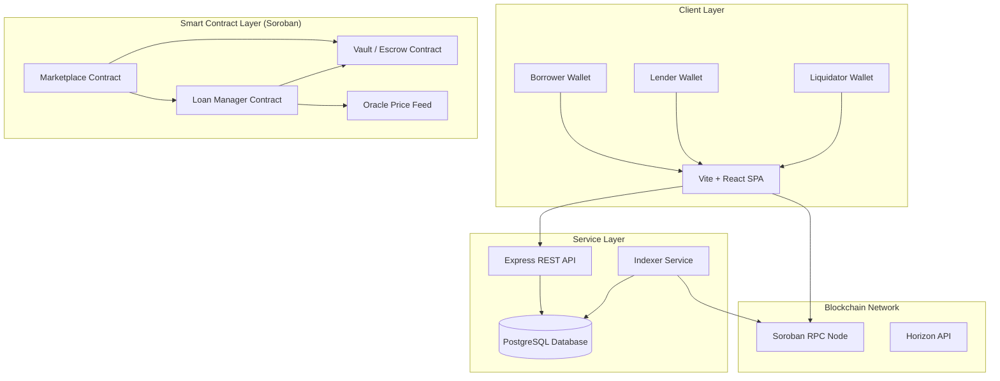

# Nexus Lending Protocol

[](https://stellar.org/)
[-orange.svg)](https://soroban.stellar.org/)
[](https://expressjs.com/)
[](https://react.dev/)

A premium, collateralized peer-to-peer (P2P) fixed-rate lending marketplace built on the **Stellar Soroban** smart contract platform. Nexus enables trustless, isolated debt agreements where lenders define fixed yield terms and borrowers lock XLM collateral to secure loans, managed with real-time risk tracking.

---

## 📖 Table of Contents

- [1. Core Protocol Philosophy](#1-core-protocol-philosophy)
- [2. System Architecture](#2-system-architecture)
- [3. Project Directory Structure](#3-project-directory-structure)
- [4. Smart Contracts (Rust / Soroban)](#4-smart-contracts-rust--soroban)
- [5. Backend API & Indexer (Express / TypeScript / Prisma)](#5-backend-api--indexer-express--typescript--prisma)
- [6. Frontend Client (Vite / React / TypeScript)](#6-frontend-client-vite--react--typescript)
- [7. Transaction Lifecycle Audit](#7-transaction-lifecycle-audit)
- [8. Installation & Quick Start](#8-installation--quick-start)
- [9. Technical Limitations & Next Steps](#9-technical-limitations--next-steps)

---

## 1. Core Protocol Philosophy

Unlike pool-based lending protocols (such as Aave or Compound) which pool liquidity and use dynamic utilization curves to determine interest rates, Nexus relies on a **P2P Isolated Lending Model**:

*   **1:1 Standalone Loans:** Every loan is an independent, isolated contract agreement between exactly one lender and one borrower. There are no shared liquidity pools and zero shared counterparty risk.
*   **Fixed APR:** Interest rates are immutable, determined by the lender during offer creation, and pre-calculated inside the contract upon matching.
*   **Dynamic Health Factor (HF):** Risk is continuously evaluated using real-time asset pricing from an oracle feed:
    $$\text{Health Factor} = \frac{\text{Collateral Value} \times \text{Liquidation Threshold BPS}}{\text{Outstanding Debt} \times 10,000}$$
*   **Structured Risk Zones:**
    *   🟢 **SAFE** ($HF \ge 1.4$): Active and fully healthy.
    *   🟠 **WARNING** ($1.2 \le HF < 1.4$): High-risk zone; borrower should add collateral or perform a partial repayment.
    *   🔴 **LIQUIDATION PLANNING** ($HF < 1.2$): Liquidatable; liquidators can repay debt to seize collateral.

---

## 2. System Architecture

Nexus uses a modern three-tier architecture:



---

## 3. Project Directory Structure

```filepath
.
├── backend/                 # Express API + Prisma indexer service
├── contracts/               # Soroban smart contracts written in Rust
│   ├── loan-manager/        # Collateral valuation, HF calculation, repayments, liquidations
│   ├── marketplace/         # Handles lending offer creation, funding, and matching
│   ├── oracle/              # Mockable on-chain price storage
│   ├── vault/               # Escrow custodian for lender tokens and borrower collateral
│   └── shared/              # Rust ABI structs, constants, and custom error types
├── deployments/             # Compiled .wasm files and network deployment scripts
├── docs/                    # Architectural documents and product specifications
└── frontend/                # Vite React client with Freighter wallet integration
```

---

## 4. Smart Contracts (Rust / Soroban)

The smart contracts are located in the `contracts/` workspace. They handle the core trustless state of the protocol.

### Contracts Overview

1.  **Marketplace (`marketplace`):** Manages the lifecycle of loan offers: `Draft -> Funding -> Active -> Matched`.
2.  **Vault (`vault`):** Custodies assets, locks borrower collateral, releases tokens upon repayment, and transfers seized assets to liquidators.
3.  **Loan Manager (`loan-manager`):** Manages the loan lifecycle: `PendingCollateral -> Active/Warning/LiquidationPlanning -> Repaid/Liquidated`. Calculates LTV and Health Factor.
4.  **Oracle (`oracle`):** Stores timestamped price feeds for assets (e.g., XLM/USDC) updated via authorized administrators.
5.  **Shared (`shared`):** An ABI-only package containing structs (e.g., `LoanOffer`, `Loan`), enums, and constants (like `BPS_DENOMINATOR = 10,000`).

### Contract Compilation & Testing

Ensure you have Rust and the Soroban CLI installed.

```bash
cd contracts
cargo test --workspace
```

*For Windows environments facing target file locks, use:*
```powershell
$env:CARGO_INCREMENTAL='0'; cargo test --workspace --target-dir ..\.tmp\contracts-target -j 1
```

---

## 5. Backend API & Indexer (Express / TypeScript / Prisma)

Located in `backend/`, this service operates as an off-chain database and indexing layer. It does not custody assets or sign transactions.

### Key Responsibilities
*   Serves endpoints to fetch active offers, loan portfolios, health analytics, and system TVL.
*   Runs a background `IndexerService` to poll Soroban RPC for contract events (e.g., `offer_created`, `loan_activated`) and update PostgreSQL state.
*   Enforces transaction receipt validation to prevent database tampering.

### API Endpoints
*   **Offers:** `GET /api/offers`, `GET /api/offers/:id`, `POST /api/offers`, `PATCH /api/offers/:id/status`
*   **Loans:** `GET /api/loans`, `GET /api/loans/liquidatable`, `GET /api/loans/:id`, `POST /api/loans`, `PATCH /api/loans/:id`
*   **Oracle:** `GET /api/oracle/prices`, `POST /api/oracle/recalculate-health`
*   **Transactions:** `POST /api/transactions` (Logs validated receipts)

---

## 6. Frontend Client (Vite / React / TypeScript)

Located in `frontend/`, this is a fully fledged Single Page Application designed using **Ant Design** and custom CSS variables.

### Key Features
*   **Freighter Wallet Connection:** Authentic wallet connection. Note: Connection currently seeds a mock testing balance (`250,000 XLM` and `50,000 USDC`) for developers on Sandbox.
*   **Lender Dashboard:** Create, fund, and activate offers.
*   **Borrower Dashboard:** Explore the marketplace, request loans, view active loan details, and add collateral or repay to restore Health Factor.
*   **Liquidation Center:** Identify and execute partial liquidations for positions where $HF < 1.2$.
*   **Oracle Monitor:** View current and historical prices updated by the Oracle contract.

---

## 7. Transaction Lifecycle Audit

To guarantee security, the backend employs a strict write-through policy based on confirmed on-chain events:

```
[ Frontend ] --(Builds Tx)--> [ Freighter Wallet ] --(Signs)--> [ Stellar RPC ]
                                                                       │
                                                                   (Confirm)
                                                                       ▼
[ UI Refresh ] <--(Update DB)--( [ Backend REST ] <--(Sends Receipt)-- [ Frontend ]
```

1.  **Execution:** The frontend initiates a transaction via Freighter.
2.  **Confirmation:** The transaction is signed and submitted to Stellar Testnet RPC.
3.  **Receipt Handling:** On a `SUCCESS` status, the frontend obtains the real `txHash`, `ledger` block, contract return value, and explorer link.
4.  **Submission:** The receipt is sent to the backend.
5.  **Validation:** The backend verifies transaction validity and updates the local PostgreSQL database.

---

## 8. Installation & Quick Start

Follow these steps to run the complete stack locally.

### Prerequisites
*   Node.js (v18+)
*   Rust + Cargo (`stellar-cli` recommended for contract work)
*   PostgreSQL Database instance

### Step 1: Deploy & Test Contracts
Compile and test the smart contracts to verify the business logic.
```bash
cd contracts
cargo test --workspace
```

### Step 2: Set Up Backend
Configure and launch the REST API server.
```bash
cd backend
npm install
cp .env.example .env
# Edit .env with your local PostgreSQL DATABASE_URL and local/testnet contract addresses
npx prisma generate
npx prisma migrate dev --name init
npm run dev
```

### Step 3: Run Frontend
Configure and start the Vite development server.
```bash
cd frontend
npm install
cp .env.example .env
# Edit .env to set your VITE_API_URL pointing to the backend
npm run dev
```

The application will run locally at `http://localhost:5173`.

---

## 9. Technical Limitations & Next Steps

*   **Oracle Decentralization:** Currently, oracle prices are admin-updated. Integration with a decentralized oracle network (e.g., Band Protocol or Dia) is planned for Phase 2.
*   **Staleness Window:** The contract uses a hardcoded 24-hour staleness check. This should be shortened for highly volatile assets.
*   **Soroban API Limits:** The vault uses `transfer_collateral_to_liq` instead of `transfer_collateral_to_liquidator` to respect the 32-character Soroban function name limit.
*   **Freighter Sandbox Integration:** Replace hardcoded balance overrides with live Horizon balance checks for user wallets.
