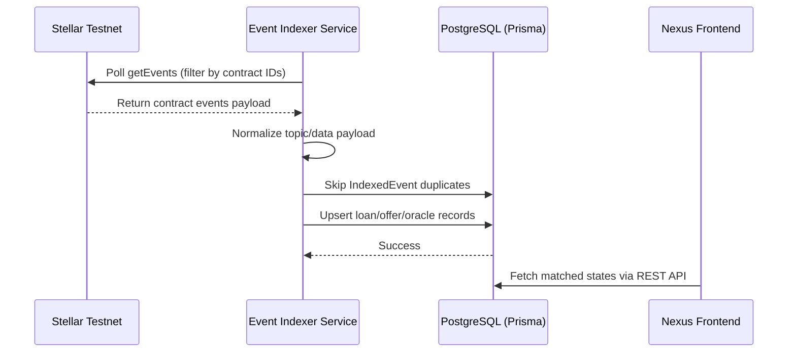

# Stellar Soroban Event Indexer

This directory contains the Soroban event indexer used by the backend to keep PostgreSQL synchronized with on-chain protocol activity. The indexer polls Stellar RPC, normalizes contract events, deduplicates by `(txHash, eventIndex)`, and applies the same database synchronization rules used by verified mutation endpoints.

## Architecture Overview

## Contract IDs

Contract IDs are read from backend environment configuration:

- `ORACLE_CONTRACT_ID`
- `VAULT_CONTRACT_ID`
- `MARKETPLACE_CONTRACT_ID`
- `LOAN_MANAGER_CONTRACT_ID`

## Event Types & Database Mapping

| Contract | Event Topic (ScVal Symbol) | Event Data Payload | DB Update Action |
| --- | --- | --- | --- |
| **Marketplace** | `offer_created` | offer id, lender, amount fields | Upsert `LoanOffer` with `contractOfferId`. |
| **Marketplace** | `offer_funded` | offer id, funder, amount | Mark offer as funded when known locally. |
| **Marketplace** | `offer_activated` | offer id, actor | Mark offer `Active`. |
| **Marketplace** | `offer_cancelled` | offer id, actor | Mark offer `Cancelled`. |
| **Marketplace** | `offer_expired` | offer id, actor | Mark offer `Expired`. |
| **Marketplace** | `offer_matched` | offer id, loan id, borrower, collateral amount | Create or update `Loan`; mark offer `Matched`. |
| **Loan Manager** | `loan_created` | loan id, borrower, lender | Create or update pending loan when enough state can be read. |
| **Loan Manager** | `loan_activated` | loan id, actor | Read chain loan and mark `Active`. |
| **Loan Manager** | `loan_state_updated` | loan id, state | Refresh loan risk/status from chain. |
| **Loan Manager** | `collateral_added` | loan id, borrower, amount | Read chain loan and refresh collateral/risk fields. |
| **Loan Manager** | `partial_repaid` | loan id, borrower, amount | Read chain loan and refresh outstanding debt. |
| **Loan Manager** | `loan_repaid` | loan id, borrower, amount | Mark loan `Repaid` after chain read. |
| **Loan Manager** | `loan_expired` | loan id, actor | Mark loan `Expired`. |
| **Loan Manager** | `loan_defaulted` | loan id, actor | Mark loan `Defaulted`. |
| **Loan Manager** | `loan_liquidated` | loan id, liquidator, amount | Mark loan `Liquidated` after chain read. |
| **Oracle** | `price_updated` | asset, price | Upsert latest oracle price metadata. |

## Event Deduplication & Safety

To prevent double-processing events:

1. `IndexedEvent` has a unique constraint on `(txHash, eventIndex)`.
2. `EventSyncService` checks this key before applying business-state changes.
3. `IndexerCheckpoint` stores the last synced ledger and operational counters.
4. The API verification path also writes `IndexedEvent`, so background polling safely ignores transactions already handled by mutation endpoints.

Detailed architecture and security notes live in `docs/backend/BLOCKCHAIN_VERIFICATION.md`.
