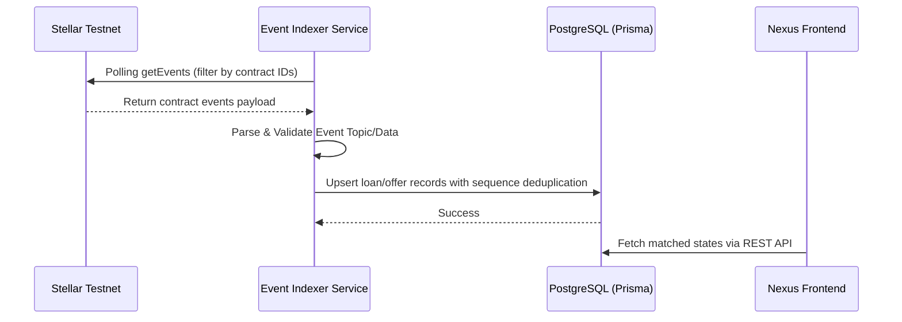

# Stellar Soroban Event Indexer Design

This directory houses the design and MVP implementation placeholder for the Stellar Soroban event indexer. The indexer's role is to poll/subscribe to Stellar RPC event streams and update the API database state asynchronously, ensuring the web application reflects true on-chain activity.

## Architecture Overview

## Deployed Contract IDs
* **Oracle**: `CC422QRYLZGQO4DL7E4JOW5XKBXFCFZOQWUMOK74VHO7SBYS6MJAPKX4`
* **Vault**: `CBKXH5LDMFZSNRUB6J7VW736BBZ5LRPYSWHDHRWVQ6P3CXSBGAMG43ZW`
* **Marketplace**: `CCJU3F3JVRIFGVHHGP3DZTK2HX2WW2DHX665KKR3CR7O6GAFQHOM7X45`
* **Loan Manager**: `CCFRNV7GOPQLCGEBUFGC6JOPPZAX5HKFQIIQBDQKPWWOVFHHNP4VWI3P`

## Event Types & Database Mapping

| Contract | Event Topic (ScVal Symbol) | Event Data Payload | DB Update Action |
| --- | --- | --- | --- |
| **Marketplace** | `offer_created` | `[offer_id (u64), lender (Address), loan_amount (i128), ...]` | Upsert `LoanOffer` with `contractOfferId = offer_id` in `Draft` status. |
| **Marketplace** | `offer_funded` | `[offer_id (u64)]` | Update `LoanOffer` status to `Funding`. |
| **Marketplace** | `offer_activated` | `[offer_id (u64)]` | Update `LoanOffer` status to `Active`. |
| **Marketplace** | `offer_accepted` | `[offer_id (u64), loan_id (u64), borrower (Address), collateral_amount (i128)]` | Create `Loan` record linked to `contractLoanId = loan_id`, status `PendingCollateral`. Update `LoanOffer` to `Matched`. |
| **Loan Manager** | `loan_activated` | `[loan_id (u64)]` | Update `Loan` status to `Active`. |
| **Loan Manager** | `collateral_added` | `[loan_id (u64), amount (i128)]` | Recalculate loan metrics, increment `collateralAmount`. |
| **Loan Manager** | `loan_repaid` | `[loan_id (u64), amount (i128), is_full (bool)]` | Subtract outstanding debt. If `is_full` is true, status to `Repaid`. |
| **Loan Manager** | `loan_liquidated` | `[loan_id (u64), liquidator (Address), repay_amount (i128), collateral_seized (i128)]` | Update outstanding debt, subtract seized collateral, status to `Liquidated`. |

## Event Deduplication & Safety
To prevent double-processing events:
1. **Processed Ledger Log Table**: Keep track of `ledgerSequence` and `txHash` in a database schema `ProcessedLedger` or `IndexedEvent`.
2. **Transaction ID Idempotency**: Each event processed is done in a database transaction. If the transaction has already been indexed, skip it.
