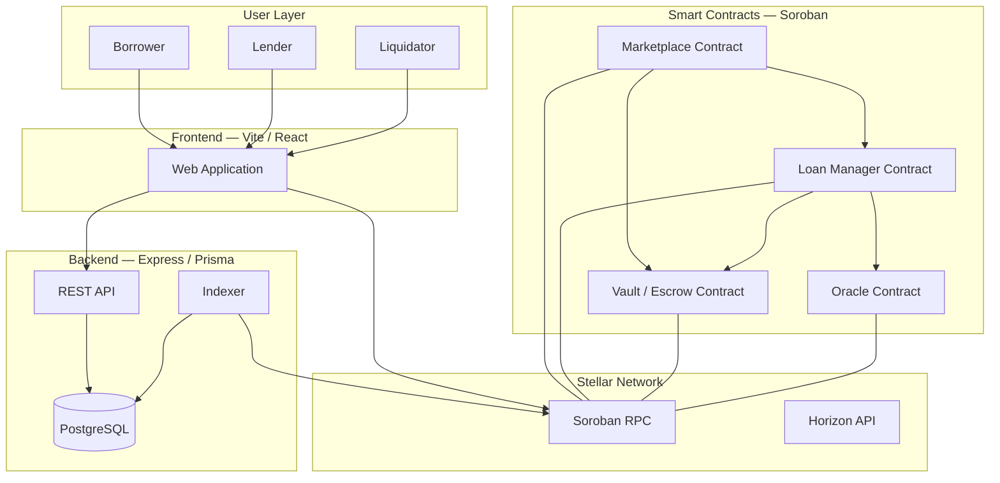

# 00 — Project Overview

> **Nexus Lending Protocol** — Collateralized Fixed-Rate P2P Lending Marketplace on Stellar Soroban

---

## 1. Purpose

This document is the entry point for the entire Nexus Lending Protocol documentation suite. It defines the project identity, scope, technology stack, high-level architecture, and the glossary that all subsequent documents reference.

---

## 2. Project Identity

| Field | Value |
|-------|-------|
| **Name** | Nexus Lending Protocol |
| **Category** | Decentralized Finance (DeFi) |
| **Subcategory** | Collateralized P2P Fixed-Rate Lending |
| **Blockchain** | Stellar (Soroban Smart Contracts) |
| **Smart Contract Language** | Rust (Soroban SDK) |
| **Backend** | Node.js / Express / Prisma / PostgreSQL |
| **Frontend** | Vite / React / TypeScript / Ant Design |

---

## 3. Mission Statement

Nexus Lending enables **peer-to-peer fixed-rate lending** on Stellar Soroban where every loan is an independent, trustless agreement between one lender and one borrower. Collateral is locked inside an escrow smart contract, and risk is continuously monitored via a Health Factor mechanism.

---

## 4. What Nexus IS and IS NOT

### Nexus IS

| Property | Description |
|----------|-------------|
| **P2P Marketplace** | Every loan is a direct agreement between ONE lender and ONE borrower |
| **Fixed Interest Rate** | Each loan carries its own immutable APR set by the lender at offer creation |
| **Independent Loans** | Every loan is a standalone record — no shared pools, no shared risk |
| **Escrow-Based** | All assets (loan principal + collateral) are locked inside a Vault smart contract |
| **Trustless** | No centralized approval — all logic is enforced by smart contracts |
| **Health Factor Driven** | Risk is measured continuously by a Health Factor derived from oracle prices |
| **Partial Liquidation** | Liquidators repay up to 50% of outstanding debt per liquidation call |
| **Borrower Rescue** | Borrowers can add collateral or partially repay to restore their Health Factor |

### Nexus IS NOT

| Anti-Pattern | Protocol Examples | Why It Doesn't Apply |
|--------------|-------------------|---------------------|
| Liquidity Pool Lending | Aave, Compound | Nexus has no shared pools, no utilization curves, no variable rates |
| Peer-to-Pool Lending | Morpho | Nexus has no pool aggregation layer |
| Algorithmic Market | Automated Market Maker | Nexus does not price assets or provide liquidity |
| Governance Protocol | DAO-governed | Nexus has no governance token, no voting |

> **Critical**: If you are reading this documentation to implement Nexus, do **NOT** reference Aave, Compound, or Morpho architectures. Every design pattern in those protocols assumes shared liquidity, which is fundamentally incompatible with Nexus.

---

## 5. Technology Stack

```
┌──────────────────────────────────────────────────────┐
│                     FRONTEND                         │
│  Vite + React + TypeScript + Ant Design              │
│  14 pages · Freighter wallet integration             │
├──────────────────────────────────────────────────────┤
│                      BACKEND                         │
│  Express + TypeScript + Prisma ORM + PostgreSQL      │
│  REST API · Indexer · Analytics                      │
├──────────────────────────────────────────────────────┤
│                  SMART CONTRACTS                     │
│  Stellar Soroban · Rust · 4 Contracts                │
│  Marketplace · Loan Manager · Vault · Oracle         │
├──────────────────────────────────────────────────────┤
│                  STELLAR NETWORK                     │
│  Soroban RPC · Horizon API · Testnet / Mainnet       │
└──────────────────────────────────────────────────────┘
```

---

## 6. High-Level Architecture



---

## 7. Smart Contract Overview

Nexus deploys exactly **four** smart contracts. No additional contracts (Reward, Governance, DAO, Insurance, Risk Engine, Liquidation) shall be created.

| # | Contract | Crate | Responsibility |
|---|----------|-------|----------------|
| 1 | **Marketplace** | `marketplace` | Loan Offer lifecycle — create, cancel, accept offers |
| 2 | **Loan Manager** | `loan-manager` | Loan lifecycle — HF/LTV calculation, repayment, rescue, liquidation, expiration, default |
| 3 | **Vault / Escrow** | `vault` | Asset custody — lock, release, transfer tokens |
| 4 | **Oracle** | `oracle` | Price feed — admin-updated asset prices |

A shared types crate (`shared`) provides ABI structs and enums consumed by all four contracts.

> See `03_SMART_CONTRACT_ARCHITECTURE.md` for detailed contract internals.

---

## 8. Core Actors

| Actor | Description | Primary Actions |
|-------|-------------|-----------------|
| **Lender** | Provides loan capital | Create offer, fund escrow, receive repayment |
| **Borrower** | Takes loans against collateral | Accept offer, deposit collateral, repay, add collateral |
| **Liquidator** | Resolves unhealthy positions | Repay portion of borrower's debt, seize discounted collateral |
| **Admin** | Protocol operator | Initialize contracts, update oracle prices |

---

## 9. Core Concepts

### 9.1 Loan Offer

A **Loan Offer** is created by a lender and published to the marketplace. It specifies:
- Loan asset and amount
- Fixed APR (in basis points)
- Duration (in days)
- Collateral requirements (asset, max LTV, liquidation threshold, liquidation bonus)
- Grace period before default
- Minimum Health Factor

### 9.2 Loan

A **Loan** is created when a borrower accepts an offer. It is a standalone record that tracks:
- Principal and outstanding debt (with pre-computed interest)
- Collateral amount
- Start and due timestamps
- Health Factor and loan status

### 9.3 Health Factor (HF)

The Health Factor measures collateral safety relative to outstanding debt:

```
HF = (collateral_value × liquidation_threshold_bps) / outstanding_debt
```

| Range | Zone | Color | Action |
|-------|------|-------|--------|
| HF ≥ 1.4 (≥ 14,000 BPS) | **SAFE** | 🟢 Green | No action required |
| 1.2 ≤ HF < 1.4 (12,000–13,999 BPS) | **WARNING** | 🟠 Orange | Borrower should add collateral or repay |
| HF < 1.2 (< 12,000 BPS) | **LIQUIDATION_PLANNING** | 🔴 Red | Liquidation is enabled |

### 9.4 Escrow / Vault

The Vault contract acts as a trustless escrow. All token movements go through the Vault:
- Lender deposits loan assets → Vault holds them
- Borrower deposits collateral → Vault locks it
- Upon repayment → Vault releases collateral to borrower, sends repayment to lender
- Upon liquidation → Vault sends seized collateral to liquidator

### 9.5 Basis Points (BPS)

All percentage-based parameters use **basis points** (1 BPS = 0.01%). The constant `BPS_DENOMINATOR = 10,000` represents 100%.

| BPS Value | Percentage | Meaning |
|-----------|-----------|---------|
| 500 | 5% | Example: liquidation bonus |
| 7,500 | 75% | Example: max LTV |
| 8,000 | 80% | Example: liquidation threshold |
| 10,000 | 100% | BPS_DENOMINATOR |
| 14,000 | 140% | Safe Health Factor threshold |

---

## 10. Document Map

This documentation suite consists of 14 documents that build upon each other:

| # | Document | Purpose | Depends On |
|---|----------|---------|------------|
| **00** | Project Overview *(this document)* | Identity, scope, glossary | — |
| **01** | Business Rules | All protocol rules and formulas | 00 |
| **02** | System Architecture | Three-tier architecture, deployment | 00 |
| **03** | Smart Contract Architecture | Contract internals, storage, access control | 00, 01 |
| **04** | Contract Interaction | Cross-contract calls, sequence diagrams | 03 |
| **05** | Contract Specification | Full function-level API reference | 03, 04 |
| **06** | Escrow and Funding Flow | Money flow, collateral flow, token mechanics | 03, 04, 05 |
| **07** | State Machine | Offer and Loan state transitions | 01, 03 |
| **08** | Data Model | On-chain and off-chain schemas | 03, 05 |
| **09** | Backend Specification | REST API, indexer, analytics | 02, 08 |
| **10** | Frontend Integration | Pages, wallet, UI flows | 02, 09 |
| **11** | Security Rules | Access control, risks, mitigations | 03, 05, 06 |
| **12** | Demo Flow | End-to-end walkthrough with values | 01, 07 |
| **13** | Implementation Roadmap | Phases, milestones, current state | All |

---

## 11. Glossary

| Term | Definition |
|------|-----------|
| **APR** | Annual Percentage Rate — the fixed interest rate for a loan, expressed in BPS |
| **BPS** | Basis Points — 1 BPS = 0.01%; 10,000 BPS = 100% |
| **Close Factor** | Maximum percentage of outstanding debt that can be liquidated in one call (50% / 5,000 BPS) |
| **Collateral** | Asset deposited by the borrower to secure the loan |
| **Default** | State when a borrower fails to repay after the grace period |
| **Escrow** | Trustless custody of assets within the Vault contract |
| **Grace Period** | Days after loan expiration before the loan is marked as defaulted |
| **Health Factor (HF)** | Ratio measuring collateral safety: `(collateral_value × liquidation_threshold) / debt` |
| **Liquidation** | Process where a liquidator repays part of a borrower's debt and seizes discounted collateral |
| **Liquidation Bonus** | Discount given to liquidators on seized collateral (e.g., 500 BPS = 5%) |
| **Liquidation Threshold** | Collateral ratio at which the HF formula operates (e.g., 8,000 BPS = 80%) |
| **Loan Asset** | The token being lent (e.g., USDC) |
| **LTV** | Loan-to-Value ratio — `(outstanding_debt × BPS_DENOMINATOR) / collateral_value` |
| **Max LTV** | Maximum LTV allowed at loan creation |
| **Offer** | A lender's published terms for a potential loan |
| **Oracle** | Contract that provides asset price data |
| **P2P** | Peer-to-Peer — direct agreement between one lender and one borrower |
| **Principal** | Original loan amount before interest |
| **Soroban** | Stellar's smart contract platform |
| **Vault** | Smart contract that holds and manages all token custody |

---

## 12. Conventions Used in This Documentation

| Convention | Meaning |
|-----------|---------|
| `code_format` | Function names, variable names, enum variants |
| **Bold** | Key terms on first use |
| `→` | State transition or data flow direction |
| BPS values | Always written as integers (e.g., 14,000 not 1.4) with equivalent shown |
| Mermaid diagrams | Used for architecture, state machines, and sequence diagrams |
| Tables | Used for structured data, parameter lists, and comparisons |

---

*Next: `01_BUSINESS_RULES.md` — Complete business rules, formulas, and constraints.*
