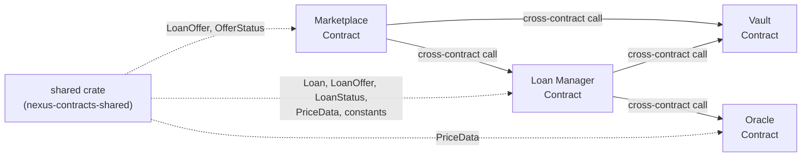
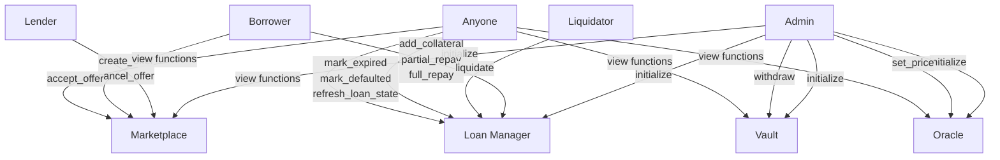

# 03 — Smart Contract Architecture

> Internal design of the four Soroban smart contracts — storage layout, shared types, access control, and the explicit contract boundary.

---

## 1. Purpose

This document describes the internal architecture of every Nexus smart contract. It covers the shared types crate, per-contract storage layout (DataKey enums), access control model, and the explicit boundary of what must **not** be added. For the function-level API reference, see `05_CONTRACT_SPECIFICATION.md`. For cross-contract interaction, see `04_CONTRACT_INTERACTION.md`.

---

## 2. Contract Map



---

## 3. Shared Types Crate (`nexus-contracts-shared`)

The `shared` crate defines all ABI types consumed by the four contracts. It has no contract logic of its own.

### 3.1 Enums

#### `OfferStatus`

| Variant | Description | Used By |
|---------|-------------|---------|
| `Listed` | Offer is active in the marketplace, available for borrowers | Marketplace |
| `Accepted` | A borrower has accepted this offer and a loan was created | Marketplace |
| `Cancelled` | Lender cancelled the offer before it was accepted | Marketplace |

#### `LoanStatus`

| Variant | Description | Terminal? |
|---------|-------------|-----------|
| `Active` | Loan is healthy (HF ≥ `min_health_factor_bps`) | No |
| `Warning` | HF is between 12,000 and `min_health_factor_bps` | No |
| `LiquidationPlanning` | HF < 12,000 — liquidation enabled | No |
| `Repaid` | Borrower fully repaid — loan closed | Yes |
| `Liquidated` | Debt zeroed by liquidation — loan closed | Yes |
| `Expired` | Past due time but within grace period | No |
| `Defaulted` | Past grace period — liquidation enabled regardless of HF | No |
| `Closed` | Administrative closure | Yes |

### 3.2 Structs

#### `LoanOffer`

| Field | Type | Description |
|-------|------|-------------|
| `offer_id` | `u64` | Sequential offer identifier |
| `lender` | `Address` | Lender's Stellar address |
| `loan_asset` | `Address` | Token contract address of the loan asset (e.g., USDC) |
| `loan_amount` | `i128` | Amount of loan asset in smallest unit (stroops) |
| `fixed_apr_bps` | `u32` | Annual interest rate in basis points |
| `duration_days` | `u32` | Loan term in days |
| `collateral_asset` | `Address` | Token contract address of the collateral asset (e.g., XLM) |
| `max_ltv_bps` | `u32` | Maximum LTV at loan creation (BPS) |
| `liquidation_threshold_bps` | `u32` | Threshold used in HF formula (BPS) |
| `liquidation_bonus_bps` | `u32` | Bonus for liquidators on seized collateral (BPS) |
| `grace_period_days` | `u32` | Days after expiration before default |
| `min_health_factor_bps` | `u32` | Minimum HF required at loan creation (BPS) |
| `status` | `OfferStatus` | Current offer status |

#### `Loan`

| Field | Type | Description |
|-------|------|-------------|
| `loan_id` | `u64` | Sequential loan identifier |
| `offer_id` | `u64` | ID of the accepted offer |
| `lender` | `Address` | Lender's address (copied from offer) |
| `borrower` | `Address` | Borrower's address |
| `loan_asset` | `Address` | Loan asset token address |
| `principal` | `i128` | Original loan amount |
| `outstanding_debt` | `i128` | Remaining debt (principal + interest − repayments) |
| `fixed_apr_bps` | `u32` | Fixed APR (copied from offer) |
| `collateral_asset` | `Address` | Collateral asset token address |
| `collateral_amount` | `i128` | Current collateral amount locked |
| `start_time` | `u64` | Ledger timestamp at loan creation |
| `due_time` | `u64` | Timestamp when loan is due |
| `max_ltv_bps` | `u32` | Max LTV (copied from offer) |
| `liquidation_threshold_bps` | `u32` | Liquidation threshold (copied from offer) |
| `liquidation_bonus_bps` | `u32` | Liquidation bonus (copied from offer) |
| `min_health_factor_bps` | `u32` | Min HF at creation (copied from offer) |
| `grace_period_days` | `u32` | Grace period (copied from offer) |
| `status` | `LoanStatus` | Current loan status |

#### `PriceData`

| Field | Type | Description |
|-------|------|-------------|
| `asset_pair` | `String` | Human-readable pair identifier (e.g., `"XLM/USDC"`) |
| `price` | `i128` | Price value in smallest unit |
| `decimals` | `u32` | Number of decimal places in the price |
| `updated_at` | `u64` | Ledger timestamp of last update |
| `source` | `String` | Source identifier (e.g., `"admin"`, `"pyth"`) |

### 3.3 Constants

| Constant | Value | Type | Description |
|----------|-------|------|-------------|
| `BPS_DENOMINATOR` | 10,000 | `u128` | 100% in basis points |
| `SAFE_HEALTH_FACTOR_BPS` | 14,000 | `u32` | Default minimum HF for safe loans (1.4×) |
| `LIQUIDATION_HEALTH_FACTOR_BPS` | 12,000 | `u32` | HF below which liquidation is enabled (1.2×) |
| `CLOSE_FACTOR_BPS` | 5,000 | `u32` | Max % of debt repayable per liquidation call (50%) |

---

## 4. Marketplace Contract

### 4.1 Responsibility

Manages the Loan Offer lifecycle: creation, cancellation, and acceptance. Does **not** manage loans after creation.

### 4.2 Storage Layout

```rust
enum DataKey {
    Admin,          // Address — contract admin
    LoanManager,    // Address — Loan Manager contract ID
    Vault,          // Address — Vault contract ID
    OfferCount,     // u64 — sequential offer counter
    Offer(u64),     // LoanOffer — stored per offer_id
}
```

| Key | Storage Type | Lifetime |
|-----|-------------|----------|
| `Admin` | Instance | Contract lifetime |
| `LoanManager` | Instance | Contract lifetime |
| `Vault` | Instance | Contract lifetime |
| `OfferCount` | Instance | Contract lifetime |
| `Offer(offer_id)` | Persistent | Individual TTL |

### 4.3 Functions

| Function | Auth | Description |
|----------|------|-------------|
| `initialize()` | None (one-time) | Sets admin, Loan Manager, and Vault addresses |
| `create_offer()` | Lender | Creates offer + deposits loan asset to Vault |
| `cancel_offer()` | Lender (owner) | Cancels Listed offer + returns loan asset from Vault |
| `accept_offer()` | Borrower | Accepts Listed offer → delegates to Loan Manager |
| `get_offer()` | None (view) | Returns offer by ID |
| `get_offer_count()` | None (view) | Returns total offers created |

### 4.4 Cross-Contract Calls

| Target | Function | When |
|--------|----------|------|
| Vault | `deposit(asset, from, amount)` | On `create_offer` — lender deposits loan asset |
| Vault | `return_loan_asset_to_lender(offer_id, lender, asset, amount)` | On `cancel_offer` — return loan asset |
| Loan Manager | `create_loan_from_offer(offer, borrower, collateral_amount)` | On `accept_offer` — create loan |

### 4.5 Events

| Event Topic | Data | When |
|-------------|------|------|
| `("offer_new", offer_id, lender)` | `loan_amount` | Offer created |
| `("offer_can", offer_id)` | `loan_amount` | Offer cancelled |
| `("offer_acc", offer_id, borrower)` | `loan_id` | Offer accepted |

---

## 5. Loan Manager Contract

### 5.1 Responsibility

The core business logic contract. Manages the entire loan lifecycle: creation, HF/LTV calculation, repayment, borrower rescue (add collateral / partial repay), liquidation, expiration, and default. The risk engine is **inside** this contract — there is no separate risk engine contract.

### 5.2 Storage Layout

```rust
enum DataKey {
    Admin,       // Address — contract admin
    Oracle,      // Address — Oracle contract ID
    Vault,       // Address — Vault contract ID
    LoanCount,   // u64 — sequential loan counter
    Loan(u64),   // Loan — stored per loan_id
}
```

| Key | Storage Type | Lifetime |
|-----|-------------|----------|
| `Admin` | Instance | Contract lifetime |
| `Oracle` | Instance | Contract lifetime |
| `Vault` | Instance | Contract lifetime |
| `LoanCount` | Instance | Contract lifetime |
| `Loan(loan_id)` | Persistent | Individual TTL |

### 5.3 Functions

| Function | Auth | Description |
|----------|------|-------------|
| `initialize()` | None (one-time) | Sets admin, Oracle, and Vault addresses |
| `create_loan_from_offer()` | Called by Marketplace | Creates loan record, validates LTV/HF, locks collateral, transfers loan asset |
| `get_loan()` | None (view) | Returns loan by ID |
| `get_loan_count()` | None (view) | Returns total loans |
| `calculate_health_factor()` | None (view) | Returns current HF for a loan |
| `calculate_ltv()` | None (view) | Returns current LTV for a loan |
| `refresh_loan_state()` | None | Recalculates HF and updates status |
| `add_collateral()` | Borrower | Adds collateral to improve HF |
| `partial_repay()` | Borrower | Partially repays debt |
| `full_repay()` | Borrower | Fully repays debt, releases collateral |
| `liquidate()` | Liquidator | Partial liquidation — repay debt, seize collateral |
| `mark_expired()` | Anyone | Marks loan as expired after due time |
| `mark_defaulted()` | Anyone | Marks loan as defaulted after grace period |

### 5.4 Internal Functions

| Function | Description |
|----------|-------------|
| `get_loan_or_panic()` | Load loan from storage or panic |
| `next_loan_id()` | Increment and return next loan ID |
| `require_mutable()` | Assert loan is in a modifiable status |
| `require_positive()` | Assert amount > 0 |
| `status_for_hf()` | Map HF BPS to LoanStatus |
| `update_status()` | Check time-based then HF-based status |
| `calculate_health_factor_for_loan()` | Core HF calculation |
| `calculate_ltv_for_loan()` | Core LTV calculation |
| `collateral_value()` | Fetch oracle price and compute collateral value |
| `get_oracle_price()` | Cross-contract call to Oracle |
| `calculate_seize_collateral()` | Compute collateral to seize during liquidation |
| `principal_with_interest()` | Compute outstanding debt at creation |
| `release_all_collateral()` | Release all remaining collateral to borrower |

### 5.5 Cross-Contract Calls

| Target | Function | When |
|--------|----------|------|
| Oracle | `get_price_for_assets(base, quote)` | HF/LTV calculation, liquidation |
| Vault | `lock_collateral(loan_id, borrower, asset, amount)` | Loan creation, add collateral |
| Vault | `release_collateral(loan_id, borrower, asset, amount)` | Repayment, post-liquidation remainder |
| Vault | `transfer_loan_asset_to_borrower(loan_id, borrower, asset, amount)` | Loan creation |
| Vault | `collect_repayment_from(loan_id, payer, lender, asset, amount)` | Repayment, liquidation |
| Vault | `transfer_collateral_to_liq(loan_id, liquidator, asset, amount)` | Liquidation |

### 5.6 Events

| Event Topic | Data | When |
|-------------|------|------|
| `("loan_new", loan_id)` | `outstanding_debt` | Loan created |
| `("state", loan_id)` | `LoanStatus` | Status changed (refresh, expire, default) |
| `("col_add", loan_id)` | `amount` | Collateral added |
| `("part_pay", loan_id)` | `repay_amount` | Partial repayment |
| `("repaid", loan_id)` | `repay_amount` | Full repayment |
| `("liq", loan_id, liquidator)` | `repay_amount` | Liquidation executed |

---

## 6. Vault / Escrow Contract

### 6.1 Responsibility

Custodial contract for all token transfers. The Vault holds loan assets and locked collateral. It executes transfers only when instructed by authorized contracts (Marketplace or Loan Manager). It has **no business logic** — it is a pure token custodian.

### 6.2 Storage Layout

```rust
enum DataKey {
    Admin,                  // Address — contract admin
    LoanManager,            // Address — Loan Manager contract ID
    Marketplace,            // Address — Marketplace contract ID
    Locked(u64, Address),   // i128 — locked collateral per (loan_id, asset)
}
```

| Key | Storage Type | Lifetime |
|-----|-------------|----------|
| `Admin` | Instance | Contract lifetime |
| `LoanManager` | Instance | Contract lifetime |
| `Marketplace` | Instance | Contract lifetime |
| `Locked(loan_id, asset)` | Persistent | Individual TTL |

### 6.3 Functions

| Function | Auth | Description |
|----------|------|-------------|
| `initialize()` | None (one-time) | Sets admin, Loan Manager, Marketplace addresses |
| `deposit()` | Depositor (`from`) | Transfers tokens from depositor to Vault |
| `withdraw()` | Admin only | Emergency withdrawal |
| `lock_collateral()` | Loan Manager + Borrower | Transfers collateral from borrower to Vault, records locked amount |
| `release_collateral()` | Loan Manager | Transfers collateral from Vault to borrower, decreases locked |
| `transfer_loan_asset_to_borrower()` | Loan Manager | Sends loan asset from Vault to borrower |
| `transfer_repayment_to_lender()` | Loan Manager | Sends repayment from Vault to lender |
| `collect_repayment_from()` | Loan Manager + Payer | Transfers repayment directly from payer to lender |
| `transfer_collateral_to_liq()` | Loan Manager | Sends seized collateral from Vault to liquidator |
| `return_loan_asset_to_lender()` | Marketplace | Returns loan asset from Vault to lender (offer cancellation) |
| `get_locked()` | None (view) | Returns locked collateral amount for a loan/asset pair |

### 6.4 Access Control

```
┌─────────────────────────────────────────────┐
│                Vault Contract               │
├─────────────────────────────────────────────┤
│ deposit()              → from.require_auth  │
│ withdraw()             → admin.require_auth │
│ lock_collateral()      → LM.require_auth    │
│                          + borrower.auth     │
│ release_collateral()   → LM.require_auth    │
│ transfer_loan_*()      → LM.require_auth    │
│ collect_repayment_*()  → LM.require_auth    │
│                          + payer.auth        │
│ transfer_collateral_*()→ LM.require_auth    │
│ return_loan_asset_*()  → MKT.require_auth   │
│ get_locked()           → none               │
└─────────────────────────────────────────────┘
```

### 6.5 Events

| Event Topic | Data | When |
|-------------|------|------|
| `("deposit", asset, from)` | `amount` | Deposit |
| `("withdraw", asset, to)` | `amount` | Admin withdrawal |
| `("locked", loan_id, borrower, asset)` | `amount` | Collateral locked |
| `("released", loan_id, borrower, asset)` | `amount` | Collateral released |
| `("loan_out", loan_id, borrower, asset)` | `amount` | Loan asset sent to borrower |
| `("repay_out", loan_id, lender, asset)` | `amount` | Repayment from vault to lender |
| `("repay_in", loan_id, payer, lender)` | `amount` | Repayment collected from payer |
| `("liq_col", loan_id, liquidator, asset)` | `amount` | Collateral sent to liquidator |
| `("offer_ret", offer_id, lender, asset)` | `amount` | Loan asset returned on cancel |

---

## 7. Oracle Contract

### 7.1 Responsibility

Stores and serves asset price data. Prices are updated by the admin. There is no on-chain aggregation or decentralized price feed — the Oracle is a simple admin-controlled price store.

### 7.2 Storage Layout

```rust
enum DataKey {
    Admin,                          // Address — contract admin
    Price(String),                  // PriceData — by string key (e.g., "XLM/USDC")
    AssetPrice(Address, Address),   // PriceData — by (base_asset, quote_asset) pair
}
```

| Key | Storage Type | Lifetime |
|-----|-------------|----------|
| `Admin` | Instance | Contract lifetime |
| `Price(pair)` | Persistent | Individual TTL |
| `AssetPrice(base, quote)` | Persistent | Individual TTL |

### 7.3 Functions

| Function | Auth | Description |
|----------|------|-------------|
| `initialize()` | None (one-time) | Sets admin address |
| `set_price()` | Admin | Sets price by string key |
| `set_price_for_assets()` | Admin | Sets price by asset address pair + string key |
| `get_price()` | None (view) | Returns price by string key |
| `get_price_for_assets()` | None (view) | Returns price by asset address pair |
| `get_last_updated()` | None (view) | Returns timestamp of last price update |

### 7.4 Events

| Event Topic | Data | When |
|-------------|------|------|
| `("price_upd", asset_pair)` | `price` | Price set by string key |
| `("price_upd", base_asset, quote_asset)` | `price` | Price set by asset pair |

---

## 8. Access Control Summary



---

## 9. Contracts NOT to Add

The following contract types must **NOT** be created. Their responsibilities either don't exist in Nexus or are absorbed into the Loan Manager:

| Prohibited Contract | Reason |
|---------------------|--------|
| **Reward Contract** | No reward tokens, no yield farming |
| **Governance Contract** | No governance token, no DAO voting |
| **DAO Contract** | Protocol is admin-operated, not community-governed |
| **Insurance Contract** | No insurance fund or coverage mechanism |
| **Risk Engine Contract** | Risk logic (HF/LTV) is inside Loan Manager |
| **Liquidation Contract** | Liquidation logic is inside Loan Manager |

> The Loan Manager IS the risk engine. Separating it would add unnecessary cross-contract calls with no benefit for a P2P protocol.

---

## 10. Soroban-Specific Design Decisions

| Decision | Rationale |
|----------|-----------|
| **`#![no_std]`** | All contracts are `no_std` for Soroban WASM compatibility |
| **`i128` for amounts** | Soroban standard for token amounts; avoids floating point |
| **`u32` for BPS** | Sufficient precision for basis points (0–4,294,967,295) |
| **`u64` for timestamps** | Ledger timestamps are u64 |
| **Sequential IDs** | Offer and loan IDs are sequential `u64` values (1, 2, 3, ...) |
| **Persistent storage for records** | Loan and offer data uses persistent storage for independent TTL management |
| **Instance storage for config** | Admin, contract references, and counters use instance storage (shared TTL) |
| **`panic!()` for errors** | Soroban idiom — transaction is atomic, panic rolls back all state changes |
| **`MuxedAddress` workaround** | Vault uses `MuxedAddress::from()` for transfers (Soroban SDK convention) |
| **Checked arithmetic** | All arithmetic uses `checked_mul`, `checked_add`, `checked_pow` to prevent overflow |

---

*Previous: `02_SYSTEM_ARCHITECTURE.md` · Next: `04_CONTRACT_INTERACTION.md`*
