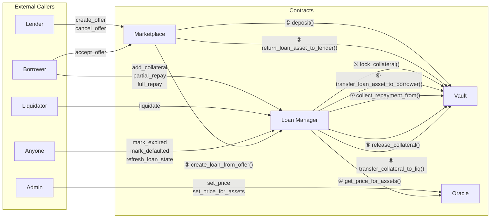
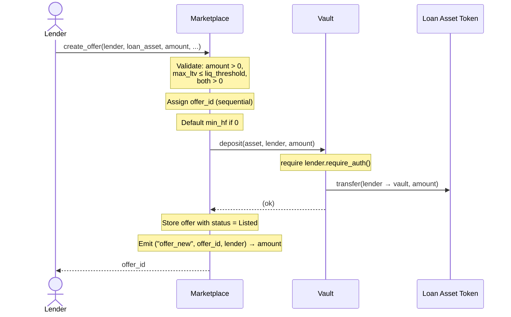
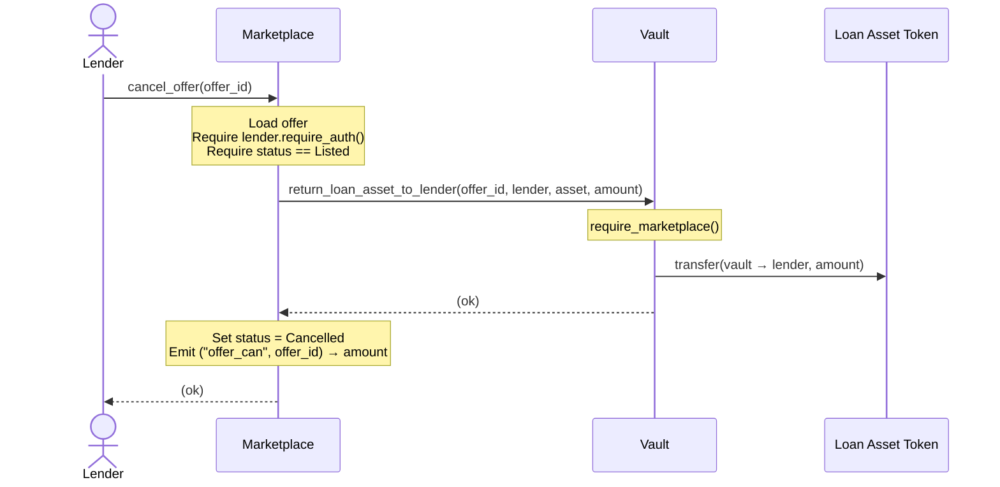
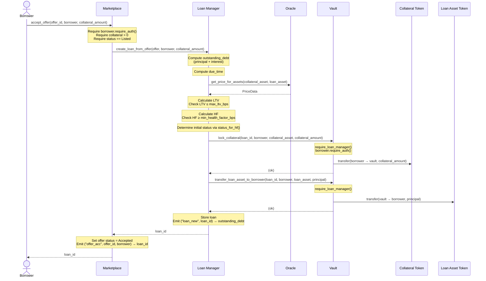
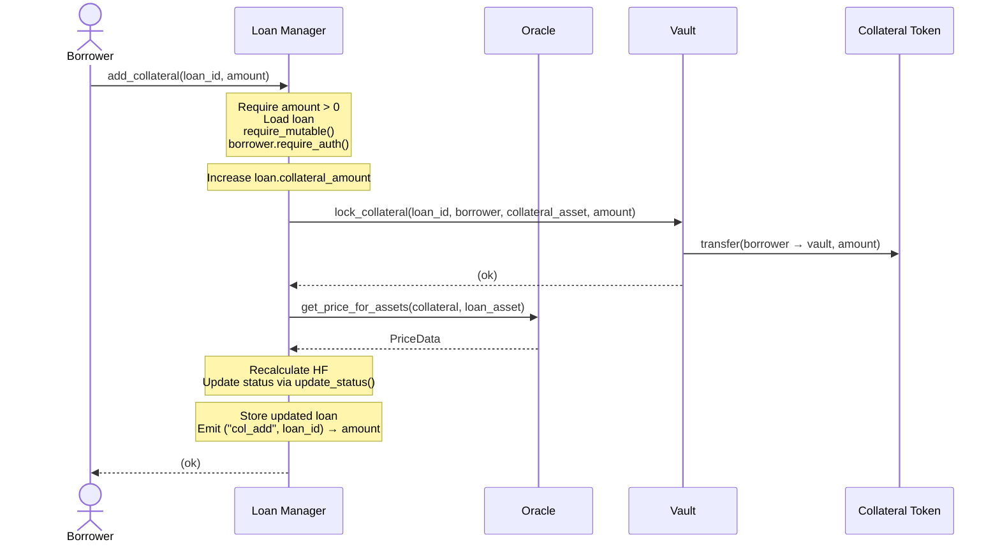
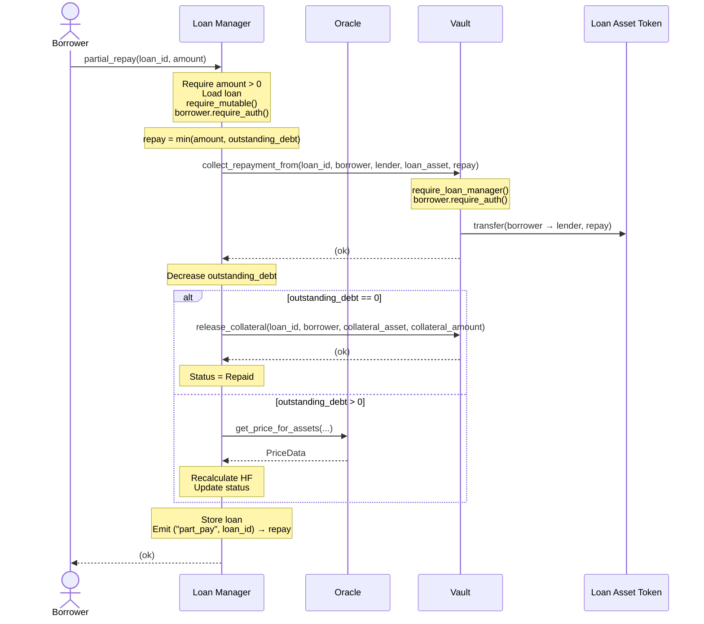
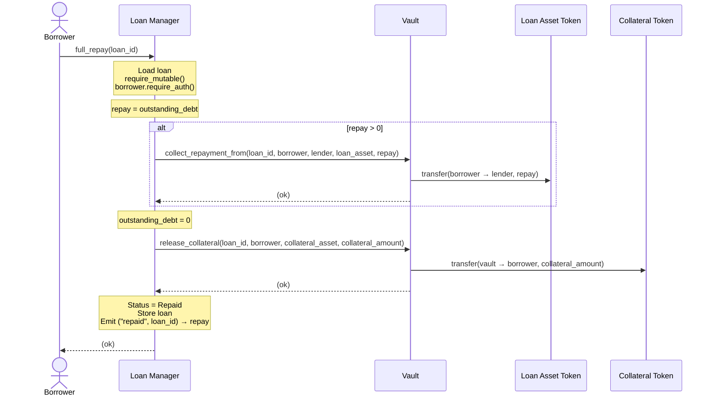
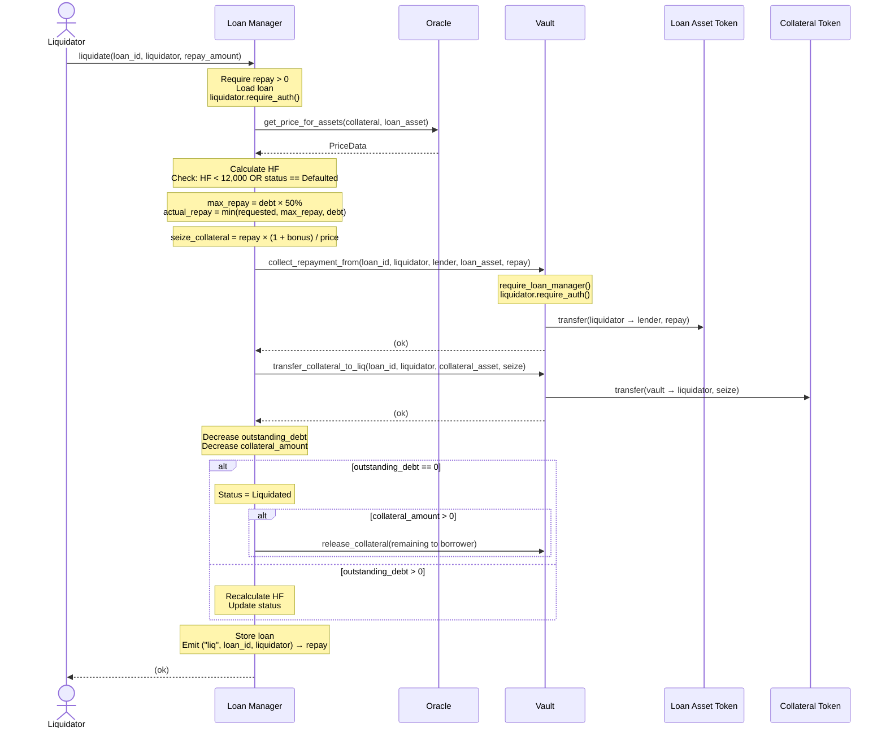
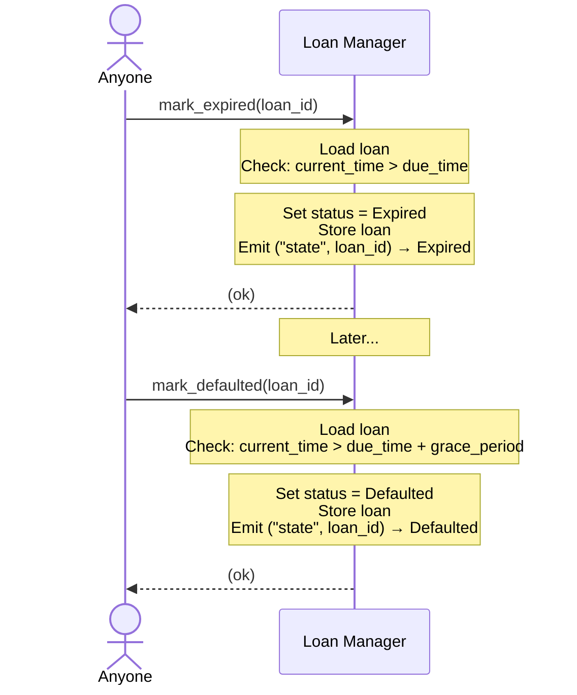
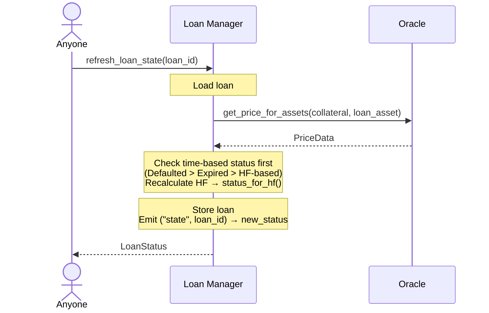

# 04 — Contract Interaction

> Cross-contract call graph, sequence diagrams for every major flow, and authorization requirements for the Nexus Lending Protocol.

---

## 1. Purpose

This document describes how the four Nexus smart contracts interact with each other. It provides the complete cross-contract call graph, detailed sequence diagrams for every major user flow, and authorization requirements per call. For function-level API details, see `05_CONTRACT_SPECIFICATION.md`. For the escrow-specific token flow, see `06_ESCROW_AND_FUNDING_FLOW.md`.

---

## 2. Cross-Contract Call Graph



---

## 3. Authorization Matrix

| # | Cross-Contract Call | Caller | Vault Check | User Auth Required |
|---|---------------------|--------|-------------|-------------------|
| ① | `deposit()` | Marketplace | `from.require_auth()` | Lender signs |
| ② | `return_loan_asset_to_lender()` | Marketplace | `require_marketplace()` | — |
| ③ | `create_loan_from_offer()` | Marketplace | — | — (Marketplace is caller) |
| ④ | `get_price_for_assets()` | Loan Manager | — | — (view function) |
| ⑤ | `lock_collateral()` | Loan Manager | `require_loan_manager()` | Borrower signs |
| ⑥ | `transfer_loan_asset_to_borrower()` | Loan Manager | `require_loan_manager()` | — |
| ⑦ | `collect_repayment_from()` | Loan Manager | `require_loan_manager()` | Payer signs |
| ⑧ | `release_collateral()` | Loan Manager | `require_loan_manager()` | — |
| ⑨ | `transfer_collateral_to_liq()` | Loan Manager | `require_loan_manager()` | — |

---

## 4. Sequence Diagrams

### 4.1 Create Offer

**Actors:** Lender, Marketplace, Vault



### 4.2 Cancel Offer

**Actors:** Lender, Marketplace, Vault



### 4.3 Accept Offer (Create Loan)

**Actors:** Borrower, Marketplace, Loan Manager, Vault, Oracle



### 4.4 Add Collateral (Borrower Rescue)

**Actors:** Borrower, Loan Manager, Vault



### 4.5 Partial Repayment

**Actors:** Borrower, Loan Manager, Vault



### 4.6 Full Repayment

**Actors:** Borrower, Loan Manager, Vault



### 4.7 Liquidation

**Actors:** Liquidator, Loan Manager, Vault, Oracle



### 4.8 Mark Expired / Defaulted

**Actors:** Anyone, Loan Manager



### 4.9 Refresh Loan State

**Actors:** Anyone, Loan Manager, Oracle



---

## 5. Call Chain Summary

| User Action | Entry Point | Call Chain |
|-------------|-------------|------------|
| Create Offer | `Marketplace.create_offer()` | MKT → VLT.deposit() |
| Cancel Offer | `Marketplace.cancel_offer()` | MKT → VLT.return_loan_asset_to_lender() |
| Accept Offer | `Marketplace.accept_offer()` | MKT → LM.create_loan_from_offer() → ORC.get_price_for_assets() → VLT.lock_collateral() → VLT.transfer_loan_asset_to_borrower() |
| Add Collateral | `LoanManager.add_collateral()` | LM → VLT.lock_collateral() → ORC.get_price_for_assets() |
| Partial Repay | `LoanManager.partial_repay()` | LM → VLT.collect_repayment_from() → [VLT.release_collateral()] → [ORC.get_price_for_assets()] |
| Full Repay | `LoanManager.full_repay()` | LM → VLT.collect_repayment_from() → VLT.release_collateral() |
| Liquidate | `LoanManager.liquidate()` | LM → ORC.get_price_for_assets() → VLT.collect_repayment_from() → VLT.transfer_collateral_to_liq() → [VLT.release_collateral()] |
| Mark Expired | `LoanManager.mark_expired()` | LM (no cross-contract calls) |
| Mark Defaulted | `LoanManager.mark_defaulted()` | LM (no cross-contract calls) |
| Refresh State | `LoanManager.refresh_loan_state()` | LM → ORC.get_price_for_assets() |
| Set Price | `Oracle.set_price_for_assets()` | ORC (no cross-contract calls) |

---

## 6. Event Flow Summary

```
                    Marketplace Events          Loan Manager Events         Vault Events
                    ──────────────────          ───────────────────         ────────────
create_offer    →   offer_new                                               deposit
cancel_offer    →   offer_can                                               offer_ret
accept_offer    →   offer_acc                   loan_new                    locked, loan_out
add_collateral  →                               col_add                     locked
partial_repay   →                               part_pay                    repay_in [, released]
full_repay      →                               repaid                      repay_in, released
liquidate       →                               liq                         repay_in, liq_col [, released]
mark_expired    →                               state
mark_defaulted  →                               state
refresh_state   →                               state
set_price       →                                                           
                                                                            Oracle: price_upd
```

---

*Previous: `03_SMART_CONTRACT_ARCHITECTURE.md` · Next: `05_CONTRACT_SPECIFICATION.md`*
