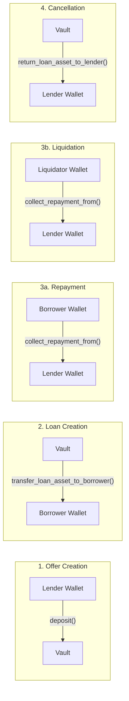
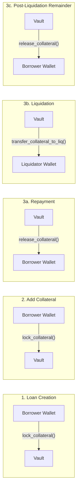

# 06 — Escrow and Funding Flow

> Detailed money flow, collateral flow, token transfer mechanics, and Vault accounting for the Nexus Lending Protocol.

---

## 1. Purpose

This document traces every token movement in the protocol. It shows where money goes at each stage of a loan's life, how collateral is locked and released, and how the Vault accounting works. For the contract functions that execute these flows, see `05_CONTRACT_SPECIFICATION.md`. For the business rules governing these flows, see `01_BUSINESS_RULES.md`.

---

## 2. Token Custody Model

The Vault contract is the **sole custodian** of all locked assets. No other contract, user, or off-chain system holds tokens during a loan's lifetime.

```
┌──────────────────────────────────────────────┐
│               VAULT CONTRACT                 │
│                                              │
│   ┌──────────────┐  ┌──────────────────┐     │
│   │  Loan Asset  │  │   Collateral     │     │
│   │  (deposited  │  │   (locked per    │     │
│   │   by lender) │  │    loan_id)      │     │
│   └──────────────┘  └──────────────────┘     │
│                                              │
│   Token Balance = Σ deposits − Σ outflows    │
│   Locked Accounting = per (loan_id, asset)   │
└──────────────────────────────────────────────┘
```

Key properties:
- The Vault holds actual token balances (Soroban `TokenClient` transfers)
- Locked collateral is tracked separately via `DataKey::Locked(loan_id, asset_address)` for accounting
- The Vault never initiates transfers — it only responds to authorized cross-contract calls

---

## 3. Loan Asset (Money) Flow

### 3.1 Complete Lifecycle



### 3.2 Step-by-Step Money Flow

| Step | Event | From | To | Mechanism | Vault Balance Change |
|------|-------|------|----|-----------|---------------------|
| 1 | Offer created | Lender | Vault | `Vault.deposit()` | +loan_amount |
| 2 | Loan created | Vault | Borrower | `Vault.transfer_loan_asset_to_borrower()` | −loan_amount |
| 3a | Repayment | Borrower | Lender | `Vault.collect_repayment_from()` | No change (direct transfer) |
| 3b | Liquidation repay | Liquidator | Lender | `Vault.collect_repayment_from()` | No change (direct transfer) |
| 4 | Offer cancelled | Vault | Lender | `Vault.return_loan_asset_to_lender()` | −loan_amount |

> **Important:** Repayments (`collect_repayment_from`) transfer tokens **directly from payer to lender**, not through the Vault. The Vault authorizes the transfer but funds don't pass through its balance.

### 3.3 Money Flow Example

Scenario: Lender offers 1,000 USDC at 10% APR for 30 days.

```
Step 1: Lender creates offer
  Lender USDC:  10,000 → 9,000  (−1,000)
  Vault USDC:   0 → 1,000       (+1,000)

Step 2: Borrower accepts offer
  Vault USDC:   1,000 → 0       (−1,000)
  Borrower USDC: 0 → 1,000      (+1,000)

Step 3: Borrower repays (1,008.22 USDC = principal + interest)
  Borrower USDC: 1,008.22 → 0   (−1,008.22)
  Lender USDC:   9,000 → 10,008.22  (+1,008.22)
  (Direct transfer, Vault balance unchanged)

Net result: Lender gained 8.22 USDC interest.
```

---

## 4. Collateral Flow

### 4.1 Complete Lifecycle



### 4.2 Step-by-Step Collateral Flow

| Step | Event | From | To | Mechanism | Vault Locked Change |
|------|-------|------|----|-----------|-------------------|
| 1 | Loan created | Borrower | Vault | `lock_collateral()` | +collateral_amount |
| 2 | Collateral added | Borrower | Vault | `lock_collateral()` | +additional_amount |
| 3a | Full repayment | Vault | Borrower | `release_collateral()` | −all_collateral |
| 3b | Liquidation | Vault | Liquidator | `transfer_collateral_to_liq()` | −seized_amount |
| 3c | Post-liquidation | Vault | Borrower | `release_collateral()` | −remaining_amount |

### 4.3 Collateral Flow Example

Scenario: Borrower locks 10,000 XLM. Price drops. Partial liquidation occurs.

```
Step 1: Loan created
  Borrower XLM:  15,000 → 5,000    (−10,000)
  Vault XLM:     0 → 10,000        (+10,000)
  Vault Locked:  (loan_1, XLM) = 10,000

Step 2: Borrower adds 2,000 XLM (rescue attempt)
  Borrower XLM:  5,000 → 3,000     (−2,000)
  Vault XLM:     10,000 → 12,000   (+2,000)
  Vault Locked:  (loan_1, XLM) = 12,000

Step 3: Liquidator seizes 3,500 XLM
  Vault XLM:     12,000 → 8,500    (−3,500)
  Liquidator XLM: 0 → 3,500        (+3,500)
  Vault Locked:  (loan_1, XLM) = 8,500

Step 4: After full liquidation, 1,000 XLM remains → returned to borrower
  Vault XLM:     1,000 → 0         (−1,000)
  Borrower XLM:  3,000 → 4,000     (+1,000)
  Vault Locked:  (loan_1, XLM) = 0
```

---

## 5. Vault Locked Accounting

### 5.1 Storage Key

```rust
DataKey::Locked(loan_id: u64, asset: Address) → i128
```

Each `(loan_id, asset)` pair has an independent locked balance.

### 5.2 Operations

| Operation | Function | Effect on Locked Amount |
|-----------|----------|------------------------|
| Lock | `lock_collateral()` | `locked += amount` |
| Release | `release_collateral()` | `locked -= amount` (panics if `locked < amount`) |
| Seize | `transfer_collateral_to_liq()` | `locked -= amount` (panics if `locked < amount`) |

### 5.3 Invariant

At all times:
```
Vault token balance ≥ Σ Locked(loan_id, asset) for all active loans
```

---

## 6. Complete Flow Diagrams

### 6.1 Happy Path (Full Repayment)

```
                        LOAN ASSET (USDC)                    COLLATERAL (XLM)
                        ─────────────────                    ────────────────
    Lender    Vault    Borrower                   Borrower    Vault

1.  ──1000──▶                           1.                   ◀──10000──
    deposit()                                    lock_collateral()

2.            ──1000──▶                 2.
    transfer_loan_asset_to_borrower()

3.                     ──1008.22──▶     3.        ◀──10000──
    collect_repayment_from()                     release_collateral()
    (borrower → lender direct)

    ┌─────────────────────────────┐     ┌──────────────────────────────┐
    │ Lender: +8.22 USDC profit  │     │ Borrower: 10000 XLM back    │
    └─────────────────────────────┘     └──────────────────────────────┘
```

### 6.2 Liquidation Path

```
                     LOAN ASSET (USDC)                        COLLATERAL (XLM)
                     ─────────────────                        ────────────────
 Lender  Vault  Borrower  Liquidator         Borrower  Vault  Liquidator

1. ──1000──▶                           1.              ◀──10000──
   deposit()                                  lock_collateral()

2.          ──1000──▶                  2.
   transfer_loan_asset()

3.                        ──500──▶     3.             ──3500──▶
   collect_repayment_from()                  transfer_collateral_to_liq()
   (liquidator → lender direct)

4. (if debt zeroed)                    4.    ◀──remaining──
                                            release_collateral()

 ┌─────────────────────────────┐    ┌───────────────────────────────────┐
 │ Lender: got 500 USDC back  │    │ Liquidator: 3500 XLM ≈ 525 USDC │
 │ (partial recovery)          │    │ (5% profit on 500 USDC repaid)  │
 └─────────────────────────────┘    └───────────────────────────────────┘
```

### 6.3 Cancellation Path

```
                     LOAN ASSET (USDC)
                     ─────────────────
    Lender    Vault

1.  ──1000──▶
    deposit()

2.  ◀──1000──
    return_loan_asset_to_lender()

    ┌──────────────────────────────┐
    │ Lender: 1000 USDC returned  │
    │ No loss, no gain.            │
    └──────────────────────────────┘
```

---

## 7. Token Transfer Mechanics

### 7.1 Soroban TokenClient

All token transfers use the Soroban `TokenClient`:

```rust
use soroban_sdk::token::TokenClient;

// Transfer from user to vault
TokenClient::new(&env, &asset).transfer(&from, &MuxedAddress::from(vault), &amount);

// Transfer from vault to user
TokenClient::new(&env, &asset).transfer(&vault, &MuxedAddress::from(to), &amount);
```

### 7.2 `MuxedAddress` Usage

The Vault uses `MuxedAddress::from()` when specifying transfer recipients. This is a Soroban SDK pattern for wrapping `Address` values in `transfer()` calls.

### 7.3 Direct vs. Through-Vault Transfers

| Transfer Type | Path | Used For |
|---------------|------|----------|
| **Through Vault** | User → Vault or Vault → User | Deposits, collateral lock/release, loan disbursement |
| **Direct** | Payer → Lender (Vault authorizes but doesn't hold) | Repayments, liquidation repayments |

The `collect_repayment_from()` function is a **direct transfer** — the Vault contract verifies authorization (`require_loan_manager()` + `payer.require_auth()`) but the tokens move directly from payer to lender without entering the Vault.

---

## 8. Vault Security Model

### 8.1 Who Can Call What

```
┌────────────────────────────────────────────────────────┐
│                    VAULT ACCESS CONTROL                │
├────────────────────────────────────────────────────────┤
│                                                        │
│  PUBLIC (anyone):                                      │
│    deposit()         → from.require_auth()             │
│    get_locked()      → no auth                         │
│                                                        │
│  ADMIN ONLY:                                           │
│    withdraw()        → admin.require_auth()            │
│                                                        │
│  LOAN MANAGER ONLY:                                    │
│    lock_collateral()                                   │
│    release_collateral()                                │
│    transfer_loan_asset_to_borrower()                   │
│    transfer_repayment_to_lender()                      │
│    collect_repayment_from()                            │
│    transfer_collateral_to_liq()                        │
│                                                        │
│  MARKETPLACE ONLY:                                     │
│    return_loan_asset_to_lender()                       │
│                                                        │
└────────────────────────────────────────────────────────┘
```

### 8.2 Authorization Implementation

```rust
fn require_loan_manager(env: &Env) -> Address {
    let trusted: Address = env.storage().instance()
        .get(&DataKey::LoanManager)
        .unwrap_or_else(|| panic!("loan manager not configured"));
    trusted.require_auth();
    trusted
}

fn require_marketplace(env: &Env) -> Address {
    let trusted: Address = env.storage().instance()
        .get(&DataKey::Marketplace)
        .unwrap_or_else(|| panic!("marketplace not configured"));
    trusted.require_auth();
    trusted
}
```

The Vault verifies that the **calling contract** is the registered Loan Manager or Marketplace by checking `require_auth()` on the stored contract address. This ensures only authorized contracts can move funds.

---

## 9. Edge Cases

| Scenario | Behavior |
|----------|----------|
| Borrower repays more than outstanding debt | Capped to `outstanding_debt` — excess is not transferred |
| Liquidator tries to seize more collateral than exists | Transaction panics: `"insufficient collateral to seize"` |
| Release more locked than stored | Transaction panics: `"insufficient locked collateral"` |
| Zero-amount transfer | Transaction panics: `"amount must be positive"` |
| Vault has insufficient token balance | Soroban `TokenClient.transfer()` panics |
| Oracle returns price = 0 | Transaction panics: `"oracle price must be positive"` |
| Outstanding debt reaches 0 during partial repay | Treated as full repayment — all collateral released, status → `Repaid` |
| Outstanding debt reaches 0 during liquidation | Status → `Liquidated`; remaining collateral returned to borrower |

---

*Previous: `05_CONTRACT_SPECIFICATION.md` · Next: `07_STATE_MACHINE.md`*
