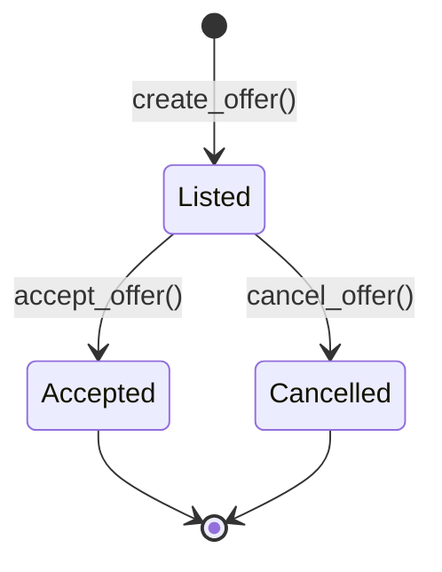
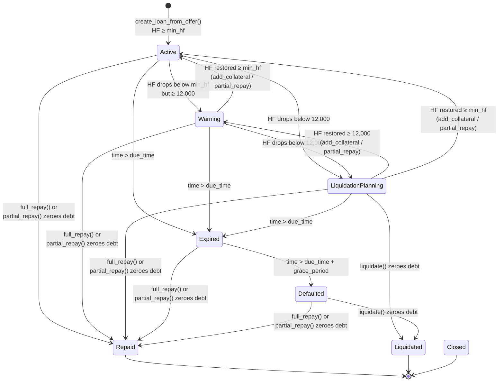

# 07 — State Machine

> Complete state machine definitions for Loan Offers and Loans, including transition triggers, guards, and code-level implementation.

---

## 1. Purpose

This document formally defines the state machines for the two primary protocol entities: **Loan Offers** and **Loans**. It specifies every valid state, every valid transition, the trigger that causes each transition, and the guard conditions that must be met. For the business rules governing these transitions, see `01_BUSINESS_RULES.md`. For the functions that execute them, see `05_CONTRACT_SPECIFICATION.md`.

---

## 2. Offer State Machine

### 2.1 State Diagram



### 2.2 States

| State | Description | Terminal? | Escrow Holds |
|-------|-------------|-----------|-------------|
| `Listed` | Offer is active in the marketplace, available for borrowers to accept | No | Loan asset (deposited by lender) |
| `Accepted` | A borrower accepted the offer and a loan was created | Yes | Loan asset transferred to borrower; collateral now in Vault under loan |
| `Cancelled` | Lender cancelled the offer before acceptance | Yes | Loan asset returned to lender |

### 2.3 Transitions

| From | To | Trigger | Guard | Effect |
|------|----|---------|-------|--------|
| _(none)_ | `Listed` | `create_offer()` | `loan_amount > 0`, `max_ltv ≤ liq_threshold`, both > 0 | Loan asset deposited to Vault |
| `Listed` | `Accepted` | `accept_offer()` | `collateral_amount > 0`, borrower auth | Loan created via Loan Manager |
| `Listed` | `Cancelled` | `cancel_offer()` | Lender auth, `status == Listed` | Loan asset returned from Vault |

### 2.4 Invalid Transitions

| Attempted | Error |
|-----------|-------|
| `Accepted` → any | No function modifies accepted offers |
| `Cancelled` → any | No function modifies cancelled offers |
| `Accepted` → `Cancelled` | `"accepted offer cannot be cancelled"` |
| `Cancelled` → `Cancelled` | `"offer already cancelled"` |

### 2.5 Implementation

The offer state machine is implemented entirely in the Marketplace contract:

```rust
// create_offer() → always starts as Listed
offer.status = OfferStatus::Listed;

// cancel_offer() → guard
match offer.status {
    OfferStatus::Listed => {},      // allowed
    OfferStatus::Accepted => panic!("accepted offer cannot be cancelled"),
    OfferStatus::Cancelled => panic!("offer already cancelled"),
}
offer.status = OfferStatus::Cancelled;

// accept_offer() → guard
if offer.status != OfferStatus::Listed {
    panic!("offer is not listed");
}
offer.status = OfferStatus::Accepted;
```

---

## 3. Loan State Machine

### 3.1 State Diagram



### 3.2 States

| State | Description | Mutable? | Liquidatable? |
|-------|-------------|----------|---------------|
| `Active` | Loan is healthy — HF ≥ `min_health_factor_bps` | ✅ Yes | ❌ No |
| `Warning` | HF is declining — between 12,000 and `min_health_factor_bps` | ✅ Yes | ❌ No |
| `LiquidationPlanning` | HF < 12,000 — collateral is unsafe | ✅ Yes | ✅ Yes |
| `Expired` | Past due time but within grace period | ✅ Yes | ❌ No (unless HF also < 12,000) |
| `Defaulted` | Past grace period — borrower failed to repay | ✅ Yes | ✅ Yes (regardless of HF) |
| `Repaid` | Fully repaid — collateral returned | ❌ No | ❌ No |
| `Liquidated` | Debt zeroed via liquidation | ❌ No | ❌ No |
| `Closed` | Administrative closure | ❌ No | ❌ No |

### 3.3 Transition Triggers

| # | From | To | Trigger Function | Condition |
|---|------|----|-----------------|-----------|
| T1 | _(none)_ | `Active` | `create_loan_from_offer()` | HF ≥ `min_hf`, LTV ≤ `max_ltv` |
| T2 | _(none)_ | `Warning` | `create_loan_from_offer()` | 12,000 ≤ HF < `min_hf` |
| T3 | `Active` | `Warning` | `refresh_loan_state()` / `update_status()` | 12,000 ≤ HF < `min_hf` |
| T4 | `Active` | `LiquidationPlanning` | `refresh_loan_state()` / `update_status()` | HF < 12,000 |
| T5 | `Warning` | `Active` | `add_collateral()` / `partial_repay()` | HF restored ≥ `min_hf` |
| T6 | `Warning` | `LiquidationPlanning` | `refresh_loan_state()` / `update_status()` | HF < 12,000 |
| T7 | `LiquidationPlanning` | `Active` | `add_collateral()` / `partial_repay()` | HF restored ≥ `min_hf` |
| T8 | `LiquidationPlanning` | `Warning` | `add_collateral()` / `partial_repay()` | 12,000 ≤ HF < `min_hf` |
| T9 | Any mutable | `Repaid` | `full_repay()` / `partial_repay()` | `outstanding_debt` reaches 0 |
| T10 | `LiquidationPlanning` / `Defaulted` | `Liquidated` | `liquidate()` | `outstanding_debt` reaches 0 via liquidation |
| T11 | `Active` / `Warning` / `LiquidationPlanning` | `Expired` | `mark_expired()` / `update_status()` | `current_time > due_time` |
| T12 | `Expired` | `Defaulted` | `mark_defaulted()` / `update_status()` | `current_time > due_time + grace_period` |

### 3.4 HF-Based Status Recovery

Unlike terminal states, HF-based statuses are **bidirectional**. The loan can recover:

```
LiquidationPlanning ←→ Warning ←→ Active
```

Recovery happens when:
1. Borrower calls `add_collateral()` → increases collateral value → HF rises
2. Borrower calls `partial_repay()` → decreases debt → HF rises
3. Oracle price increases → collateral value rises → HF rises (detected on next `refresh_loan_state()`)

### 3.5 Time-Based Status Priority

The `update_status()` function checks conditions in strict priority order:

```
Priority 1: outstanding_debt == 0 → skip (already settled)
Priority 2: current_time > default_time → Defaulted
Priority 3: current_time > due_time → Expired  
Priority 4: HF-based → status_for_hf() (Active / Warning / LiquidationPlanning)
```

Time-based status **always overrides** HF-based status. A loan past its due date is `Expired` even if its HF is healthy.

---

## 4. Mutable vs. Terminal States

### 4.1 `require_mutable()` Guard

This guard function is called before any borrower action (`add_collateral`, `partial_repay`, `full_repay`) and prevents modifications to closed loans:

```rust
fn require_mutable(loan: &Loan) {
    match loan.status {
        LoanStatus::Active
        | LoanStatus::Warning
        | LoanStatus::LiquidationPlanning
        | LoanStatus::Expired
        | LoanStatus::Defaulted => {},  // allowed
        _ => panic!("loan is closed"),  // Repaid, Liquidated, Closed
    }
}
```

### 4.2 Allowed Operations Per State

| State | add_collateral | partial_repay | full_repay | liquidate | mark_expired | mark_defaulted | refresh |
|-------|:-:|:-:|:-:|:-:|:-:|:-:|:-:|
| `Active` | ✅ | ✅ | ✅ | ❌ | ✅* | ❌ | ✅ |
| `Warning` | ✅ | ✅ | ✅ | ❌ | ✅* | ❌ | ✅ |
| `LiquidationPlanning` | ✅ | ✅ | ✅ | ✅ | ✅* | ❌ | ✅ |
| `Expired` | ✅ | ✅ | ✅ | ✅** | ❌ | ✅* | ✅ |
| `Defaulted` | ✅ | ✅ | ✅ | ✅ | ❌ | ❌ | ✅ |
| `Repaid` | ❌ | ❌ | ❌ | ❌ | ❌ | ❌ | ❌ |
| `Liquidated` | ❌ | ❌ | ❌ | ❌ | ❌ | ❌ | ❌ |
| `Closed` | ❌ | ❌ | ❌ | ❌ | ❌ | ❌ | ❌ |

\* Only if the time condition is met  
\** Only if HF < 12,000 (time-expired alone doesn't enable liquidation unless also unhealthy)

---

## 5. Status Determination Functions

### 5.1 `status_for_hf(loan, hf_bps) → LoanStatus`

Pure HF-based status mapping (no time checks):

```rust
fn status_for_hf(loan: &Loan, hf_bps: u32) -> LoanStatus {
    if hf_bps >= loan.min_health_factor_bps {
        LoanStatus::Active
    } else if hf_bps >= LIQUIDATION_HEALTH_FACTOR_BPS {  // 12,000
        LoanStatus::Warning
    } else {
        LoanStatus::LiquidationPlanning
    }
}
```

| HF (BPS) | min_hf = 14,000 | Result |
|-----------|-----------------|--------|
| 20,000 | ≥ 14,000 | `Active` |
| 14,000 | ≥ 14,000 | `Active` |
| 13,999 | < 14,000, ≥ 12,000 | `Warning` |
| 12,000 | < 14,000, ≥ 12,000 | `Warning` |
| 11,999 | < 12,000 | `LiquidationPlanning` |
| 0 | < 12,000 | `LiquidationPlanning` |

### 5.2 `update_status(env, loan)`

Full status update with time checks (called after every mutation):

```rust
fn update_status(env: &Env, loan: &mut Loan) {
    if loan.outstanding_debt == 0 {
        return;  // Already settled, don't change status
    }
    let now = env.ledger().timestamp();
    let default_time = loan.due_time + (loan.grace_period_days as u64) * 86_400;
    if now > default_time {
        loan.status = LoanStatus::Defaulted;
        return;
    }
    if now > loan.due_time {
        loan.status = LoanStatus::Expired;
        return;
    }
    let hf = calculate_health_factor_for_loan(env, loan);
    loan.status = status_for_hf(loan, hf);
}
```

### 5.3 Liquidation Eligibility Check

```rust
// In liquidate()
let hf = calculate_health_factor_for_loan(&env, &loan);
if hf >= LIQUIDATION_HEALTH_FACTOR_BPS && loan.status != LoanStatus::Defaulted {
    panic!("loan is not liquidatable");
}
```

Liquidation is allowed when:
- **HF < 12,000** (regardless of status), OR
- **Status is `Defaulted`** (regardless of HF)

---

## 6. State Transition Examples

### 6.1 Happy Path

```
create_loan_from_offer() → Active (HF = 19,800)
  ↓ time passes, borrower repays
full_repay() → Repaid ■
```

### 6.2 Price Crash → Recovery

```
Active (HF = 16,000)
  ↓ oracle price drops
refresh_loan_state() → Warning (HF = 13,500)
  ↓ borrower adds collateral
add_collateral() → Active (HF = 15,200)
```

### 6.3 Price Crash → Liquidation

```
Active (HF = 16,000)
  ↓ oracle price drops sharply
refresh_loan_state() → LiquidationPlanning (HF = 10,500)
  ↓ liquidator steps in
liquidate() → LiquidationPlanning (HF = 11,800, debt partially repaid)
  ↓ second liquidation
liquidate() → Liquidated (debt fully repaid) ■
```

### 6.4 Expiration → Default → Liquidation

```
Active (HF = 15,000)
  ↓ due date passes
mark_expired() → Expired
  ↓ grace period passes
mark_defaulted() → Defaulted
  ↓ liquidator liquidates (even if HF is fine)
liquidate() → Liquidated ■
```

### 6.5 Expiration → Late Repayment

```
Active (HF = 15,000)
  ↓ due date passes
mark_expired() → Expired
  ↓ borrower repays during grace period
full_repay() → Repaid ■
```

---

## 7. State Machine Invariants

| Invariant | Description |
|-----------|-------------|
| **SM-1** | Terminal states (`Repaid`, `Liquidated`, `Closed`) are final — no outbound transitions |
| **SM-2** | `outstanding_debt == 0` always leads to a terminal state (`Repaid` or `Liquidated`) |
| **SM-3** | `Defaulted` can only be reached from `Expired` (time must pass through due_time first) |
| **SM-4** | HF-based transitions (`Active` ↔ `Warning` ↔ `LiquidationPlanning`) are bidirectional |
| **SM-5** | Time-based transitions are unidirectional (`Active/Warning/LP` → `Expired` → `Defaulted`) |
| **SM-6** | Time-based status overrides HF-based status in `update_status()` |
| **SM-7** | Initial status is always determined by `status_for_hf()` — there is no `PendingCollateral` state in the contract |

> **Note on `PendingCollateral`:** The high-level lifecycle includes a `PendingCollateral` state, but the contract implementation does not have this state. Collateral is deposited atomically during `accept_offer()` / `create_loan_from_offer()`, so the loan is never in a pending state on-chain. `PendingCollateral` is a frontend/UX concept for the period when the borrower is preparing their transaction.

---

*Previous: `06_ESCROW_AND_FUNDING_FLOW.md` · Next: `08_DATA_MODEL.md`*
