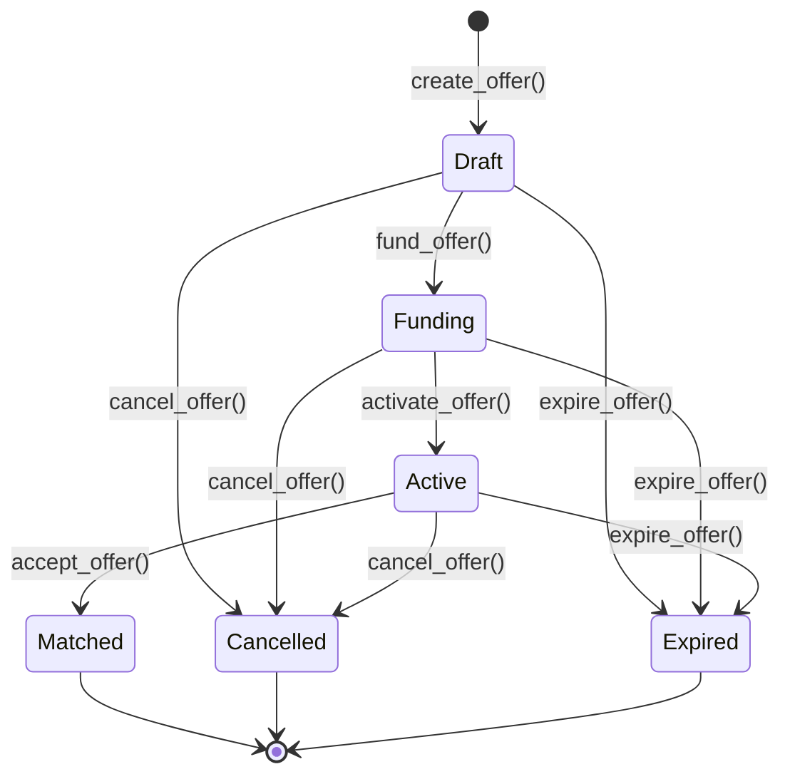
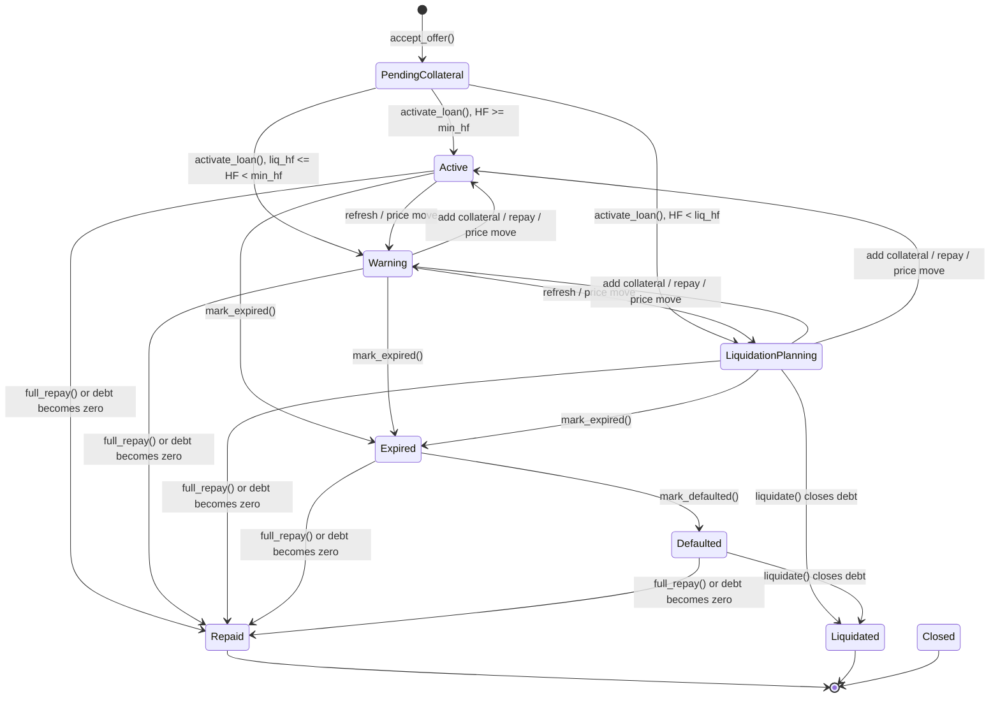

# 07 - State Machine

This document describes the current state machines implemented by the Soroban contracts, backend Prisma schema, and frontend domain types.

## Offer State Machine

Current offer states:

| State | Meaning | Terminal |
| --- | --- | --- |
| `Draft` | Terms were created, but lender funds are not locked yet. | No |
| `Funding` | Lender funds are locked in Vault, but the offer is not public yet. | No |
| `Active` | Offer is listed and can be accepted by a borrower. | No |
| `Matched` | Borrower accepted the offer and a pending loan was created. | Yes |
| `Cancelled` | Lender cancelled the offer and locked funds were returned when needed. | Yes |
| `Expired` | Offer was expired and locked funds were returned when needed. | Yes |

Important guards:

- `create_offer()` requires positive amount, valid APR/duration, distinct loan and collateral assets, valid LTV/liquidation thresholds, and lender auth.
- `fund_offer()` requires `Draft` status and lender auth, then calls Vault `lock_lender_funds`.
- `activate_offer()` requires `Funding` status and sufficient locked Vault balance.
- `accept_offer()` requires `Active` status, borrower auth, borrower not equal to lender, and positive collateral amount.
- `cancel_offer()` and `expire_offer()` cannot operate after `Matched`, `Cancelled`, or `Expired`.

Backend status names intentionally match the contract enum names: `Draft`, `Funding`, `Active`, `Matched`, `Cancelled`, `Expired`.

## Loan State Machine

Current loan states:

| State | Meaning | Mutable | Liquidatable |
| --- | --- | --- | --- |
| `PendingCollateral` | Offer was accepted; borrower has not activated and locked collateral yet. | Limited | No |
| `Active` | Healthy loan; HF is at or above the configured minimum. | Yes | No |
| `Warning` | HF is below configured minimum but at or above liquidation threshold. | Yes | No |
| `LiquidationPlanning` | HF is below liquidation threshold. | Yes | Yes |
| `Expired` | Due time has passed but grace period has not ended. | Yes | Only if HF is also liquidatable |
| `Defaulted` | Grace period has ended. | Yes | Yes |
| `Repaid` | Debt was fully repaid and collateral released. | No | No |
| `Liquidated` | Liquidation closed the remaining position. | No | No |
| `Closed` | Administrative terminal state. | No | No |

## Health Factor Mapping

All contract risk math uses basis points:

| Health Factor BPS | Status |
| --- | --- |
| `HF >= min_health_factor_bps` | `Active` |
| `12000 <= HF < min_health_factor_bps` | `Warning` |
| `HF < 12000` | `LiquidationPlanning` |

The liquidation threshold is fixed at `12000` BPS in shared constants. Offer creation defaults `min_health_factor_bps` to `14000` when omitted or zero.

## Time-Based Priority

Status refresh is ordered so terminal settlement wins first, then time, then HF:

1. If debt is zero, keep/enter settlement terminal status.
2. If now is past `due_time + grace_period_days`, status becomes `Defaulted`.
3. If now is past `due_time`, status becomes `Expired`.
4. Otherwise, status follows HF mapping.

`Defaulted` loans are liquidatable regardless of HF. `Expired` loans are still repayable during grace period and are liquidatable only if HF is also below the liquidation threshold.

## Backend Synchronization

The backend does not invent state transitions in API mode. Mutating routes verify a confirmed Soroban receipt, match the expected contract event/action, then read the authoritative on-chain offer or loan when needed. The database stores the resulting indexed state for fast UI queries.

The local frontend mock mode can still simulate state transitions in browser state for demos. API mode always requires live Soroban receipts.
