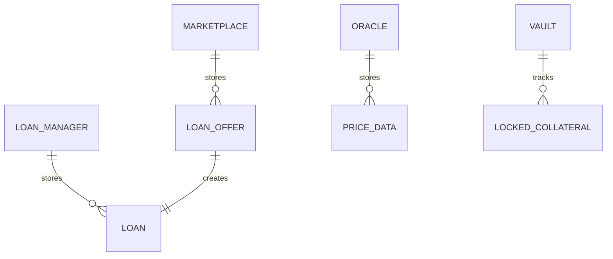
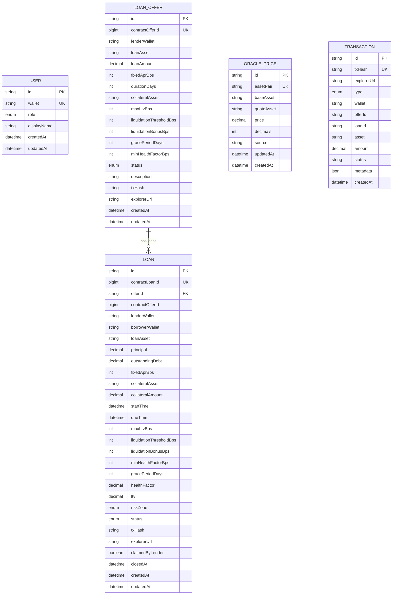

# 08 — Data Model

> On-chain and off-chain data schemas, ER diagrams, field-level documentation, and mapping between contract storage and the Prisma database.

---

## 1. Purpose

This document describes every data structure in the Nexus protocol — both on-chain (Soroban contract storage) and off-chain (PostgreSQL via Prisma). It provides field-level documentation, the ER diagram, and the mapping between the two layers. For the contract functions that read and write this data, see `05_CONTRACT_SPECIFICATION.md`. For the backend API that serves this data, see `09_BACKEND_SPEC.md`.

---

## 2. On-Chain Data Model (Soroban)

### 2.1 Overview

On-chain data is stored in Soroban persistent and instance storage. Each contract manages its own storage namespace.

### 2.2 LoanOffer (Marketplace Storage)

**Storage Key:** `DataKey::Offer(offer_id: u64)` — Persistent

| Field | Type | Size | Description | Constraints |
|-------|------|------|-------------|-------------|
| `offer_id` | `u64` | 8 bytes | Sequential identifier (1, 2, 3, ...) | Unique, auto-increment |
| `lender` | `Address` | 32 bytes | Lender's Stellar public key | Must `require_auth()` |
| `loan_asset` | `Address` | 32 bytes | Token contract address of the loan asset | Valid token contract |
| `loan_amount` | `i128` | 16 bytes | Loan amount in smallest unit (stroops) | > 0 |
| `fixed_apr_bps` | `u32` | 4 bytes | Annual interest rate in basis points | ≥ 0 |
| `duration_days` | `u32` | 4 bytes | Loan duration in days | > 0 (practical) |
| `collateral_asset` | `Address` | 32 bytes | Token contract address of collateral | Valid token contract |
| `max_ltv_bps` | `u32` | 4 bytes | Maximum LTV at loan creation | > 0, ≤ `liquidation_threshold_bps` |
| `liquidation_threshold_bps` | `u32` | 4 bytes | HF formula threshold | > 0 |
| `liquidation_bonus_bps` | `u32` | 4 bytes | Liquidator bonus percentage | ≥ 0 |
| `grace_period_days` | `u32` | 4 bytes | Days after expiry before default | ≥ 0 |
| `min_health_factor_bps` | `u32` | 4 bytes | Minimum HF at creation | Defaults to 14,000 if 0 |
| `status` | `OfferStatus` | 1 byte | Listed / Accepted / Cancelled | Enum variant |

### 2.3 Loan (Loan Manager Storage)

**Storage Key:** `DataKey::Loan(loan_id: u64)` — Persistent

| Field | Type | Size | Description | Source |
|-------|------|------|-------------|--------|
| `loan_id` | `u64` | 8 bytes | Sequential identifier | Auto-increment |
| `offer_id` | `u64` | 8 bytes | ID of the accepted offer | From LoanOffer |
| `lender` | `Address` | 32 bytes | Lender's address | Copied from offer |
| `borrower` | `Address` | 32 bytes | Borrower's address | From `accept_offer()` |
| `loan_asset` | `Address` | 32 bytes | Loan token address | Copied from offer |
| `principal` | `i128` | 16 bytes | Original loan amount | Copied from `offer.loan_amount` |
| `outstanding_debt` | `i128` | 16 bytes | Remaining debt (principal + interest − repayments) | Computed at creation |
| `fixed_apr_bps` | `u32` | 4 bytes | Fixed APR | Copied from offer |
| `collateral_asset` | `Address` | 32 bytes | Collateral token address | Copied from offer |
| `collateral_amount` | `i128` | 16 bytes | Current locked collateral | Updated on add/seize/release |
| `start_time` | `u64` | 8 bytes | Ledger timestamp at creation | `env.ledger().timestamp()` |
| `due_time` | `u64` | 8 bytes | Deadline for repayment | `start_time + duration × 86,400` |
| `max_ltv_bps` | `u32` | 4 bytes | Maximum LTV | Copied from offer |
| `liquidation_threshold_bps` | `u32` | 4 bytes | HF formula threshold | Copied from offer |
| `liquidation_bonus_bps` | `u32` | 4 bytes | Liquidator bonus | Copied from offer |
| `min_health_factor_bps` | `u32` | 4 bytes | Minimum HF at creation | Copied from offer |
| `grace_period_days` | `u32` | 4 bytes | Grace period | Copied from offer |
| `status` | `LoanStatus` | 1 byte | Current loan status | Maintained by Loan Manager |

### 2.4 PriceData (Oracle Storage)

**Storage Keys:**
- `DataKey::Price(asset_pair: String)` — Persistent
- `DataKey::AssetPrice(base: Address, quote: Address)` — Persistent

| Field | Type | Description |
|-------|------|-------------|
| `asset_pair` | `String` | Human-readable pair (e.g., `"XLM/USDC"`) |
| `price` | `i128` | Price value in smallest units |
| `decimals` | `u32` | Number of decimal places |
| `updated_at` | `u64` | Ledger timestamp of last update |
| `source` | `String` | Source identifier (e.g., `"admin"`) |

### 2.5 Locked Collateral (Vault Storage)

**Storage Key:** `DataKey::Locked(loan_id: u64, asset: Address)` — Persistent

| Field | Type | Description |
|-------|------|-------------|
| _(value)_ | `i128` | Amount of collateral locked for this loan and asset |

### 2.6 Configuration Keys (Instance Storage)

| Contract | Key | Type | Description |
|----------|-----|------|-------------|
| Marketplace | `Admin` | `Address` | Protocol admin |
| Marketplace | `LoanManager` | `Address` | Loan Manager contract ID |
| Marketplace | `Vault` | `Address` | Vault contract ID |
| Marketplace | `OfferCount` | `u64` | Next offer ID counter |
| Loan Manager | `Admin` | `Address` | Protocol admin |
| Loan Manager | `Oracle` | `Address` | Oracle contract ID |
| Loan Manager | `Vault` | `Address` | Vault contract ID |
| Loan Manager | `LoanCount` | `u64` | Next loan ID counter |
| Vault | `Admin` | `Address` | Protocol admin |
| Vault | `LoanManager` | `Address` | Loan Manager contract ID |
| Vault | `Marketplace` | `Address` | Marketplace contract ID |
| Oracle | `Admin` | `Address` | Protocol admin |

---

## 3. Off-Chain Data Model (Prisma / PostgreSQL)

### 3.1 ER Diagram

### 3.2 Enums (Prisma)

#### UserRole
| Value | Description |
|-------|-------------|
| `LENDER` | Creates and funds loan offers |
| `BORROWER` | Accepts offers and takes loans |
| `LIQUIDATOR` | Liquidates unhealthy positions |

#### OfferStatus
| Value | Maps To (Contract) |
|-------|---------------------|
| `LISTED` | `OfferStatus::Listed` |
| `ACCEPTED` | `OfferStatus::Accepted` |
| `CANCELLED` | `OfferStatus::Cancelled` |

#### LoanStatus
| Value | Maps To (Contract) |
|-------|---------------------|
| `PENDING` | _(frontend-only, pre-transaction)_ |
| `ACTIVE` | `LoanStatus::Active` |
| `WARNING` | `LoanStatus::Warning` |
| `LIQUIDATION_PLANNING` | `LoanStatus::LiquidationPlanning` |
| `REPAID` | `LoanStatus::Repaid` |
| `LIQUIDATED` | `LoanStatus::Liquidated` |
| `EXPIRED` | `LoanStatus::Expired` |
| `DEFAULTED` | `LoanStatus::Defaulted` |
| `CLOSED` | `LoanStatus::Closed` |

#### RiskZone
| Value | Maps To (HF Range) |
|-------|---------------------|
| `SAFE` | HF ≥ 14,000 BPS |
| `WARNING` | 12,000 ≤ HF < 14,000 BPS |
| `LIQUIDATION_PLANNING` | HF < 12,000 BPS |

#### TransactionType
| Value | Description |
|-------|-------------|
| `CONNECT_WALLET` | Wallet connection event |
| `CREATE_OFFER` | Lender created an offer |
| `CANCEL_OFFER` | Lender cancelled an offer |
| `ACCEPT_OFFER` | Borrower accepted an offer |
| `BORROW_LOAN` / `BORROW` | Loan disbursement |
| `ADD_COLLATERAL` | Borrower added collateral |
| `PARTIAL_REPAY` | Borrower partially repaid |
| `FULL_REPAY` / `REPAY` | Borrower fully repaid |
| `LIQUIDATE` | Liquidator executed liquidation |
| `UPDATE_ORACLE` / `ORACLE_UPDATE` | Oracle price updated |
| `HEALTH_RECALCULATION` | Health factor recalculated |
| `CLAIM_REPAYMENT` | Lender claimed repayment |

### 3.3 Model: User

| Column | Type | Constraints | Description |
|--------|------|-------------|-------------|
| `id` | `String` | PK, CUID | Internal ID |
| `wallet` | `String` | Unique | Stellar public key |
| `role` | `UserRole?` | Optional | Primary role |
| `displayName` | `String?` | Optional | User-chosen display name |
| `createdAt` | `DateTime` | Auto | Record creation time |
| `updatedAt` | `DateTime` | Auto | Last update time |

**Indexes:** `wallet` (unique)

### 3.4 Model: LoanOffer

| Column | Type | Constraints | Description |
|--------|------|-------------|-------------|
| `id` | `String` | PK, CUID | Internal ID |
| `contractOfferId` | `BigInt?` | Unique | On-chain offer_id |
| `lenderWallet` | `String` | Indexed | Lender's Stellar address |
| `loanAsset` | `String` | — | Loan token contract address |
| `loanAmount` | `Decimal(30,7)` | — | Loan amount |
| `fixedAprBps` | `Int` | — | APR in BPS |
| `durationDays` | `Int` | — | Loan duration |
| `collateralAsset` | `String` | — | Collateral token address |
| `maxLtvBps` | `Int` | — | Max LTV at creation |
| `liquidationThresholdBps` | `Int` | — | HF threshold |
| `liquidationBonusBps` | `Int` | — | Liquidator bonus |
| `gracePeriodDays` | `Int` | — | Grace period days |
| `minHealthFactorBps` | `Int` | Default 14000 | Min HF |
| `status` | `OfferStatus` | Default LISTED, Indexed | Current status |
| `description` | `String?` | Optional | Lender's description |
| `txHash` | `String?` | Optional | Creation transaction hash |
| `explorerUrl` | `String?` | Optional | Explorer link |
| `createdAt` | `DateTime` | Auto | Creation time |
| `updatedAt` | `DateTime` | Auto | Last update |

**Indexes:** `lenderWallet`, `status`  
**Relations:** `loans: Loan[]`

### 3.5 Model: Loan

| Column | Type | Constraints | Description |
|--------|------|-------------|-------------|
| `id` | `String` | PK, CUID | Internal ID |
| `contractLoanId` | `BigInt?` | Unique | On-chain loan_id |
| `offerId` | `String?` | FK → LoanOffer.id | Internal offer reference |
| `contractOfferId` | `BigInt?` | — | On-chain offer_id |
| `lenderWallet` | `String` | Indexed | Lender address |
| `borrowerWallet` | `String` | Indexed | Borrower address |
| `loanAsset` | `String` | — | Loan token address |
| `principal` | `Decimal(30,7)` | — | Original loan amount |
| `outstandingDebt` | `Decimal(30,7)` | — | Current remaining debt |
| `fixedAprBps` | `Int` | — | Fixed APR |
| `collateralAsset` | `String` | — | Collateral token address |
| `collateralAmount` | `Decimal(30,7)` | — | Current collateral locked |
| `startTime` | `DateTime?` | — | Loan start time |
| `dueTime` | `DateTime?` | — | Loan due time |
| `maxLtvBps` | `Int` | — | Max LTV |
| `liquidationThresholdBps` | `Int` | — | Liquidation threshold |
| `liquidationBonusBps` | `Int` | — | Liquidation bonus |
| `minHealthFactorBps` | `Int` | Default 14000 | Min HF |
| `gracePeriodDays` | `Int` | — | Grace period |
| `healthFactor` | `Decimal(18,6)` | Default 0 | Current HF (computed) |
| `ltv` | `Decimal(18,6)` | Default 0 | Current LTV (computed) |
| `riskZone` | `RiskZone` | Default SAFE, Indexed | Current risk zone |
| `status` | `LoanStatus` | Default ACTIVE, Indexed | Current status |
| `txHash` | `String?` | — | Creation tx hash |
| `explorerUrl` | `String?` | — | Explorer link |
| `claimedByLender` | `Boolean` | Default false | Whether lender claimed repayment |
| `closedAt` | `DateTime?` | — | When loan was closed |
| `createdAt` | `DateTime` | Auto | Creation time |
| `updatedAt` | `DateTime` | Auto | Last update |

**Indexes:** `borrowerWallet`, `lenderWallet`, `status`, `riskZone`  
**Relations:** `offer: LoanOffer?`

### 3.6 Model: OraclePrice

| Column | Type | Constraints | Description |
|--------|------|-------------|-------------|
| `id` | `String` | PK, CUID | Internal ID |
| `assetPair` | `String` | Unique | e.g., `"XLM/USDC"` |
| `baseAsset` | `String?` | Indexed (composite) | Base token address |
| `quoteAsset` | `String?` | Indexed (composite) | Quote token address |
| `price` | `Decimal(30,12)` | — | Current price |
| `decimals` | `Int` | — | Price decimal places |
| `source` | `String` | — | Price source |
| `updatedAt` | `DateTime` | — | Last price update |
| `createdAt` | `DateTime` | Auto | Record creation |

**Indexes:** `(baseAsset, quoteAsset)` composite

### 3.7 Model: Transaction

| Column | Type | Constraints | Description |
|--------|------|-------------|-------------|
| `id` | `String` | PK, CUID | Internal ID |
| `txHash` | `String` | Unique | Stellar transaction hash |
| `explorerUrl` | `String?` | — | Explorer link |
| `type` | `TransactionType` | Indexed | Transaction type |
| `wallet` | `String` | Indexed | Acting wallet address |
| `offerId` | `String?` | Indexed | Related offer ID |
| `loanId` | `String?` | Indexed | Related loan ID |
| `asset` | `String?` | — | Token involved |
| `amount` | `Decimal(30,7)?` | — | Amount transferred |
| `status` | `String` | Default "CONFIRMED" | Transaction status |
| `metadata` | `Json?` | — | Additional data |
| `createdAt` | `DateTime` | Auto | Record creation |

**Indexes:** `wallet`, `type`, `loanId`, `offerId`

---

## 4. On-Chain ↔ Off-Chain Mapping

### 4.1 LoanOffer Mapping

| On-Chain Field | Off-Chain Column | Type Conversion |
|----------------|-----------------|-----------------|
| `offer_id` (u64) | `contractOfferId` (BigInt) | Direct |
| `lender` (Address) | `lenderWallet` (String) | `.to_string()` |
| `loan_asset` (Address) | `loanAsset` (String) | `.to_string()` |
| `loan_amount` (i128) | `loanAmount` (Decimal) | Divide by asset decimals |
| `fixed_apr_bps` (u32) | `fixedAprBps` (Int) | Direct |
| `duration_days` (u32) | `durationDays` (Int) | Direct |
| `collateral_asset` (Address) | `collateralAsset` (String) | `.to_string()` |
| `max_ltv_bps` (u32) | `maxLtvBps` (Int) | Direct |
| `liquidation_threshold_bps` (u32) | `liquidationThresholdBps` (Int) | Direct |
| `liquidation_bonus_bps` (u32) | `liquidationBonusBps` (Int) | Direct |
| `grace_period_days` (u32) | `gracePeriodDays` (Int) | Direct |
| `min_health_factor_bps` (u32) | `minHealthFactorBps` (Int) | Direct |
| `status` (OfferStatus) | `status` (OfferStatus) | Enum mapping |
| _(none)_ | `id` (String) | Backend-generated CUID |
| _(none)_ | `description` (String) | Backend-only metadata |
| _(none)_ | `txHash` (String) | Backend tracks tx hash |

### 4.2 Loan Mapping

| On-Chain Field | Off-Chain Column | Notes |
|----------------|-----------------|-------|
| `loan_id` (u64) | `contractLoanId` (BigInt) | Direct |
| `offer_id` (u64) | `contractOfferId` (BigInt) | Direct |
| `lender` (Address) | `lenderWallet` (String) | |
| `borrower` (Address) | `borrowerWallet` (String) | |
| `principal` (i128) | `principal` (Decimal) | |
| `outstanding_debt` (i128) | `outstandingDebt` (Decimal) | |
| `collateral_amount` (i128) | `collateralAmount` (Decimal) | |
| `start_time` (u64) | `startTime` (DateTime) | Unix → DateTime |
| `due_time` (u64) | `dueTime` (DateTime) | Unix → DateTime |
| `status` (LoanStatus) | `status` (LoanStatus) | Enum mapping |
| _(computed)_ | `healthFactor` (Decimal) | Computed by backend |
| _(computed)_ | `ltv` (Decimal) | Computed by backend |
| _(computed)_ | `riskZone` (RiskZone) | Derived from HF |
| _(none)_ | `claimedByLender` (Boolean) | Backend-only tracking |

### 4.3 Enum Mapping

| Contract Enum | Prisma Enum | Mapping |
|---------------|-------------|---------|
| `OfferStatus::Listed` | `LISTED` | Direct |
| `OfferStatus::Accepted` | `ACCEPTED` | Direct |
| `OfferStatus::Cancelled` | `CANCELLED` | Direct |
| `LoanStatus::Active` | `ACTIVE` | Direct |
| `LoanStatus::Warning` | `WARNING` | Direct |
| `LoanStatus::LiquidationPlanning` | `LIQUIDATION_PLANNING` | Direct |
| `LoanStatus::Repaid` | `REPAID` | Direct |
| `LoanStatus::Liquidated` | `LIQUIDATED` | Direct |
| `LoanStatus::Expired` | `EXPIRED` | Direct |
| `LoanStatus::Defaulted` | `DEFAULTED` | Direct |
| `LoanStatus::Closed` | `CLOSED` | Direct |
| _(none)_ | `PENDING` | Frontend-only (pre-transaction) |

---

## 5. Data Lifecycle

| Phase | On-Chain | Off-Chain |
|-------|----------|-----------|
| Offer Created | `LoanOffer` stored in Marketplace | `LoanOffer` row created |
| Offer Accepted | `LoanOffer.status → Accepted` | `LoanOffer.status → ACCEPTED` |
| Loan Created | `Loan` stored in Loan Manager | `Loan` row created |
| Price Updated | `PriceData` stored in Oracle | `OraclePrice` row upserted |
| HF Recalculated | `Loan.status` updated | `Loan.healthFactor`, `ltv`, `riskZone`, `status` updated |
| Repayment | `Loan.outstanding_debt` decreased | `Loan.outstandingDebt` updated |
| Collateral Added | `Loan.collateral_amount` increased | `Loan.collateralAmount` updated |
| Liquidation | `Loan.outstanding_debt` & `collateral_amount` decreased | Updated + `Transaction` created |
| All mutations | Contract events emitted | `Transaction` row created |

---

*Previous: `07_STATE_MACHINE.md` · Next: `09_BACKEND_SPEC.md`*
