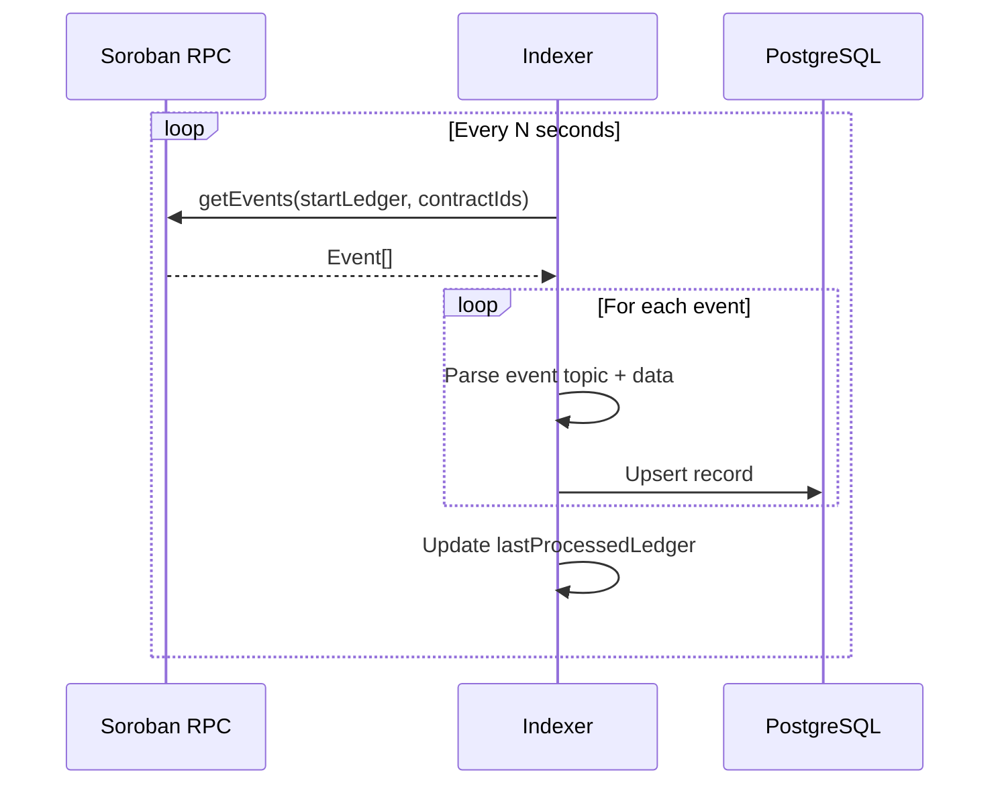
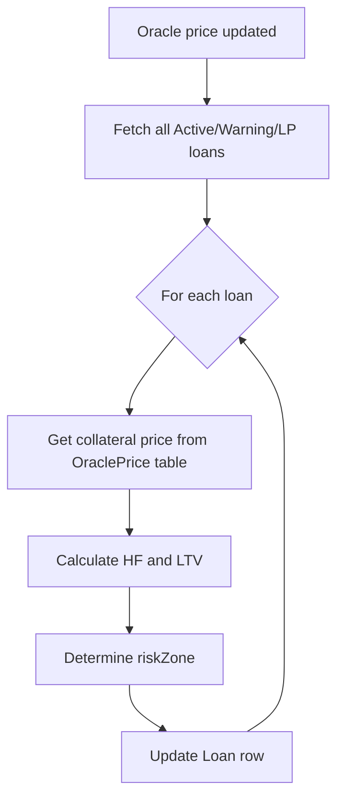
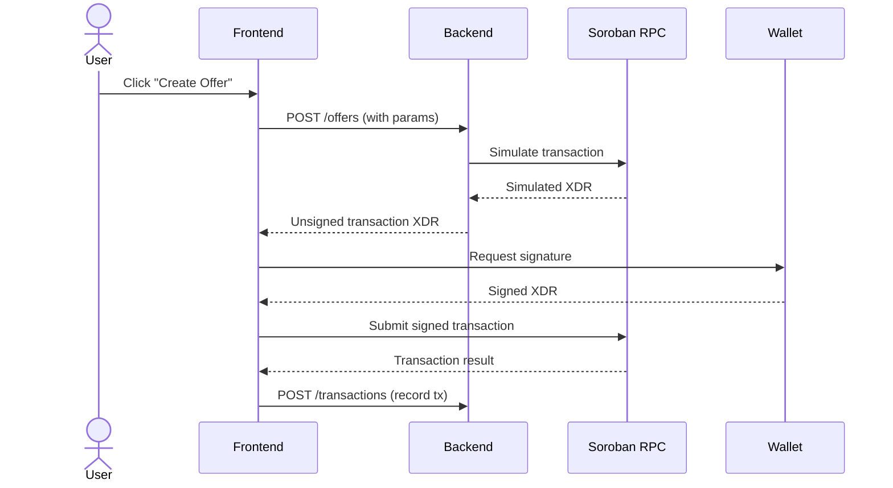

# 09 — Backend Specification

> REST API reference, module architecture, indexer design, and operational responsibilities for the Nexus backend service.

---

## 1. Purpose

This document specifies the backend service that sits between the smart contracts and the frontend. It covers every REST endpoint, the module architecture, the event indexer, and the backend's security boundaries. For the data models it serves, see `08_DATA_MODEL.md`. For the frontend that consumes this API, see `10_FRONTEND_INTEGRATION.md`.

---

## 2. Architecture

```
┌──────────────────────────────────────────────────┐
│                Backend Service                   │
│  Express + TypeScript                            │
├──────────────────────────────────────────────────┤
│                                                  │
│  ┌──────────┐  ┌──────────┐  ┌──────────┐       │
│  │  Routes   │  │Modules   │  │ Prisma   │       │
│  │  index.ts │→│ *.routes  │→│  ORM     │→ PG   │
│  └──────────┘  │ *.service │  └──────────┘       │
│                │ *.controller│                    │
│                └──────────┘                      │
│                                                  │
│  ┌──────────┐  ┌──────────────────┐              │
│  │ Indexer   │  │ Soroban Service  │              │
│  │ (events)  │  │ (tx assembly)    │              │
│  └──────────┘  └──────────────────┘              │
│                                                  │
└──────────────────────────────────────────────────┘
```

### 2.1 Module Structure

| Module | Directory | Responsibility |
|--------|-----------|----------------|
| **Users** | `src/modules/users/` | Wallet registration, user profiles |
| **Offers** | `src/modules/offers/` | Loan offer CRUD, status management |
| **Loans** | `src/modules/loans/` | Loan queries, status updates, HF tracking |
| **Oracle** | `src/modules/oracle/` | Price data, HF recalculation |
| **Transactions** | `src/modules/transactions/` | Transaction log |
| **Soroban** | `src/modules/soroban/` | Contract interaction stubs (to be replaced with real Soroban SDK calls) |

### 2.2 Security Boundary

> **The backend NEVER stores user funds. It NEVER holds private keys. It NEVER makes financial decisions.**

The backend is a **read cache** and **API gateway**. All authoritative financial state lives on-chain. The backend:
- Indexes contract events into PostgreSQL for fast queries
- Serves cached data to the frontend via REST
- Optionally assembles unsigned transactions for the frontend to sign
- Computes derived metrics (HF, LTV, risk zone) from on-chain + oracle data

---

## 3. REST API Reference

Base URL: `http://localhost:5000/api`

### 3.1 Health Check

| Method | Path | Description |
|--------|------|-------------|
| `GET` | `/health` | Service health check |

**Response:** `200 OK`
```json
{ "status": "ok" }
```

---

### 3.2 Users

| Method | Path | Description |
|--------|------|-------------|
| `GET` | `/users/:wallet` | Get user by wallet address |
| `POST` | `/users` | Create or register a user |

#### `GET /users/:wallet`

**Path Parameters:**
| Parameter | Type | Description |
|-----------|------|-------------|
| `wallet` | `string` | Stellar public key |

**Response:** `200 OK`
```json
{
  "id": "clx...",
  "wallet": "GABC...XYZ",
  "role": "LENDER",
  "displayName": "Alice",
  "createdAt": "2026-01-15T10:00:00Z",
  "updatedAt": "2026-01-15T10:00:00Z"
}
```

#### `POST /users`

**Request Body:**
```json
{
  "wallet": "GABC...XYZ",
  "role": "LENDER",
  "displayName": "Alice"
}
```

**Response:** `201 Created` — User object

---

### 3.3 Offers

| Method | Path | Description |
|--------|------|-------------|
| `GET` | `/offers` | List all offers (with filters) |
| `GET` | `/offers/:id` | Get offer by internal ID |
| `POST` | `/offers` | Create a new offer record |
| `PATCH` | `/offers/:id/status` | Update offer status |

#### `GET /offers`

**Query Parameters:**
| Parameter | Type | Description |
|-----------|------|-------------|
| `status` | `string` | Filter by status (LISTED, ACCEPTED, CANCELLED) |
| `lenderWallet` | `string` | Filter by lender |

**Response:** `200 OK` — Array of LoanOffer objects

#### `GET /offers/:id`

**Response:** `200 OK` — Single LoanOffer object
```json
{
  "id": "clx...",
  "contractOfferId": 1,
  "lenderWallet": "GABC...XYZ",
  "loanAsset": "CDLZ...USDC",
  "loanAmount": "1000.0000000",
  "fixedAprBps": 1000,
  "durationDays": 30,
  "collateralAsset": "CDLZ...XLM",
  "maxLtvBps": 7500,
  "liquidationThresholdBps": 8000,
  "liquidationBonusBps": 500,
  "gracePeriodDays": 7,
  "minHealthFactorBps": 14000,
  "status": "LISTED",
  "description": "30-day USDC loan at 10% APR",
  "txHash": "abc123...",
  "explorerUrl": "https://stellar.expert/...",
  "createdAt": "2026-01-15T10:00:00Z",
  "updatedAt": "2026-01-15T10:00:00Z"
}
```

#### `POST /offers`

**Request Body:**
```json
{
  "lenderWallet": "GABC...XYZ",
  "loanAsset": "CDLZ...USDC",
  "loanAmount": 1000,
  "fixedAprBps": 1000,
  "durationDays": 30,
  "collateralAsset": "CDLZ...XLM",
  "maxLtvBps": 7500,
  "liquidationThresholdBps": 8000,
  "liquidationBonusBps": 500,
  "gracePeriodDays": 7,
  "minHealthFactorBps": 14000,
  "description": "30-day USDC loan at 10% APR"
}
```

**Response:** `201 Created` — LoanOffer object with `txHash` and `contractOfferId`

#### `PATCH /offers/:id/status`

**Request Body:**
```json
{
  "status": "CANCELLED"
}
```

**Response:** `200 OK` — Updated LoanOffer object

---

### 3.4 Loans

| Method | Path | Description |
|--------|------|-------------|
| `GET` | `/loans` | List all loans (with filters) |
| `GET` | `/loans/liquidatable` | List liquidatable loans |
| `GET` | `/loans/:id` | Get loan by internal ID |
| `POST` | `/loans` | Create a loan record |
| `PATCH` | `/loans/:id` | Update loan fields |

#### `GET /loans`

**Query Parameters:**
| Parameter | Type | Description |
|-----------|------|-------------|
| `status` | `string` | Filter by loan status |
| `borrowerWallet` | `string` | Filter by borrower |
| `lenderWallet` | `string` | Filter by lender |
| `riskZone` | `string` | Filter by risk zone |

**Response:** `200 OK` — Array of Loan objects

#### `GET /loans/liquidatable`

Returns loans where `riskZone = LIQUIDATION_PLANNING` or `status = DEFAULTED`.

**Response:** `200 OK` — Array of Loan objects

#### `GET /loans/:id`

**Response:** `200 OK`
```json
{
  "id": "clx...",
  "contractLoanId": 1,
  "offerId": "clx...",
  "contractOfferId": 1,
  "lenderWallet": "GABC...XYZ",
  "borrowerWallet": "GDEF...XYZ",
  "loanAsset": "CDLZ...USDC",
  "principal": "1000.0000000",
  "outstandingDebt": "1008.2191780",
  "fixedAprBps": 1000,
  "collateralAsset": "CDLZ...XLM",
  "collateralAmount": "10000.0000000",
  "startTime": "2026-01-15T10:00:00Z",
  "dueTime": "2026-02-14T10:00:00Z",
  "maxLtvBps": 7500,
  "liquidationThresholdBps": 8000,
  "liquidationBonusBps": 500,
  "minHealthFactorBps": 14000,
  "gracePeriodDays": 7,
  "healthFactor": "1.984126",
  "ltv": "0.403287",
  "riskZone": "SAFE",
  "status": "ACTIVE",
  "claimedByLender": false,
  "createdAt": "2026-01-15T10:05:00Z",
  "updatedAt": "2026-01-15T12:00:00Z"
}
```

#### `POST /loans`

**Request Body:** Loan creation data (typically assembled from an accepted offer)

#### `PATCH /loans/:id`

**Request Body:** Partial update fields (status, outstandingDebt, collateralAmount, healthFactor, ltv, riskZone, etc.)

---

### 3.5 Oracle

| Method | Path | Description |
|--------|------|-------------|
| `GET` | `/oracle/prices` | Get all current prices |
| `POST` | `/oracle/prices` | Set / update a price |
| `POST` | `/oracle/recalculate-health` | Recalculate HF for all active loans |

#### `GET /oracle/prices`

**Response:** `200 OK`
```json
[
  {
    "id": "clx...",
    "assetPair": "XLM/USDC",
    "baseAsset": "CDLZ...XLM",
    "quoteAsset": "CDLZ...USDC",
    "price": "0.250000000000",
    "decimals": 7,
    "source": "admin",
    "updatedAt": "2026-01-15T12:00:00Z"
  }
]
```

#### `POST /oracle/prices`

**Request Body:**
```json
{
  "assetPair": "XLM/USDC",
  "baseAsset": "CDLZ...XLM",
  "quoteAsset": "CDLZ...USDC",
  "price": 0.25,
  "decimals": 7,
  "source": "admin"
}
```

#### `POST /oracle/recalculate-health`

Triggers a recalculation of Health Factor, LTV, and risk zone for all active loans using the latest oracle prices.

**Response:** `200 OK`
```json
{
  "recalculated": 15,
  "warnings": 2,
  "liquidatable": 1
}
```

---

### 3.6 Transactions

| Method | Path | Description |
|--------|------|-------------|
| `GET` | `/transactions` | List transactions (with filters) |
| `POST` | `/transactions` | Create a transaction record |

#### `GET /transactions`

**Query Parameters:**
| Parameter | Type | Description |
|-----------|------|-------------|
| `wallet` | `string` | Filter by wallet |
| `type` | `string` | Filter by transaction type |
| `loanId` | `string` | Filter by loan |
| `offerId` | `string` | Filter by offer |

**Response:** `200 OK` — Array of Transaction objects

#### `POST /transactions`

**Request Body:**
```json
{
  "txHash": "abc123...",
  "type": "CREATE_OFFER",
  "wallet": "GABC...XYZ",
  "offerId": "clx...",
  "asset": "USDC",
  "amount": 1000,
  "metadata": { "apr": 1000, "duration": 30 }
}
```

---

## 4. Event Indexer

### 4.1 Architecture

The indexer polls Soroban RPC for contract events and writes them to PostgreSQL:



### 4.2 Event-to-Database Mapping

| Contract Event | DB Action |
|----------------|-----------|
| `offer_new` | Insert `LoanOffer` row |
| `offer_can` | Update `LoanOffer.status → CANCELLED` |
| `offer_acc` | Update `LoanOffer.status → ACCEPTED`, Insert `Loan` row |
| `loan_new` | Insert `Loan` row (or confirm existing) |
| `state` | Update `Loan.status` |
| `col_add` | Update `Loan.collateralAmount`, recalculate HF |
| `part_pay` | Update `Loan.outstandingDebt`, recalculate HF |
| `repaid` | Update `Loan.status → REPAID`, `outstandingDebt → 0` |
| `liq` | Update `Loan.outstandingDebt` and `collateralAmount`, update status |
| `price_upd` | Upsert `OraclePrice` row |
| All events | Insert `Transaction` row |

### 4.3 HF Recalculation Workflow



**HF Formula (Backend):**
```
collateral_value = collateral_amount × oracle_price
health_factor = (collateral_value × liquidation_threshold_bps) / outstanding_debt
ltv = outstanding_debt / collateral_value
```

**Risk Zone Mapping:**
```
if health_factor >= 1.4 → SAFE
else if health_factor >= 1.2 → WARNING
else → LIQUIDATION_PLANNING
```

---

## 5. Soroban Service (Integration Layer)

### 5.1 Current State

The Soroban service (`src/modules/soroban/soroban.service.ts`) currently contains **stub implementations** that return mock transaction hashes and explorer URLs. This is documented in the project README.

### 5.2 Target Implementation

When fully integrated, the Soroban service will:

| Function | Description |
|----------|-------------|
| `assembleCreateOffer()` | Build unsigned `create_offer()` transaction |
| `assembleCancelOffer()` | Build unsigned `cancel_offer()` transaction |
| `assembleAcceptOffer()` | Build unsigned `accept_offer()` transaction |
| `assembleAddCollateral()` | Build unsigned `add_collateral()` transaction |
| `assemblePartialRepay()` | Build unsigned `partial_repay()` transaction |
| `assembleFullRepay()` | Build unsigned `full_repay()` transaction |
| `assembleLiquidate()` | Build unsigned `liquidate()` transaction |
| `assembleSetPrice()` | Build unsigned `set_price_for_assets()` transaction |
| `submitTransaction()` | Submit signed transaction to Soroban RPC |
| `pollEvents()` | Poll contract events from Soroban RPC |

### 5.3 Transaction Assembly Flow



---

## 6. Database Migrations

| Tool | Description |
|------|-------------|
| `npx prisma migrate dev` | Create and apply migrations in development |
| `npx prisma migrate deploy` | Apply migrations in production |
| `npx prisma generate` | Generate Prisma client after schema changes |
| `npx prisma db seed` | Seed database with test data |

The migration files are stored in `backend/prisma/migrations/`.

---

## 7. Error Handling

| HTTP Status | Usage |
|-------------|-------|
| `200` | Successful GET, PATCH |
| `201` | Successful POST (created) |
| `400` | Validation error, invalid parameters |
| `404` | Resource not found |
| `409` | Conflict (e.g., duplicate wallet) |
| `500` | Internal server error |

**Error Response Format:**
```json
{
  "error": "Validation failed",
  "message": "loan_amount must be positive",
  "statusCode": 400
}
```

---

## 8. Best Practices

| Practice | Description |
|----------|-------------|
| **Idempotent Indexing** | Use `contractOfferId` and `contractLoanId` as unique keys to prevent duplicate records |
| **Eventual Consistency** | Backend data may lag behind on-chain state by a few seconds |
| **No Fund Custody** | Backend never calls token transfer functions directly |
| **Input Validation** | Validate all incoming request bodies before database writes |
| **Decimal Precision** | Use `Decimal(30,7)` for amounts to match Stellar's 7-decimal precision |
| **Audit Trail** | Every mutation creates a `Transaction` record |

---

*Previous: `08_DATA_MODEL.md` · Next: `10_FRONTEND_INTEGRATION.md`*
