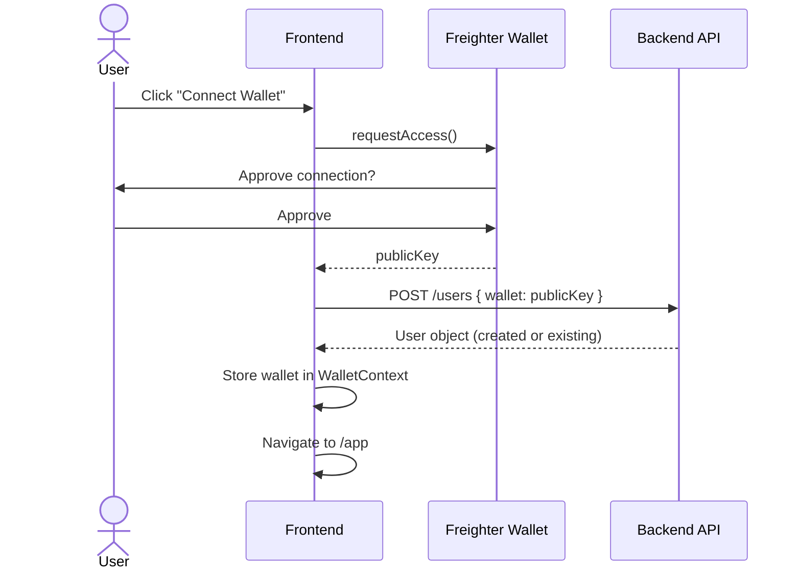
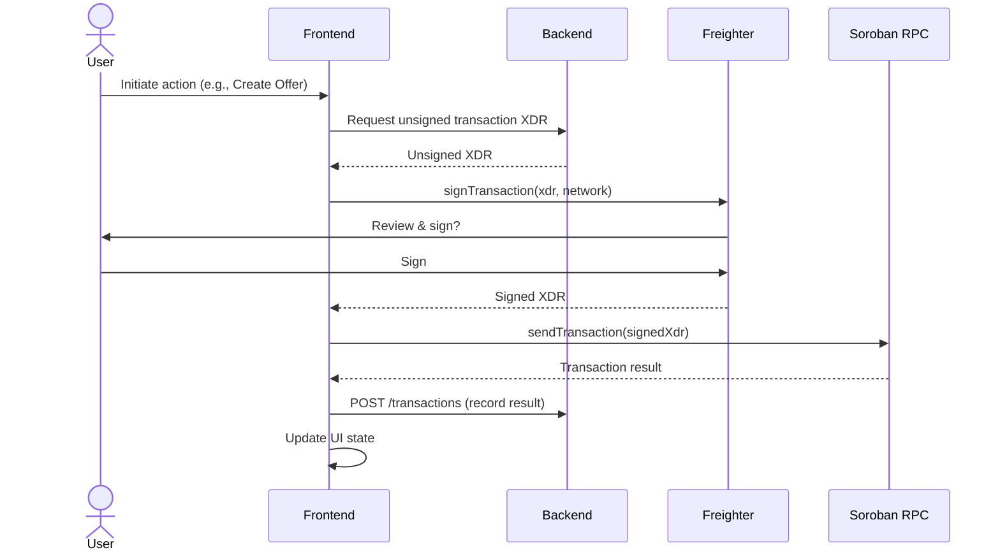

# 10 — Frontend Integration

> Page inventory, wallet integration, UI-to-contract data flow, and role-based views for the Nexus frontend.

---

## 1. Purpose

This document describes how the Vite/React frontend integrates with the backend API and Soroban smart contracts. It covers every page, the wallet connection flow, data requirements per user action, and role-based view logic. For the backend API it consumes, see `09_BACKEND_SPEC.md`. For the contract functions it triggers, see `05_CONTRACT_SPECIFICATION.md`.

---

## 2. Technology Stack

| Component | Technology |
|-----------|------------|
| **Framework** | React 18+ with TypeScript |
| **Build Tool** | Vite |
| **UI Library** | Ant Design |
| **Routing** | React Router v6 |
| **State Management** | React Context (WalletContext) |
| **Wallet** | Freighter Wallet Extension |
| **Blockchain** | Soroban SDK (@stellar/stellar-sdk) |
| **HTTP Client** | Fetch / Axios (to backend REST API) |

---

## 3. Route Architecture

### 3.1 Route Map

```mermaid
graph TD
    ROOT["/"] --> LANDING["LandingPage"]
    CONNECT["/connect"] --> CONN_PAGE["ConnectPage"]
    
    APP["/app"] --> DASH["DashboardPage"]
    APP --> MKT["/app/marketplace"]
    APP --> CREATE["/app/create-loan"]
    APP --> LOAN_D["/app/loans/:id"]
    APP --> BORROW["/app/borrow/:id"]
    APP --> BORR_DASH["/app/borrower"]
    APP --> LEND_DASH["/app/lender"]
    APP --> LIQ_CENTER["/app/liquidation"]
    APP --> LIQ_DETAIL["/app/liquidation/:id"]
    APP --> ORACLE["/app/oracle"]
    APP --> MY_LOANS["/app/my-loans"]
    APP --> SETTINGS["/app/settings"]
```



### 3.2 Layout Structure

| Layout | Routes | Description |
|--------|--------|-------------|
| **PublicLayout** | `/`, `/connect` | No authentication required, marketing/onboarding |
| **AppLayout** | `/app/*` | Requires wallet connection, sidebar navigation |
| **ProtectedRoute** | Wraps AppLayout | Redirects to `/connect` if wallet not connected |

### 3.3 Page Inventory

| # | Route | Page Component | Purpose | Auth Required | Primary Role |
|---|-------|---------------|---------|---------------|-------------|
| 1 | `/` | `LandingPage` | Marketing, protocol overview | No | — |
| 2 | `/connect` | `ConnectPage` | Wallet connection | No | — |
| 3 | `/app` | `DashboardPage` | Portfolio overview, stats | Yes | All |
| 4 | `/app/marketplace` | `MarketplacePage` | Browse and filter loan offers | Yes | Borrower |
| 5 | `/app/create-loan` | `CreateLoanPage` | Create a new loan offer | Yes | Lender |
| 6 | `/app/loans/:id` | `LoanDetailPage` | View loan details, actions | Yes | Borrower/Lender |
| 7 | `/app/borrow/:id` | `BorrowLoanPage` | Accept an offer, deposit collateral | Yes | Borrower |
| 8 | `/app/borrower` | `BorrowerDashboardPage` | Borrower-specific dashboard | Yes | Borrower |
| 9 | `/app/lender` | `LenderDashboardPage` | Lender-specific dashboard | Yes | Lender |
| 10 | `/app/liquidation` | `LiquidationCenterPage` | Browse liquidatable positions | Yes | Liquidator |
| 11 | `/app/liquidation/:id` | `LiquidationDetailPage` | Liquidate a specific loan | Yes | Liquidator |
| 12 | `/app/oracle` | `OracleMonitorPage` | View oracle prices, history | Yes | All |
| 13 | `/app/my-loans` | `MyLoansPage` | All loans for connected wallet | Yes | All |
| 14 | `/app/settings` | `SettingsPage` | Profile, preferences | Yes | All |

---

## 4. Wallet Integration

### 4.1 Connection Flow



### 4.2 Wallet State

```typescript
interface WalletState {
  connected: boolean;
  address: string | null;
  role: UserRole | null;
  balanceXLM: number;
  balanceUSDC: number;
}
```

### 4.3 Transaction Signing Flow



---

## 5. Page Details

### 5.1 LandingPage (`/`)

| Element | Description |
|---------|-------------|
| Hero section | Protocol tagline, CTA to connect wallet |
| Feature cards | P2P lending, fixed rates, escrow, HF monitoring |
| Stats | Total loans, total value locked, active offers |
| CTA | "Get Started" → `/connect` |

**API Calls:** None (static or mock data)

### 5.2 ConnectPage (`/connect`)

| Element | Description |
|---------|-------------|
| Wallet selector | Freighter connection button |
| Role selection | Lender / Borrower / Liquidator |
| Wallet info | Display connected address and balances |

**API Calls:**
- `POST /api/users` — register wallet

### 5.3 DashboardPage (`/app`)

| Element | Description |
|---------|-------------|
| Portfolio summary | Total lent, total borrowed, total collateral |
| Active loans | Count and summary cards |
| Recent transactions | Last 5–10 transactions |
| Quick actions | Create offer, browse marketplace |
| HF alerts | Loans in Warning or LiquidationPlanning |

**API Calls:**
- `GET /api/loans?borrowerWallet=X` or `lenderWallet=X`
- `GET /api/offers?lenderWallet=X`
- `GET /api/transactions?wallet=X`
- `GET /api/oracle/prices`

### 5.4 MarketplacePage (`/app/marketplace`)

| Element | Description |
|---------|-------------|
| Offer list | Cards/table of LISTED offers |
| Filters | Asset pair, APR range, duration, amount |
| Sort | By APR, amount, duration, creation date |
| Offer card | Amount, APR, duration, collateral requirements, "Borrow" button |

**API Calls:**
- `GET /api/offers?status=LISTED`

**User Actions:**
- Click offer → navigate to `/app/borrow/:id`

### 5.5 CreateLoanPage (`/app/create-loan`)

| Element | Description |
|---------|-------------|
| Form | All offer parameters |
| Preview | Calculated interest, collateral requirements |
| Submit | Triggers `create_offer()` contract call |

**Form Fields:**

| Field | Input Type | Validation |
|-------|-----------|------------|
| Loan Asset | Dropdown (USDC) | Required |
| Loan Amount | Number | > 0 |
| Fixed APR | Number (%) | ≥ 0 |
| Duration | Number (days) | > 0 |
| Collateral Asset | Dropdown (XLM) | Required |
| Max LTV | Number (%) | > 0, < Liq Threshold |
| Liquidation Threshold | Number (%) | > Max LTV |
| Liquidation Bonus | Number (%) | ≥ 0 |
| Grace Period | Number (days) | ≥ 0 |
| Min Health Factor | Number | ≥ 1.2 |
| Description | Text | Optional |

**Transaction Flow:**
1. Frontend converts % inputs to BPS (×100)
2. Backend assembles `create_offer()` transaction
3. User signs with Freighter
4. Transaction submitted to Soroban RPC
5. Backend records offer + transaction

### 5.6 BorrowLoanPage (`/app/borrow/:id`)

| Element | Description |
|---------|-------------|
| Offer details | Full offer parameters display |
| Collateral input | Amount of collateral to deposit |
| HF preview | Simulated HF based on input collateral and current oracle price |
| LTV preview | Simulated LTV |
| Submit | Triggers `accept_offer()` contract call |

**API Calls:**
- `GET /api/offers/:id`
- `GET /api/oracle/prices`

**HF Simulation (Client-Side):**
```typescript
const collateralValue = collateralAmount * oraclePrice;
const simulatedHF = (collateralValue * liquidationThreshold) / outstandingDebt;
```

### 5.7 LoanDetailPage (`/app/loans/:id`)

| Element | Description |
|---------|-------------|
| Loan summary | All loan parameters, current status |
| Health Factor gauge | Visual HF indicator with color zones |
| Collateral info | Amount, value, asset |
| Actions | Add Collateral, Partial Repay, Full Repay (borrower only) |
| Timeline | Loan events (creation, repayments, status changes) |

**API Calls:**
- `GET /api/loans/:id`
- `GET /api/oracle/prices`
- `GET /api/transactions?loanId=X`

**Borrower Actions:**
| Action | Contract Function | UI Element |
|--------|------------------|-----------|
| Add Collateral | `LoanManager.add_collateral()` | Input + Button |
| Partial Repay | `LoanManager.partial_repay()` | Input + Button |
| Full Repay | `LoanManager.full_repay()` | Button |

### 5.8 BorrowerDashboardPage (`/app/borrower`)

| Element | Description |
|---------|-------------|
| Active loans | List with HF, status, due date |
| Upcoming due dates | Calendar/list of loans approaching due |
| HF alerts | Loans needing attention |
| Total borrowed | Sum of outstanding debt |

**API Calls:**
- `GET /api/loans?borrowerWallet=X`

### 5.9 LenderDashboardPage (`/app/lender`)

| Element | Description |
|---------|-------------|
| Active offers | Listed offers awaiting borrowers |
| Matched loans | Loans where the lender's offers were accepted |
| Earnings | Total interest earned from repaid loans |
| Pending claims | Repayments awaiting claim |

**API Calls:**
- `GET /api/offers?lenderWallet=X`
- `GET /api/loans?lenderWallet=X`

### 5.10 LiquidationCenterPage (`/app/liquidation`)

| Element | Description |
|---------|-------------|
| Liquidatable loans | Loans with HF < 1.2 or status Defaulted |
| Profit calculator | Estimated profit per liquidation (bonus) |
| Sort | By HF (ascending), by profit (descending) |

**API Calls:**
- `GET /api/loans/liquidatable`
- `GET /api/oracle/prices`

### 5.11 LiquidationDetailPage (`/app/liquidation/:id`)

| Element | Description |
|---------|-------------|
| Loan details | Full loan state, current HF |
| Liquidation calculator | Input repay amount → show seized collateral and profit |
| Execute | Triggers `LoanManager.liquidate()` |

**Liquidation Preview (Client-Side):**
```typescript
const maxRepay = outstandingDebt * 0.5;
const actualRepay = Math.min(inputAmount, maxRepay, outstandingDebt);
const repayWithBonus = actualRepay * (1 + liquidationBonus);
const seizeCollateral = repayWithBonus / oraclePrice;
const profit = seizeCollateral * oraclePrice - actualRepay;
```

### 5.12 OracleMonitorPage (`/app/oracle`)

| Element | Description |
|---------|-------------|
| Price table | All tracked asset pairs with current prices |
| Last updated | Timestamp of each price update |
| Price chart | Historical price data (if available) |
| Admin panel | Set price form (admin only) |

**API Calls:**
- `GET /api/oracle/prices`

### 5.13 MyLoansPage (`/app/my-loans`)

| Element | Description |
|---------|-------------|
| All loans | Combined view of loans as borrower and lender |
| Tabs | Active / Completed / All |
| Filters | By role, status, date range |

**API Calls:**
- `GET /api/loans?borrowerWallet=X`
- `GET /api/loans?lenderWallet=X`

### 5.14 SettingsPage (`/app/settings`)

| Element | Description |
|---------|-------------|
| Profile | Display name, wallet address |
| Notifications | HF alert thresholds (future) |
| Network | Testnet / Mainnet selector (future) |
| Theme | Light / Dark mode toggle |

---

## 6. Role-Based View Logic

### 6.1 View Permissions

| Page | Lender | Borrower | Liquidator |
|------|:------:|:--------:|:----------:|
| Dashboard | ✅ | ✅ | ✅ |
| Marketplace | View | Browse & Accept | View |
| Create Loan | Create | — | — |
| Loan Detail | View (as lender) | View + Actions | View |
| Borrow | — | Accept + Collateral | — |
| Borrower Dashboard | — | ✅ | — |
| Lender Dashboard | ✅ | — | — |
| Liquidation Center | — | — | ✅ |
| Liquidation Detail | — | — | Execute |
| Oracle | View | View | View |
| My Loans | ✅ | ✅ | ✅ |
| Settings | ✅ | ✅ | ✅ |

### 6.2 Conditional UI Elements

```typescript
// Loan Detail Page — show actions based on role
if (wallet === loan.borrower) {
  // Show: Add Collateral, Partial Repay, Full Repay
}
if (wallet === loan.lender) {
  // Show: Claim Repayment (if repaid)
}
if (isLiquidatable(loan)) {
  // Show: Liquidate button (any user)
}
```

---

## 7. Data Flow Per User Action

### 7.1 Create Offer (Lender)

```
UI Form → Validate → Convert to BPS → POST /api/offers
→ Backend assembles Soroban tx → Frontend signs with Freighter
→ Submit to Soroban RPC → Record transaction in backend
→ Refresh offer list
```

### 7.2 Accept Offer (Borrower)

```
Marketplace → Select offer → Navigate to /app/borrow/:id
→ Input collateral amount → Preview HF/LTV → Submit
→ Backend assembles accept_offer() tx → Sign → Submit
→ Loan created on-chain → Backend indexes loan
→ Navigate to /app/loans/:id
```

### 7.3 Repay Loan (Borrower)

```
Loan Detail → Click "Full Repay" or input partial amount
→ Backend assembles repay tx → Sign → Submit
→ Debt updated on-chain → Backend indexes event
→ Refresh loan detail
```

### 7.4 Liquidate (Liquidator)

```
Liquidation Center → Select loan → Navigate to /app/liquidation/:id
→ Input repay amount → Preview seized collateral + profit
→ Backend assembles liquidate() tx → Sign → Submit
→ Collateral transferred → Backend indexes event
→ Refresh liquidation center
```

---

## 8. Real-Time Data Requirements

| Data | Source | Refresh Strategy |
|------|--------|-----------------|
| Oracle prices | Backend API | Poll every 30 seconds |
| Loan HF | Backend API (computed) | Poll every 30 seconds, or on-demand after mutations |
| Loan status | Backend API (indexed from events) | Poll every 15 seconds |
| Wallet balances | Soroban RPC / Horizon | Poll every 30 seconds |
| Offer list | Backend API | Poll every 15 seconds on marketplace page |

---

## 9. Frontend Types

The frontend type definitions in `src/types/index.ts` align with the backend API responses:

| Type | Description | Used By |
|------|-------------|---------|
| `WalletState` | Current wallet connection state | WalletContext |
| `LoanOffer` | Offer data for marketplace display | MarketplacePage, CreateLoanPage |
| `Loan` | Loan data for dashboards and detail views | LoanDetailPage, DashboardPage |
| `OraclePrice` | Price data for HF calculations | OracleMonitorPage, BorrowLoanPage |
| `Transaction` | Transaction history entries | DashboardPage, LoanDetailPage |

---

*Previous: `09_BACKEND_SPEC.md` · Next: `11_SECURITY_RULES.md`*
