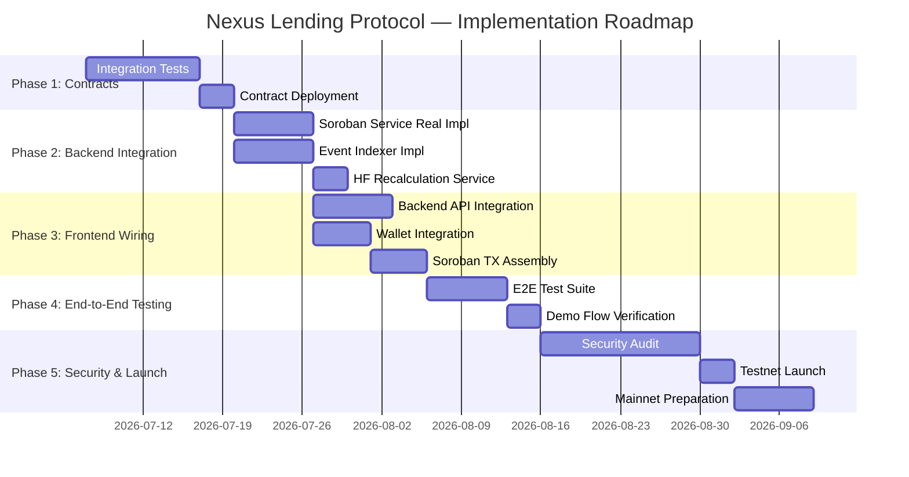
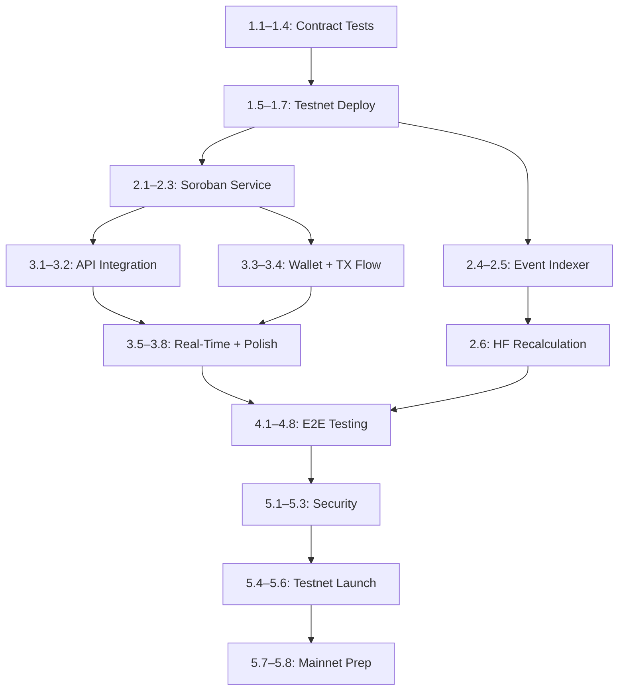

# 13 — Implementation Roadmap

> Phased roadmap from current state to production, dependency graph, and milestone definitions for the Nexus Lending Protocol.

---

## 1. Purpose

This document defines the implementation roadmap from the current state to a production-ready deployment. It assesses what has been built, what is mocked, and provides a phased plan with dependencies and milestones. This document references all previous documents as the specification for each phase.

---

## 2. Current State Assessment

### 2.1 Smart Contracts

| Component | Status | Details |
|-----------|--------|---------|
| `shared` crate | ✅ Complete | All ABI types, enums, constants defined |
| `marketplace` contract | ✅ Complete | `create_offer`, `cancel_offer`, `accept_offer`, cross-contract calls |
| `loan-manager` contract | ✅ Complete | Full lifecycle: create, HF/LTV, repay, rescue, liquidate, expire, default |
| `vault` contract | ✅ Complete | All custody functions: deposit, lock, release, transfer, collect |
| `oracle` contract | ✅ Complete | Admin price feeds, dual-key storage, unit tests |
| Contract tests | ⚠️ Partial | Oracle has unit tests; others need integration tests |

### 2.2 Backend

| Component | Status | Details |
|-----------|--------|---------|
| Express server | ✅ Complete | App setup, middleware, CORS |
| Prisma schema | ✅ Complete | All 5 models (User, LoanOffer, Loan, OraclePrice, Transaction) |
| REST API routes | ✅ Complete | All endpoints for users, offers, loans, oracle, transactions |
| Module structure | ✅ Complete | Service/controller/routes pattern per module |
| Soroban service | 🔴 Mocked | Returns mock txHash and explorer URLs — no real contract calls |
| Event indexer | 🔴 Mocked | Placeholder — no real event polling |
| Database seeding | ✅ Complete | Seed script with test data |

### 2.3 Frontend

| Component | Status | Details |
|-----------|--------|---------|
| Vite + React setup | ✅ Complete | TypeScript, Ant Design, React Router |
| All 14 pages | ✅ Complete | UI layouts and components built |
| Type definitions | ✅ Complete | Matching backend API response shapes |
| Mock data | ✅ Complete | Local mock data for development |
| Wallet integration | ⚠️ Partial | Context structure exists; real Freighter calls need wiring |
| Backend API calls | 🔴 Not wired | Pages use mock data; need to connect to backend REST API |
| Soroban SDK calls | 🔴 Not wired | No transaction assembly or submission |

### 2.4 Summary Matrix

```
                     Contracts    Backend    Frontend
                     ──────────   ─────────  ─────────
Data Structures      ✅           ✅          ✅
Business Logic       ✅           ⚠️ Mock     ❌
API / UI             N/A          ✅          ✅
Integration          ❌           ❌          ❌
Testing              ⚠️           ❌          ❌
Deployment           ❌           ❌          ❌
```

---

## 3. Phased Roadmap



---

## 4. Phase 1: Smart Contract Finalization

### 4.1 Objectives

- Complete integration test suite
- Deploy contracts to Stellar Testnet
- Verify cross-contract interactions

### 4.2 Tasks

| Task | Description | Reference Doc |
|------|-------------|---------------|
| **1.1** Write Marketplace integration tests | Test create_offer, cancel_offer, accept_offer with mock Vault and LM | `05_CONTRACT_SPECIFICATION.md` |
| **1.2** Write Loan Manager integration tests | Test full lifecycle: create, HF check, repay, liquidate, expire, default | `05_CONTRACT_SPECIFICATION.md`, `07_STATE_MACHINE.md` |
| **1.3** Write Vault integration tests | Test all custody operations with proper auth | `05_CONTRACT_SPECIFICATION.md` |
| **1.4** Write cross-contract integration tests | Full flow: MKT → LM → VLT → ORC | `04_CONTRACT_INTERACTION.md` |
| **1.5** Deploy contracts to Testnet | `stellar contract deploy` for all 4 contracts | `02_SYSTEM_ARCHITECTURE.md` §7.3 |
| **1.6** Initialize contracts | Call `initialize()` on each contract with correct addresses | `02_SYSTEM_ARCHITECTURE.md` §7.3 |
| **1.7** Set initial oracle prices | Call `set_price_for_assets()` for XLM/USDC | `05_CONTRACT_SPECIFICATION.md` §4 |

### 4.3 Verification

```bash
cd contracts
cargo test
# With Windows target workaround:
$env:CARGO_INCREMENTAL='0'; cargo test --target-dir ..\.tmp\contracts-target -j 1
```

### 4.4 Deliverables

- All contract tests passing
- Four deployed contract addresses on Testnet
- All contracts initialized with correct cross-references

---

## 5. Phase 2: Backend Integration

### 5.1 Objectives

- Replace Soroban service stubs with real transaction assembly
- Implement event indexer for contract event polling
- Wire HF recalculation to oracle price updates

### 5.2 Tasks

| Task | Description | Reference Doc |
|------|-------------|---------------|
| **2.1** Install Stellar SDK | Add `@stellar/stellar-sdk` to backend dependencies | — |
| **2.2** Implement transaction assembly | Build unsigned XDR for each contract function | `09_BACKEND_SPEC.md` §5 |
| **2.3** Implement transaction submission | Submit signed transactions to Soroban RPC | `09_BACKEND_SPEC.md` §5.3 |
| **2.4** Implement event indexer | Poll Soroban RPC for contract events, parse topics and data | `09_BACKEND_SPEC.md` §4 |
| **2.5** Map events to DB writes | Insert/update rows in PostgreSQL based on event type | `09_BACKEND_SPEC.md` §4.2 |
| **2.6** Implement HF recalculation | On oracle price update, recalculate HF for all active loans | `09_BACKEND_SPEC.md` §4.3 |
| **2.7** Configure contract IDs | Set `MARKETPLACE_CONTRACT_ID`, `LOAN_MANAGER_CONTRACT_ID`, etc. in `.env` | `02_SYSTEM_ARCHITECTURE.md` §8 |
| **2.8** Database migrations | Run `prisma migrate deploy` on staging database | `09_BACKEND_SPEC.md` §6 |

### 5.3 Key Implementation: Soroban Service

Replace each stub function:

| Stub Function | Real Implementation |
|---------------|---------------------|
| `assembleCreateOffer()` | Build `Marketplace.create_offer()` transaction XDR |
| `assembleCancelOffer()` | Build `Marketplace.cancel_offer()` transaction XDR |
| `assembleAcceptOffer()` | Build `Marketplace.accept_offer()` transaction XDR |
| `assembleAddCollateral()` | Build `LoanManager.add_collateral()` transaction XDR |
| `assemblePartialRepay()` | Build `LoanManager.partial_repay()` transaction XDR |
| `assembleFullRepay()` | Build `LoanManager.full_repay()` transaction XDR |
| `assembleLiquidate()` | Build `LoanManager.liquidate()` transaction XDR |
| `assembleSetPrice()` | Build `Oracle.set_price_for_assets()` transaction XDR |

### 5.4 Key Implementation: Event Indexer

```typescript
// Polling loop (simplified)
async function pollEvents() {
  const startLedger = getLastProcessedLedger();
  const events = await sorobanRpc.getEvents({
    startLedger,
    filters: [
      { contractIds: [MARKETPLACE_ID, LOAN_MANAGER_ID, VAULT_ID, ORACLE_ID] }
    ]
  });
  
  for (const event of events) {
    await processEvent(event);
  }
  
  updateLastProcessedLedger(events.latestLedger);
}
```

### 5.5 Deliverables

- Backend can assemble unsigned transactions for all contract functions
- Event indexer populates database from on-chain events
- HF recalculation works on oracle updates

---

## 6. Phase 3: Frontend Wiring

### 6.1 Objectives

- Replace mock data with backend API calls
- Integrate Freighter wallet for real signing
- Implement full transaction flow (assemble → sign → submit → confirm)

### 6.2 Tasks

| Task | Description | Reference Doc |
|------|-------------|---------------|
| **3.1** Create API service layer | HTTP client for all backend endpoints | `10_FRONTEND_INTEGRATION.md` |
| **3.2** Replace mock data in all pages | Fetch from `GET /api/*` endpoints | `10_FRONTEND_INTEGRATION.md` §5 |
| **3.3** Integrate Freighter wallet | `requestAccess()`, `signTransaction()` | `10_FRONTEND_INTEGRATION.md` §4 |
| **3.4** Implement transaction flow | Assemble → Sign → Submit → Record | `10_FRONTEND_INTEGRATION.md` §4.3 |
| **3.5** Add real-time polling | Poll prices and loan states at intervals | `10_FRONTEND_INTEGRATION.md` §8 |
| **3.6** Implement HF simulation | Client-side HF preview on BorrowLoanPage | `10_FRONTEND_INTEGRATION.md` §5.6 |
| **3.7** Implement liquidation calculator | Client-side profit preview | `10_FRONTEND_INTEGRATION.md` §5.11 |
| **3.8** Error handling | Toast notifications for transaction failures | `02_SYSTEM_ARCHITECTURE.md` §10 |
| **3.9** Implement overdue repayment notifications | When a loan passes `due_time`, mark it `Expired`, notify the borrower to repay, show a 7-day countdown, and surface overdue visibility to the lender | `01_BUSINESS_RULES.md` |
| **3.10** Implement default-to-liquidation flow | After `due_time + 7 days`, mark unpaid loans `Defaulted` and expose them in Liquidation Center as liquidatable regardless of HF | `07_STATE_MACHINE.md`, `10_FRONTEND_INTEGRATION.md` |

### 6.3 Deliverables

- All pages show real data from the backend
- Users can create offers, accept offers, repay, and liquidate via the UI
- Wallet connection and transaction signing works end-to-end
- Borrowers are notified when loans expire, see a 7-day repayment grace countdown, and defaulted loans become liquidatable after the countdown ends

---

## 7. Phase 4: End-to-End Testing

### 7.1 Objectives

- Verify every scenario from `12_DEMO_FLOW.md`
- Ensure data consistency between contracts, backend, and frontend

### 7.2 Tasks

| Task | Description | Reference Doc |
|------|-------------|---------------|
| **4.1** Execute Demo Scenario A | Happy path: create → accept → repay | `12_DEMO_FLOW.md` §3 |
| **4.2** Execute Demo Scenario B | Price crash → liquidation | `12_DEMO_FLOW.md` §4 |
| **4.3** Execute Demo Scenario C | Borrower rescue | `12_DEMO_FLOW.md` §5 |
| **4.4** Execute Demo Scenario D | Expiration → default → liquidation | `12_DEMO_FLOW.md` §6 |
| **4.4A** Verify 7-day overdue grace UX | Confirm due-date notification, repay CTA, grace countdown, and default/liquidation exposure after 7 days | `01_BUSINESS_RULES.md` |
| **4.5** Execute Demo Scenario E | Offer cancellation | `12_DEMO_FLOW.md` §7 |
| **4.6** Verify state consistency | On-chain vs. backend DB at each step | `08_DATA_MODEL.md` §4 |
| **4.7** Edge case testing | Zero amounts, overflow, double-init, stale oracle | `11_SECURITY_RULES.md` §4 |
| **4.8** Multi-user scenarios | Multiple offers, multiple borrowers, concurrent liquidations | — |

### 7.3 Deliverables

- All 12 demo checklist items verified (see `12_DEMO_FLOW.md` §9)
- Edge cases documented and tested
- Bug fixes applied

---

## 8. Phase 5: Security and Launch

### 8.1 Objectives

- Conduct security audit
- Deploy to Stellar Testnet (public)
- Prepare for Mainnet deployment

### 8.2 Tasks

| Task | Description | Reference Doc |
|------|-------------|---------------|
| **5.1** Internal security review | Walk through `11_SECURITY_RULES.md` checklist | `11_SECURITY_RULES.md` §8 |
| **5.2** External audit (optional) | Third-party review of contract code | — |
| **5.3** Oracle security hardening | Implement staleness checks, price bands | `11_SECURITY_RULES.md` §4.5 |
| **5.4** Deploy to public Testnet | Deploy all contracts, configure backend | `02_SYSTEM_ARCHITECTURE.md` §7 |
| **5.5** Public beta testing | Invite testers, collect feedback | — |
| **5.6** Deploy frontend to CDN | Vercel / Netlify deployment | `02_SYSTEM_ARCHITECTURE.md` §7.2 |
| **5.7** Deploy backend to cloud | Cloud VM + managed PostgreSQL | `02_SYSTEM_ARCHITECTURE.md` §7.2 |
| **5.8** Mainnet preparation | Contract audit, admin key security, operational procedures | `11_SECURITY_RULES.md` §8 |

### 8.3 Deliverables

- Security audit report (internal or external)
- Public Testnet deployment with real users
- Mainnet deployment plan

---

## 9. Dependency Graph



---

## 10. Risk Register

| Risk | Impact | Probability | Mitigation |
|------|--------|-------------|------------|
| Soroban SDK breaking changes | High | Medium | Pin SDK version; monitor Stellar release notes |
| Oracle manipulation on Mainnet | Critical | Low | Multi-sig admin; future decentralized oracle |
| Smart contract bugs discovered post-deploy | Critical | Medium | Extensive testing; upgrade strategy (deploy new, migrate) |
| Backend indexer falls behind | Medium | Medium | Monitor lag; implement catch-up mechanism |
| Low initial liquidity | High | High | Start with small testnet demo; build community |
| Gas cost changes on Stellar | Medium | Low | Monitor network fees; budget for resource costs |

---

## 11. Documentation as Source of Truth

This documentation suite serves as the single source of truth for the entire project:

| Question | Document |
|----------|----------|
| What is Nexus? | `00_PROJECT_OVERVIEW.md` |
| What are the rules? | `01_BUSINESS_RULES.md` |
| How is the system structured? | `02_SYSTEM_ARCHITECTURE.md` |
| How do contracts work internally? | `03_SMART_CONTRACT_ARCHITECTURE.md` |
| How do contracts call each other? | `04_CONTRACT_INTERACTION.md` |
| What does each function do? | `05_CONTRACT_SPECIFICATION.md` |
| How do tokens flow? | `06_ESCROW_AND_FUNDING_FLOW.md` |
| What are the valid state transitions? | `07_STATE_MACHINE.md` |
| What data is stored where? | `08_DATA_MODEL.md` |
| What does the API look like? | `09_BACKEND_SPEC.md` |
| How does the frontend work? | `10_FRONTEND_INTEGRATION.md` |
| What security rules apply? | `11_SECURITY_RULES.md` |
| How do I demo the protocol? | `12_DEMO_FLOW.md` |
| What's the implementation plan? | `13_IMPLEMENTATION_ROADMAP.md` (this document) |

---

*Previous: `12_DEMO_FLOW.md` · This is the final document in the Nexus Lending Protocol documentation suite.*
