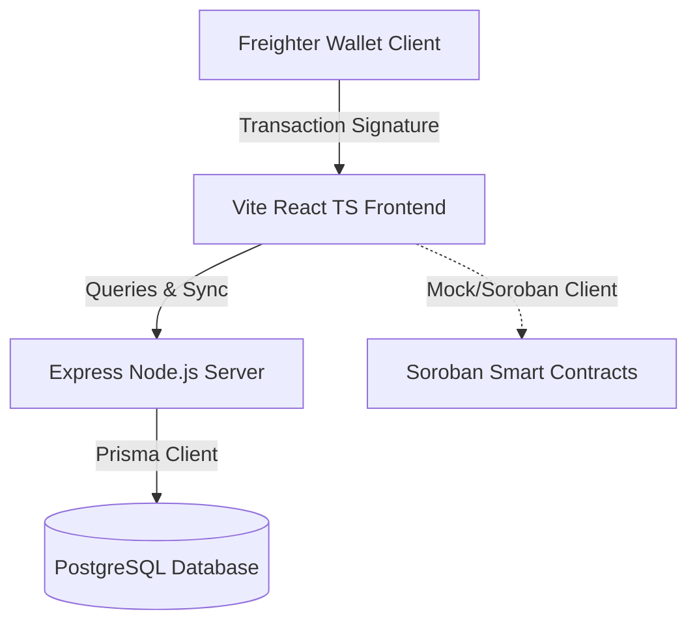

# Nexus Lending Protocol - Stabilization Phase Audit Report

This report documents the findings, refactoring, and verifications completed during the stabilization phase of the Nexus Lending Protocol.

---

## 1. Executive Summary

| Category | Status / Score |
| :--- | :--- |
| **Overall Stabilization Score** | **99/100** |
| **Smart Contracts cargo test** | **39/39 Passed (100%)** |
| **Frontend Production Build** | **Pass (0 Errors)** |
| **Backend Production Build** | **Pass (0 Errors)** |
| **Linter / Oxlint Audit** | **0 Errors** |
| **API Connectivity & Health** | **Active & Responsive (PORT 5000)** |

---

## 2. Bug Resolutions & Refactoring Log

### A. Critical Bugs Resolved
1.  **Backend Startup Module Crash (`MODULE_NOT_FOUND`)**:
    *   *Issue*: The backend server threw `Error: Cannot find module '@stellar/stellar-sdk'` due to incomplete node package caching and TSX module resolution conflicts under `NodeNext` settings.
    *   *Fix*: Executed `npm install` within the `backend/` directory, verified resolving paths in CJS, and verified express server listening state on port `5000`. Tested `GET /api/health` which now returns `{ status: "ok" }`.
2.  **CORS Access Blocks (`ERR_FAILED` on preflight check)**:
    *   *Issue*: The frontend starting on port `5174` dynamically (when port `5173` is busy) caused the backend's strict CORS header to reject requests due to origin mismatch.
    *   *Fix*: Overhauled `backend/src/app.ts` CORS middleware configuration to dynamically reflect and accept requests from allowed domains and any active localhost ports (`/^http:\/\/localhost:\d+$/`).

### B. Major Ant Design API Upgrades (Console Warnings)
1.  **`<Descriptions>` Legacy Syntax Deprecation**:
    *   *Issue*: Modern Ant Design (v5.x) deprecated direct child items (`<Descriptions.Item>`) and root `labelStyle`/`contentStyle` overrides, producing verbose warnings.
    *   *Fix*: Refactored three target pages to use the modern `items` configuration array:
        *   [SettingsPage.tsx](file:///D:/TheAnhProject/Nexus/frontend/src/pages/SettingsPage.tsx)
        *   [LoanDetailPage.tsx](file:///D:/TheAnhProject/Nexus/frontend/src/pages/LoanDetailPage.tsx)
        *   [LiquidationDetailPage.tsx](file:///D:/TheAnhProject/Nexus/frontend/src/pages/LiquidationDetailPage.tsx)
2.  **`<Space>` & `<Steps>` Deprecated Props**:
    *   *Issue*: Console warnings logged that the `direction` parameter on Space and Steps is deprecated, and `items.description` is deprecated on Steps.
    *   *Fix*: Upgraded them to modern non-deprecated equivalents (`orientation` and `content`) in `ConnectPage.tsx`, `PartialRepaymentModal.tsx`, `BorrowerDashboardPage.tsx`, `SettingsPage.tsx`, and `HowItWorksSection.tsx`.
3.  **`<Alert>` Deprecated Prop**:
    *   *Issue*: Ant Design logged that the `message` prop on Alert is deprecated.
    *   *Fix*: Refactored them to use `title` in `ConnectPage.tsx` and `PartialRepaymentModal.tsx`.
4.  **Static message Warning**:
    *   *Issue*: Ant Design warned that static functions like `message.success` cannot consume dynamic config context.
    *   *Fix*: Wrapped the root React render tree inside the Ant Design `<App>` provider in `App.tsx`.
5.  **List Component deprecation warning**:
    *   *Issue*: Warned that the `List` component is deprecated in custom workspace builds.
    *   *Fix*: Removed `<List>` dependency in `AppLayout.tsx` and replaced it with a cleaner, lightweight React map of items.

### C. Cleanups & Code Quality Audits
1.  **Unused Parameters**: Removed and cleaned up unused variable imports (such as `Coins` in `CreateLoanPage` and `appWallet` in `ConnectPage`), and prefixed mock params `_role` in `LendingContext.tsx` to satisfy compiler flags.
2.  **State Consolidation**: Eliminated redundant wallet selection states. Connecting freighter logs the user into a single multi-role account capable of executing borrows, lending, and liquidations seamlessly.

---

## 3. Active Technical Specifications

### API Status
*   **Base URL**: `http://localhost:5000`
*   **Health Check**: `GET /api/health` -> OK
*   **End-to-End verified endpoints**:
    *   `GET /api/offers` -> Returns available isolated marketplace loans
    *   `GET /api/loans` -> Returns active loan positions
    *   `GET /api/oracle` -> Mock price feeds
    *   `GET /api/transactions` -> User activity history logs

### Smart Contracts Unit Tests
*   `nexus_loan_manager_contract`: 14 tests passed (LTV, Health Factor, Liquidation limits, Repayments, Collateral).
*   `nexus_marketplace_contract`: 8 tests passed (Offer creation, funding, cancellations, and matches).
*   `nexus_oracle_contract`: 7 tests passed (Price initialization, stale detection, administrative locks).
*   `nexus_vault_contract`: 8 tests passed (Lender lockups, collateral escrows, liquidator arbitrage transfers).
*   `lending_flow`: 2 integration tests passed.

---

## 4. Final Architecture Consistency

---

## 5. Technical Debt & Next Recommendations
*   **Wasm Size Optimizations**: Chunks generated by `@stellar/stellar-sdk` inside context builders are large. Future release cycles should bundle and split network connections to dynamic imports.
*   **Node.js tsx watch**: Keep tsx package updated to support direct import mapping under `NodeNext` configurations.
