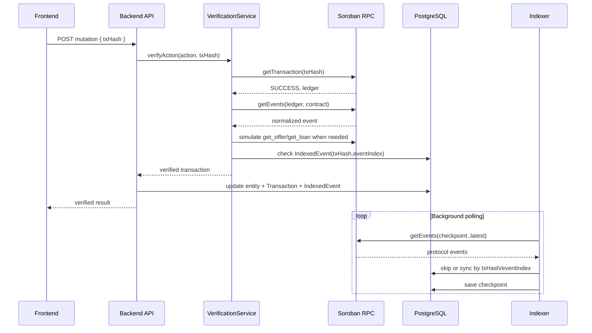

# Blockchain Verification Backend

## Purpose

Nexus treats Stellar Soroban as the source of truth for lending state. The backend must not trust frontend transaction receipts, explorer URLs, wallet fields, amounts, or entity IDs when a state-changing blockchain action is submitted.

The frontend may submit a transaction hash. The backend verifies the transaction through Soroban RPC, derives the contract event, reads on-chain state when needed, and only then updates PostgreSQL.

## Architecture

```text
Frontend
  |
  | txHash only
  v
API mutation endpoint
  |
  v
VerificationService
  |
  +-- TransactionVerifierService -> Soroban RPC getTransaction/getEvents
  +-- EventVerifierService       -> contract/action/entity/payload checks
  +-- ContractReaderService      -> read-only get_offer/get_loan simulation
  +-- ExplorerService            -> server-generated Stellar Expert URL
  |
  v
Database transaction
  |
  +-- business entity update
  +-- Transaction record
  +-- IndexedEvent idempotency record
```

Background synchronization uses the same normalization and database sync path:

```text
IndexerService
  |
  +-- load IndexerCheckpoint
  +-- poll Soroban RPC events
  +-- normalize events
  +-- EventSyncService
  +-- save IndexedEvent
  +-- update IndexerCheckpoint
```

## Verification Pipeline

For every supported blockchain action, the backend performs these checks before mutating business state:

1. Validate `txHash` format.
2. Query Soroban RPC with `getTransaction`.
3. Require transaction status `SUCCESS`.
4. Require configured network to match the expected deployment network.
5. Fetch contract events for the transaction ledger.
6. Locate the expected contract event for the submitted action.
7. Verify contract ID against configured contract IDs.
8. Verify event name/function semantics.
9. Verify actor wallet when the event exposes one.
10. Verify offer or loan ID when the action is entity-bound.
11. Verify amount, collateral, and asset when the event exposes them.
12. Read on-chain offer or loan state for database synchronization.
13. Insert `IndexedEvent` using `(txHash, eventIndex)` to prevent replay.
14. Persist business changes and the normalized `Transaction` record.

Supported actions:

```text
create_offer
fund_offer
activate_offer
cancel_offer
expire_offer
accept_offer
activate_loan
add_collateral
partial_repay
full_repay
liquidate
oracle_update
```

## Event Parser

Soroban events are normalized into a common shape:

```text
contractId
ledger
txHash
eventIndex
eventName
actor
offerId
loanId
amount
asset
timestamp
payload
```

The parser supports these protocol events:

```text
offer_created
offer_funded
offer_activated
offer_cancelled
offer_expired
offer_matched
loan_created
loan_activated
loan_state_updated
collateral_added
partial_repaid
loan_repaid
loan_expired
loan_defaulted
loan_liquidated
price_updated
```

The public API may expose friendlier names, but the backend stores and verifies the emitted contract event names.

## Indexer Pipeline

On backend startup, `IndexerService.start()` runs in the background:

1. Load the checkpoint for the configured network.
2. Ask Soroban RPC for the latest ledger.
3. Resume from `lastLedger + 1`, or from a recent ledger window if no checkpoint exists.
4. Poll configured protocol contracts through RPC `getEvents`.
5. Normalize each event.
6. Skip already processed `(txHash, eventIndex)` pairs.
7. Synchronize the matching database entity.
8. Persist `IndexedEvent`.
9. Update `IndexerCheckpoint` with ledger, status, counters, and RPC health.

Status is exposed through:

```text
GET /api/indexer/status
POST /api/indexer/poll
```

## Database Synchronization

The backend avoids direct frontend-driven business-state mutation for confirmed blockchain actions. Mutation endpoints now verify the transaction first, then derive the authoritative state from the chain.

The updated `Transaction` model stores:

```text
txHash
ledger
contractId
eventName
actor
entityType
entityId
status
confirmedAt
network
explorerUrl
eventIndex
```

`IndexedEvent` stores the idempotency key and normalized event metadata:

```text
txHash
eventIndex
ledger
contractId
eventName
actor
entityType
entityId
amount
asset
network
explorerUrl
payload
processedAt
```

`IndexerCheckpoint` stores background sync state:

```text
network
lastLedger
currentLedger
rpcStatus
status
pendingEvents
processedEvents
failedEvents
lastError
```

## Security Model

The frontend is untrusted. It can submit a transaction hash, but the backend rejects:

- fake transaction hashes
- missing transactions
- failed transactions
- wrong network submissions
- wrong contract IDs
- wrong protocol events
- wrong actor wallets
- wrong offer or loan IDs
- wrong repayment, collateral, or oracle amounts
- duplicate event processing
- replayed transaction events
- frontend-provided explorer URLs

Explorer URLs are generated server-side:

```text
testnet: https://stellar.expert/explorer/testnet/tx/{txHash}
mainnet: https://stellar.expert/explorer/public/tx/{txHash}
```

## Replay Protection

Every normalized event is processed with this idempotency key:

```text
txHash + eventIndex
```

`IndexedEvent` has a unique database constraint on this pair. If the event already exists, API verification treats it as replayed/idempotent and the indexer skips it.

## RPC Verification

The backend verifies transactions using Soroban RPC, not Stellar Expert or frontend receipts. RPC is used for:

- `getTransaction` success and ledger checks
- `getEvents` event extraction
- read-only contract simulation for `get_offer`
- read-only contract simulation for `get_loan`

Explorer links are informational only and are never used as trust input.

## Flow Diagram



## Operational Notes

- `STELLAR_NETWORK_PASSPHRASE` must match the configured network.
- `STELLAR_RPC_URL` must point to the same network as deployed contracts.
- `MARKETPLACE_CONTRACT_ID`, `LOAN_MANAGER_CONTRACT_ID`, `ORACLE_CONTRACT_ID`, and `VAULT_CONTRACT_ID` must be configured.
- `STELLAR_READ_SOURCE_ACCOUNT` should be set for background read-only contract simulations when an event does not expose a usable source account.

## Limitations

- Existing smart contracts were not changed, so the backend can only verify fields emitted by events or returned by read-only contract methods.
- Some current events do not emit every business field. The backend reads `get_offer` and `get_loan` to fill gaps where possible.
- Oracle events do not expose every metadata field, so decimals/source metadata still comes from backend configuration or the existing API context.
- The indexer currently processes bounded event batches and should add full pagination/backfill controls before high-volume production use.
- Signer verification is event-driven: if the contract emits an actor, the backend verifies it. Full raw transaction auth-entry auditing can be added if the RPC metadata contract auth format is standardized for the deployment target.
- Compatibility paths that create local draft records before a transaction hash exists are not authoritative chain state. Confirmed blockchain actions must pass verification before final state changes.

